
<h1>计算机网络笔记</h1>

[toc]

# 第一章 计算机网络体系结构

### 1.1 计算机网络概述

##### 1.1.1 计算机网络概念

- 定义：计算机网络是一个将分散的、具有独立功能（**自治的，autonomous**）的计算机系统，通过通信设备与线路连接起来，由功能完善的软件实现**资源共享**和**信息传递**的系统。
- 资源共享观点
  - 目的：资源共享
  - 组成单元：自治计算机
  - 统一规则：网络协议Protocol
- 用户透明性观点
  - 存在一个能为用户自动管理资源的网络操作系统，整个网络对用户透明，用户使用网络就像使用一台单一超级计算机。

##### 1.1.2 计算机网络组成

- 从组成部分上看
  - 完整的计算机网络由**硬件、软件、协议**三大部分组成
  - **协议是计算机网络的核心**
- 从工作方式上看
  - **边缘部分**：所有主机，进行通信和资源共享
  - **核心部分**：网络、路由器等，提供连通性和交换服务
- 从功能组成上看
  - **通信子网**：传输介质、通信设备、网络协议
  - **资源子网**：实现资源共享功能的设备及其软件集合

##### 1.1.3 计算机网络功能

- **数据通信**
- **资源共享**
- **分布式处理**
- **数据通信提高可靠性**
- **负载均衡**

##### 1.1.4 计算机网络分类

**1. 按分布范围分**

- 广域网（Wide Area Network, WAN）
  - 提供长距离通信
  - 广域网是**因特网（Internet）**的核心部分
- 城域网（Metro Area Network, MAN）
  - 大多采用**以太网（Ethernet）**技术
- 局域网（Local Area Network, LAN）
  - 使用广播技术
- 个人区域网（Personal Area Network, PAN）

**2. 按传输技术分**

- 广播式网络
  - 所有联网计算机共享一个公共通信信道
- 点对点网络
  - 每条物理线路连接一对计算机

**3. 按拓扑结构分**

- 总线形网络
- 星形网络
- 环形网络
- 网状网络

**4. 按使用者分**

- 公用网（Public Network），如电信、网通
- 专用网（Private Network），如校园网

**5. 按交换技术分**

- 电路交换网络（如电话）
  - 建立专用通路来传送数据
- 报文交换网络
  - 用户数据加上辅助信息，封装成**报文**
  - 整个报文传送到相邻结点、再转发给下一结点，直到达到目标结点
- 分组交换网络
  - 将数据分成较短固定长度**数据块**
  - **现在主流网络基本上都是分组交换网络**

**6. 按传输介质分**

- 有线
- 无线

##### 1.1.6 计算机网络性能指标

- 带宽Bandwidth
  - 单位：比特/秒，b/s
  - 网络通信线路所能传送数据的能力，即**最高数据传输速率**
- 时延Delay：**数据从网络一端传送到另一端所需总时间**
  - $发送时延=\frac{分组长度}{信道宽度}$，**结点将分组所有比特推向链路所需时间**
  - $传播时延=\frac{信道长度}{电磁波在信道上 传播速率}$，**电磁波在信道中传播一定距离花费时间**
  - 处理时延（**通常忽略不计**）：数据在交换结点为存储转发而进行的必要处理花费时间
  - 排队时延（**通常忽略不计**）：分组进入路由器后先在输入队列排队时间
- 时延带宽积
  - **发送端发送第一个比特到达终点时，发送端已经发出多少比特**
  - 时延带宽积=传播时延*信道带宽（圆柱高度\*横截面积）
- 往返时延Round-Trip Time，RTT（例如**游戏延迟**）
  - **发送端发出一个短分组到发送端收到来自接受端确认经过的时延**
- 吞吐量Throughput
  - **单位时间通过某个网络的数据量**
- 速率Speed
  - **主机在数字信道上传送数据的速率**
  - **把最高数据传输速率称为带宽**
  - 单位：kb/s、Mb/s、Gb/s，$k=10^3$，和存储空间的$K=2^{10}$不同
- 信道利用率
  - **信道有百分之多少时间有数据通过**
  - $信道利用率=\frac{有数据通过时间}{(有+无)数据通过时间}$

### 1.2 计算机网络体系结构与参考模型

##### 1.2.1 计算机网络分层结构

- **网络体系结构Architecture**：计算机网络各层及其协议和层间接口的集合
- 第1层网络层，越往上越抽象，**下层为上层服务**，相同层级称为**对等层**，同一层的实体称为**对等实体**
- 各个层次中的报文：第n层的SDU和第n层的PCI组合成第n层的PDU，并传送到n-1层作为其SDU：$SDU_n+PCI_n=PDU_n=SDU_{n-1}$
  - 数据部分（到手包裹）：**服务数据单元（Service Data Unit, SDU）**
  - 控制信息部分（要添加包装）：**协议控制信息（Protocol Control Information, PCI）**
  - 二者共同组成（包装后包裹）：**协议数据单元（Protocol Data Unit, PDU）**

- 层次结构具体含义
  - 第n层向n+1层提供的服务是第n层及其**下面各层提供服务总和**（tg高层剥削低层，实质是剥削所有百姓）
  - 上一层只通过层间接口使用下一层服务，下一层提供服务的实现细节对上层**透明**
  - **对等层逻辑上有一条直接信道**

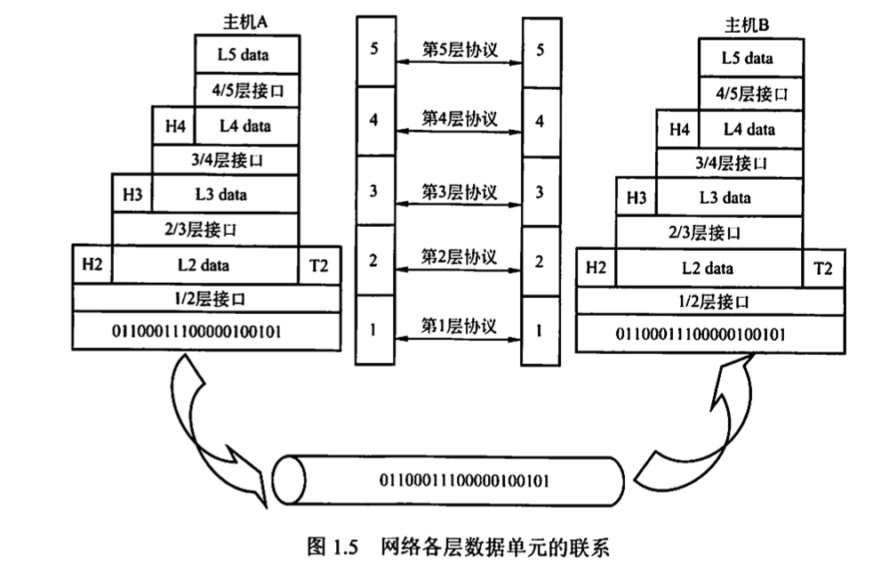

##### 1.2.2 计算机网络协议、接口、服务概念

**1. 协议**

- 网络协议（Network Protocol）：**为进行网络中的数据交换而建立的规则、标准或约定**
- 协议是控制两个或多个**对等实体**进行通信的规则集合，是**水平的**
- 协议组成
  - 语法：规定传输数据格式
  - 语义：规定所要完成的功能
  - 同步：规定了执行各种操作的条件、时序关系等

**2. 接口**

- 接口（Interface）：**同一结点内相邻两层间交换信息的连接点，是一个系统内部的规定**
- 接口是**“垂直的”**
- 同一结点相邻两层实体通过**服务访问点（Service Access Point, SAP）**交互
  - ​	第n层SAP是第n+1层可以访问第n层服务的地方

**3. 服务**

- 服务（Service）：**下层为紧邻的上层提供的功能调用**
- 服务是**垂直的**
- 上层使用下层的服务时必须与下层交换一些命令：**服务原语**（OSI内容）
  - 请求Request：服务用户->服务提供者，请求完成某项工作
  - 指示Indication：服务提供者->服务用户，指示用户做某件事情
  - 响应Response（无应答服务不包括）：服务用户->服务提供者，对指示的响应
  - 证实Confirmation（无应答服务不包括）：服务提供者->服务用户，对请求的证实

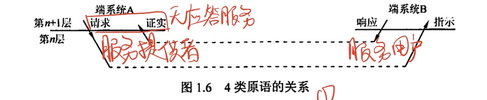

- 协议和服务区别
  - 本层协议的实现才能保证向上一层提供服务。本层用户只看见服务看不见下面的协议，下面的协议对上层的服务用户**透明**
  - 协议**水平**，控制**对等实体**之间通信；服务**垂直**，下层通过**层间接口**向上层提供
  - **只有被高一层实体看得见的功能、而非一层内完成的全部功能**称为服务

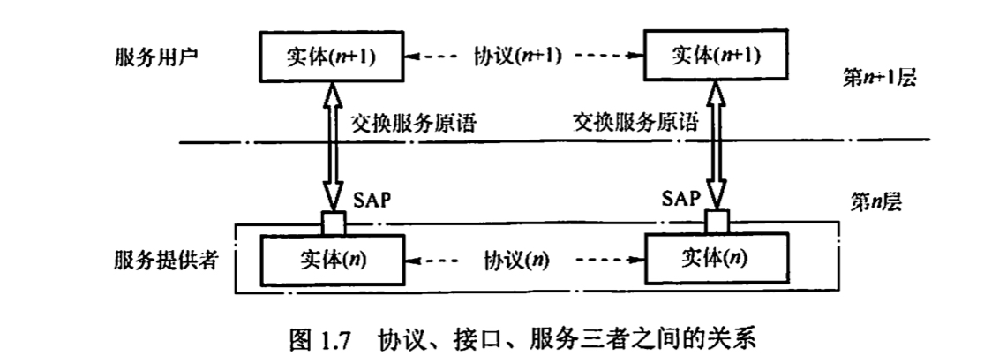

- 服务分类
  - 面向连接服务和无连接服务
    - **面向连接服务**通信前双方先建立连接、分配相应资源、结束后释放连接和资源
    - 分为**连接建立、数据传输、连接释放**三个阶段
  - 可靠服务和不可靠服务
    - **可靠服务**有**纠错、检查、应答**机制
  - 有应答服务和无应答服务
    - **有应答服务**是接收方收到数据后向发送方给出相应应答

##### 1.2.3 ISO/OSI参考模型和TCP/IP模型

**1. OSI参考模型**

物链网输会示用

低三层：通信子网（物理层、数据链路层、网络层）

高三层：资源子网（会话层、表示层、应用层）

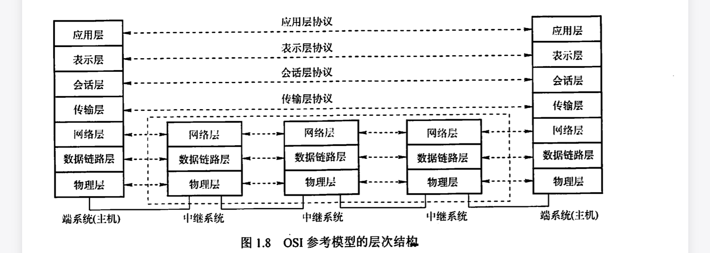

- 1.物理层 Physical Layer
  - 传输单位：比特
  - 任务：透明地传输比特流
  - 主要定义数据终端设备DTE和数据通信设备DCE的物理与逻辑连接方法
    - 通信链路与通信结点的连接所需要电路接口的参数
    - 通信链路上传输的信号的意义和电器特征
  - 接口标准：EIA-232C，EIA/TIA RS-449，CCITT的X.21
- 2.数据链路层 Data Link Layer
  - 传输单位：帧
  - 任务：将网络层传来的IP数据报组装成帧
  - 成帧功能
  - 差错控制功能：检测传输过程中发生的差错
  - 流量控制功能：协调两个结点速率
  - 传输管理功能
  - 协议：SDLC，HDLC，PPP，STP，帧中继
- 3.网络层 Network Layer
  - 传输单位：数据报
  - 任务：把网络层的协议数据单元从源端传到目的端，为分组交换网上的不同主机提供通信服务
  - 功能：流量控制、差错控制、拥塞控制
  - 协议：IP、IPX、ICMP、IGMP、ARP、RARP、OSPF
- 4.传输层 Transport Layer
  - 传输单位：报文段TCP或用户数据报UDP
  - 任务：负责主机中两个进程之间的通信
  - 功能：为端到端连接提供流量控制、差错控制、服务质量、数据传输管理等服务
  - 点到点（数据链路层的通信）：主机到主机之间的通信
  - 端到端（传输层的通信）：运行在不同主机内两个进程之间的通信，一个进程一个端口
  - 复用和分用
    - 复用：多个应用层进行可同时使用下面传输层服务
    - 分用：传输层把接收到的信息分别交付给上面应用层中相应进程
  - 协议：TCP，UDP
- 5.会话层 Session Layer
  - 允许不同主机上各个进程之间进行会话（也称建立同步SYN）
- 6.表示层 Presentation Layer
  - 处理两个通信系统中交换信息的表示方式
- 7.应用层 Application Layer
  - 用户与网络的界面，最复杂、使用协议最多
  - 协议：文件传送FTP，电子邮件SMTP，万维网HTTP

**2. TCP/IP模型**

- 网络接口层：对应OSI的物理层、数据链路层
- 网际层
- 传输层
- 应用层：对应OSI的会话层、表示层、应用层

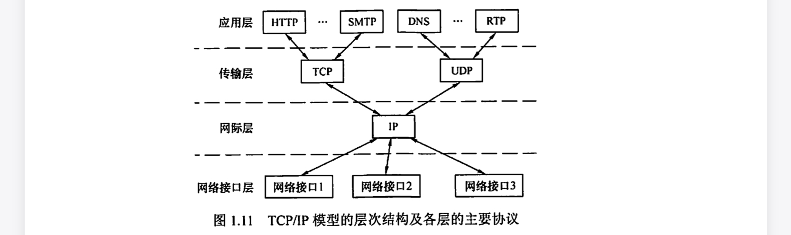

---

# 第二章 物理层

物理层定义标准（接口）

- 机械特性
- 电气特性
- 功能特性
- 规程特性

### 2.1 通信基础

##### 2.1.1 基本概念

**1. 数据、信号和码元**

- **数据**：传送信息的实体（二进制序列）
- **信号**：数据的电气/电磁表现，是数据在传输过程中的存在形式
  - 连续变化的数据（或信号）称为**模拟数据（或模拟信号）**
  - 取值离散的数据（或信号）称为**数字数据（或数字信号）**

- **码元**：用一个固定时长的信号波形表示一位k进制数字
  - 二进制码元即只有高、低两种电平的数字信号，每个电平取值都是码元，1码元=1比特
  - k进制码元：$1码元=log_2k比特$
  - 如16进制，则1码元可代表0～15共16个数字取值，对应4bit信息

**2. 信源、信道和信宿**

- **信源**：产生和发送数据的源头
- **信宿**：接收数据的终点
- **信道**：信号的传输媒介（实际的双向通信包含发送信道、接收信道）
  - 信道按信号形式
    - 传送模拟信号的模拟信道
    - 传送数字信号的数字信道
  - 信道按传输介质
    - 无线信道
    - 有线信道
  - 信道上的信号
    - 基带信号：将数字信号直接用两种电压表示，然后送到数字信道传输（基带传输）
    - 宽带信号：将基带信号调制后形成频分复用模拟信号，然后送到模拟信道传输（宽带传输）

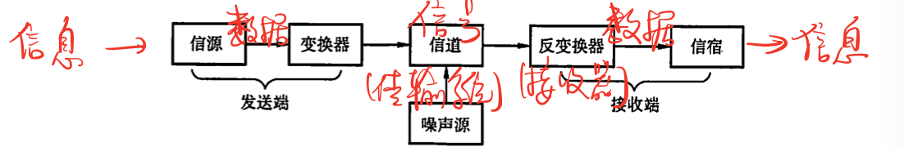

- 通信双方信息的交互方式
  - **单向（单工）通信**：讲座，只有一个方向的通信
  - **半双工通信**：对话，通信双方都可以发送或接收信息，但不能同时
  - **全双工通信**：吵架，通信双方都可以发送或接收信息，可以同时
- 通信方式其他分类
  - 串/并行通信方式：串行为低到高位依次传输，特性为速度慢、成本低、远距离；并行为多条信道同时传输，特性反之
  - 同/异步通信方式：同步为以数据区块为单位，异步为分小组传送

**3. 速率、波特和带宽**

- **速率（数据率）**：单位时间内传输的数据量
  - 码元传输速率（波特率）：单位时间内传输码元个数，单位波特Baud=个/秒
  - 信息传输速率（比特率）：单位时间内传输二进制码元（即比特）个数，单位bit/s
  - k进制码元，码元传输速率为M波特，则信息传输速率=$Mlog_2k$ bit/s
- **带宽**：最高数据率，衡量网络通信线路传输数据的能力，单位bit/s
  - 信道带宽：与带宽含义不同，指信道能通过最高、最低频率之差，如3300Hz～300Hz，则为3000Hz，在奈氏定理里有用

##### 2.1.2 奈氏定理和香农定理

**奈氏定理**

- **码间串扰**：信号中的高频分量不能通过信道，否则会在传输中衰减，导致接受的信号波形失去码元之间清晰界限
- 奈氏定理定义：理想低通（没有噪声、带宽有限）的信道中，为避免码间串扰，极限码元传输速率为2W波特，W为理想低通信道带宽（Hz），V为每个码元离散电平数目（即几进制）

$$
理想低通信道下极限数据传输速率=2Wlog_2V(b/s)
$$

- 结论
  - 任何信道中码元传输速率有上限
  - 信道频带越宽，即通过信号高频分量越多，可用更高速率进行码元传输
  - 仅限制码元传输速率，没有限制信息传输速率，即1码元=多少二进制位没有限制。这时就需要多元制调制方法提高每个码元信息量。

**香农定理**

给出了带宽受限、且有高斯白噪声干扰的信道极限数据传输速率。
$$
信道极限数据传输速率=Wlog_2(1+S/N)
$$

- W：信道带宽
- S：传输信号平均功率
- N：信道内高斯噪声功能
- S/N ：信噪比，单位为dB的信噪比=$10log_{10}(S/N)$
- 结论
  - 信噪比越大，信息极限传输速率越高
  - 传输带宽和信噪比决定信息传输速率上限
  - 只要信息传输速率低于信道极限传输速率，就可以找到某种方法实现无差错传输

##### 2.1.3 编码与调制

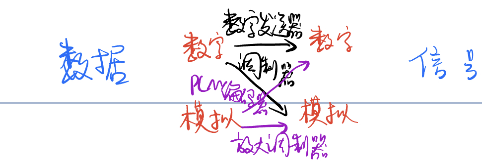

- **调制**：把数据变换为**模拟信号**
- **编码**：把数据变换为**数字信号**

**1. 数字数据编码为数字信号**

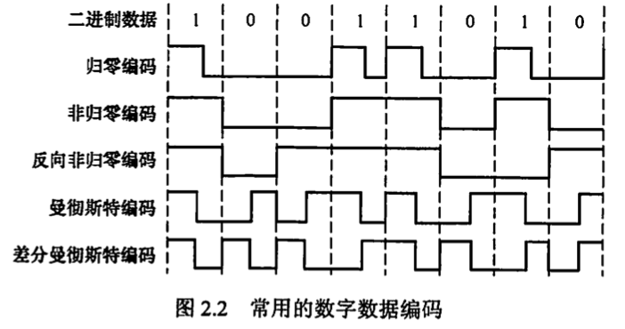

- **归零编码**
  - 高电平代表1，低电平代表0
  - 每个时钟周期中间都跳到低电平
  - 归零占据一部分带宽，传输效率收到影响
- **非归零编码**
  - 与归零编码的区别是不用归零，一个周期全用来传输数据
  - 无法传递时钟信号，双方难以同步
- **反向非归零编码**
  - 翻转代表0，保持不变代表1
  - 既能传输时钟信号，又尽量不损失带宽
- **曼彻斯特编码**
  - 一个码元分为两个相等间隔
  - 前高后低为1，前低后高为0
  - 所占频带宽度是原始基带宽度两倍
  - 以太网的编码方式
- **差分曼彻斯特编码**
  - 前半个码元与上一码元的后半个码元相同为1，不同为0
  - 可以实现自同步，抗干扰性好
- **4B/5B编码**
  - 数据流4位一组，按照编码规则转换为5位码
  - 5位码共32种组合，其中16种对应16种不同4位码，其他16种作为控制码或保留

**2. 数字数据调制为模拟信号**

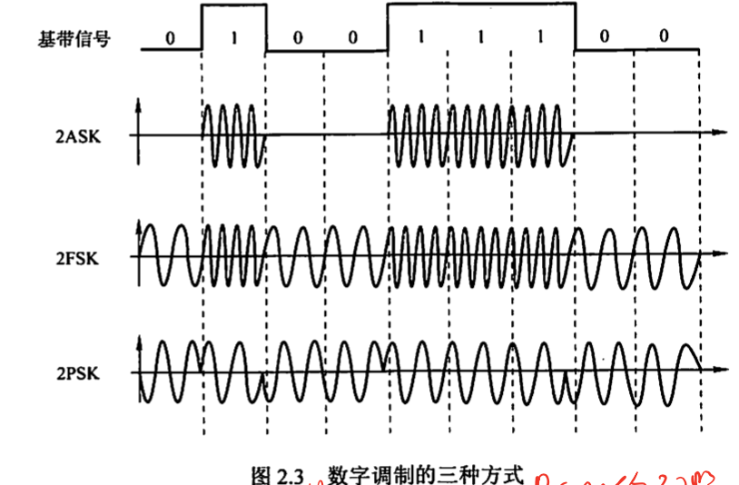

- **幅移键控ASK**
  - 通过改变载波信号振幅表示0和1
  - 实现容易，抗干扰差
- **频移键控FSK**
  - 通过改变载波信号频率表示0和1
  - 实现容易，抗干扰强，应用广泛
- **相移键控PSK**
  - 通过改变载波信号相位表示0和1
- **正交振幅调制QAM**
  - 频率相同，结合ASK和PSK，形成叠加信号
  - 设波特率B，m个相位、每个相位n种振幅，则QAM的数据传输速率$R=Blog_2(mn)$

**3. 模拟数据编码为数字信号**

- **采样定理（奈奎斯特定理）**
  -  采样频率必须大于等于原始信号最大频率的两倍，即$f_{采样}≥2f_{max}$

- **采样**：对模拟信号周期性扫描，把时间上连续的信号变为时间上离散的信号。根据采样定理采样的离散信号可以**无失真**地表示被采样的模拟数据。
- **量化**：把采样取得的电平幅值按照分级标度转化为对应数字值并取整
- **编码**：把量化结果转化为二进制编码

**4. 模拟数据调制为模拟信号**

- 为实现传输有效性、充分利用带宽资源，可能需要较高频率
- 频分复用FDM

##### 2.1.4 交换方式

**1. 电路交换Circuit Exchanging**

- 进行数据传输前，两个结点间先建立一条双方独占的物理通信路径
- 三个阶段
  - 连接建立
  - 数据传输
  - 连接释放
- 优点
  - 通信时延小
  - 有序传输（不会失序）
  - 没有冲突（不会争用物理信道）
  - 适用范围广（适用于模拟信号和数字信号）
  - 实时性强（物理通路一旦建立双方可以随时通信）
  - 控制简单
- 缺点
  - 建立连接时间长
  - 线路独占
  - 灵活性差（通路中任何一点出故障都需要重新建立连接）
  - 难以规格化（数据直达，类型、规格、速率不同的终端难以通信，难以差错控制）

**2. 报文交换Message Exchanging**（存储转发）

- 数据交换单位是报文，携带目标地址、源地址等信息
- 优点
  - 无须建立连接
  - 动态分配线路（报文发送给交换设备，先存储整个报文，然后选择合适的空闲线路发送报文）
  - 提高线路可靠性（某条传输路径故障可以选择另一条路径）
  - 提高线路利用率（通信双方不固定占有一条通信线路）
  - 提供多目标服务（一个报文可以同时发送给多个目标地址）
- 缺点
  - 存储转发引起**转发时延**（包括接收报文、检验正确性、排队、发送时间）
  - 对报文大小没有限制，需要网络结点有较大缓存空间

**3. 分组交换Packet Exchanging**（存储转发）

- 现在报文交换很少用，被分组交换替代
- 限制了每次传送数据块大小上限，把大的数据块划分为小数据块并加上必要的控制信息构成**分组Packet**
- 优点
  - 无建立时延
  - 线路利用率高
  - 简化了存储管理（报文长度固定，缓冲区大小固定，交换结点中的存储器管理被简化为缓冲区管理）
  - 加速传输（流水线）
  - 减少了出错概率和重发数据量（分组短，出错概率小，重发数据量减少）
- 缺点
  - 存在传输时延（仍存在存储转发时延）
  - 需要传输额外信息量（每个小数据块都需要额外信息）
  - 若采用**数据报服务**，可能出现失序、丢失或重复分组；若采用**虚电路服务**，无失序问题，但有呼叫建立、数据传输、虚电路释放三个过程

**三种数据交换方式比较**

- 采用电路交换：传送数据量很大且传送时间远大于呼叫时间

- 采用分组交换：端到端的通路由多段链路组成时

- **分组交换比报文交换更优**

  - 时延小，适合于计算机之间的突发式数据通信
  - 提高整个网络信道利用率

  

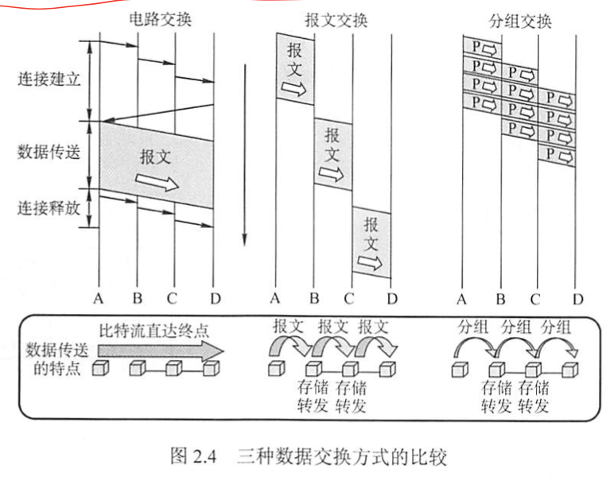

**3.1. 数据报**（分组交换，无连接）

- 原理
  - 主机A将分组逐个发向与之连接的交换结点A，交换结点A缓存分组
  - 交换结点A查找转发表（不同时刻网络状态不同，因此转发表内容可能不同），有的分组转发给交换结点C，有的给D
  - 其他结点类似转发分组，直到到达主机B
- 特点
  - 不需要建立连接，随时发送、接收分组
  - 传输不保证可靠性，可能丢失；每个分组独立选择路由，转发路径可能不同，不一定按序到达
  - 发送的分组要包含发送端、接收端完整地址，才能独立传输
  - 存储转发造成**排队时延**，网络拥塞时延大大增加，交换结点可能丢弃部分分组
  - 有冗余路径，某结点或链路故障时会更新转发表，对故障适应力强
  - 存储转发延时较小
  - 不独占链路，资源利用率高

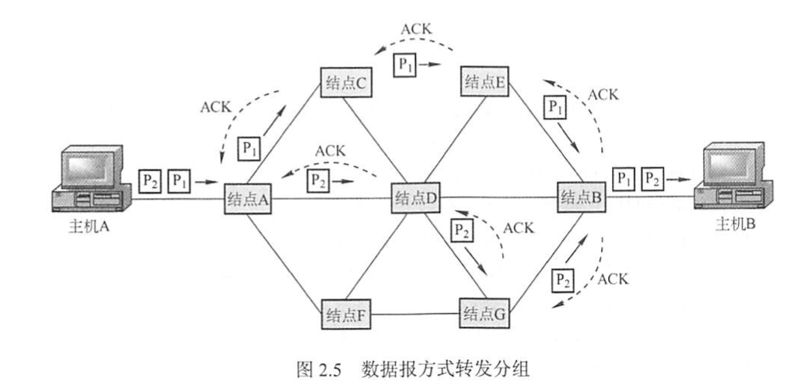

**3.2. 虚电路**（分组交换，面向连接）

- 结合**数据报方式**和**电路交换方式**
- 分组发送前双方建立逻辑上相连的虚电路，连接建立后虚电路物理路径固定
- 通信过程分为虚电路建立、数据传输、虚电路释放三个过程
- 原理
  - 建立逻辑通路：主机A发出**呼叫请求**分组，通过中间结点送往主机B，若B同意连接，则发送**呼叫应答**分组确认
  - 虚电路建立后，A可向B发送数据分组，B也可以向A发
  - 传送结束后A发送**释放请求**分组来拆除虚电路
- 特点
  - 虚电路通信链路的建立和拆除需要时间开销
  - 路由选择体现在连接建立阶段，建立后就确定了传输路径
  - 提供可靠的通信功能，确保每个分组正确**有序到达**，且可以进行**流量控制**
  - **致命弱点**：某个结点或链路出现故障，所有经过该结点或链路的虚电路都被破坏

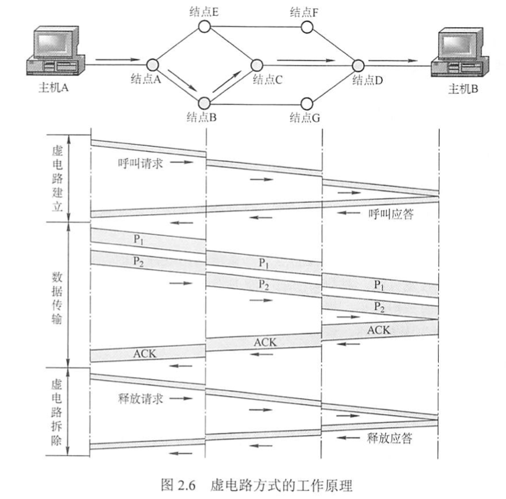

**3.3. 数据报服务和虚电路服务比较**

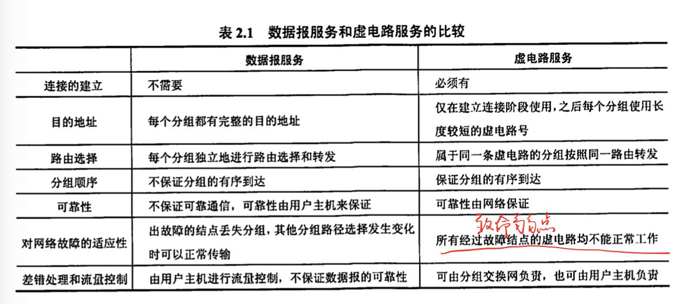

### 2.2 传输介质

这部分在物理层之下，可称为第0层，仅负责无脑传播信号，不能进行识别。

##### 2.2.1 有线与无线传输介质

- 导向传输介质：电磁波被导向沿着固定媒介传播（电车）
- 非导向传输介质：传输介质是空气、真空、海水等（飞机）

**1. 双绞线**（导向型）

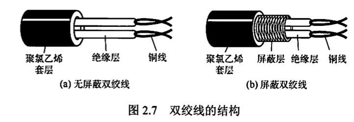

- 价格便宜，最常用
- 若距离太远，则对模拟传输用放大器放大衰减信号、对数字传输用中继器整形失真信号

**2. 同轴电缆**（导向型）

- 基带同轴电缆：传送基带数字信号，用于局域网
- 宽带同轴电缆：传送宽带数字信号，用于有线电视

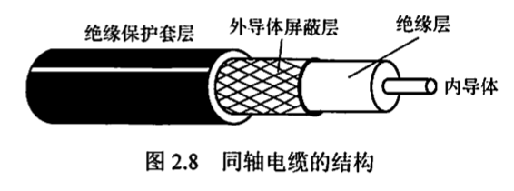

- 具有良好抗干扰特性
- 传输距离更远
- 价格比双绞线贵

**3. 光纤**（导向型）

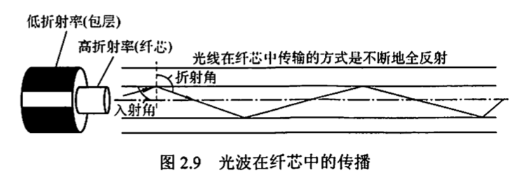

- 多模光纤：不同入射角的多条光线在一条光线中传输，适合近距离传输
- 单模光纤：直径只有一个光的波长，适合远距离传输
- 光纤特点
  - 通信容量很大
  - 传输损耗小
  - 抗干扰
  - 保密性好
  - 体积小重量轻

**4. 无线传输介质**（非导向型）

- 无线电波（向所有方向）
  - 穿透能力强
  - 可以传输很长距离
  - 广泛应用于通信领域
- 微波、红外线和激光（固定方向）

##### 2.2.2 物理层接口特性

- 机械特性
- 电气特性
- 功能特性
- 过程特性

# 第三章 数据链路层

# 第四章 网络层

# 第五章 传输层

# 第六章 应用层