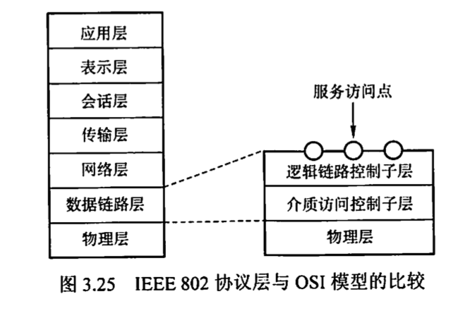

<h1>计算机网络笔记</h1>

[toc]

# 第三章 数据链路层

## 3.1 数据链路层的功能

- 对上：在物理层提供服务的基础上向网络层提供服务
- 对下：加强物理层传输原始比特流的功能，将物理层可能出错的物理连接改造为逻辑上无差错的数据链路

### 3.1.1 为网络层提供服务

数据链路层为网络层提供如下服务：

- **无确认的无连接服务**：发送数据帧不需要先建立链路连接，收到数据帧不需要发回确认。
  - 丢失的帧交给上层处理
  - 适合实时通信或误码率较低的通信信道，如**以太网**
- **有确认的无连接服务**：发送数据帧不需要先建立链路连接，收到数据帧需要发回确认。
  - 发送者规定时间内未收到确认信号，则重传丢失的帧
  - 适合误码率较高的通信信道，如**无线通信**
- **有确认的面向连接服务**：发送数据帧不需要先建立链路连接（传输过程三个阶段：建立数据链路、传输帧、释放数据链路），收到数据帧需要发回确认。
  - 适合于对通信要求较高（可靠性、实时性）的场合

⚠️：有连接必有确认，即不可能无确认的面向连接服务。

### 3.1.2 链路管理

- 链路管理：数据链路层连接的建立、维持和释放过程
  - 即有确认面向连接服务中传输过程三个阶段：建立数据链路、传输帧、释放数据链路

### 3.1.3 帧定界、帧同步与透明传输

- 组帧：两台主机传输信息，必须将网络层的分组封装成帧，以帧的格式传送。将一段数据前后添加首部和尾部（用来帧定界），即构成帧。
  - 如HDLC协议用标识符F（01111110）标识帧的开始结束
- 帧同步：接收方应能从接收到的比特流中区分出帧的起始和终止。
  - 例如后面的违规编码等方法等标识方法，接收方可以用一定方法去掉转义符、识别起始位置、还原原始数据
- 透明传输：不管数据的比特组合如何，都应该可以在链路上传送
  - 即转义掉数据中的标识符

### 3.1.4 流量控制

- 流量控制：限制发送方的数据流量，使之发送速率不超过接收方接收能力

### 3.1.5 差错控制

- 差错控制：用以使发送方确定接收方是否正确收到由其发送的数据的方法
- 自动重传请求（Automatic Repeat reQuest, ARQ）：接收方发现错误帧则丢弃，发送方超时重传

## 3.2 组帧

- 组帧过程：【IP数据报】$\stackrel{封装成帧}{\Rightarrow}$【「帧首部」「帧数据部分」「帧尾部」】
  - 帧长=数据部分长度+首部和尾部长度
- 组帧目的：出错时只需要重传错帧，不必重发全部数据
- 组帧主要解决三个问题
  - 帧定界（发送方加密）
  - 帧同步（接收方解密）
  - 透明传输（转义数据中的标识符，链路层看不见信息）

### 3.2.1 字符计数法

- 在帧头部使用一个计数字段来标明帧内字符数
- 问题：如果计数字段出错，则失去同步，完全错误

### 3.2.2 字符填充的首尾定界符法

- 用特定字符SOH和EOT定界一帧的开始和结束
- 若帧由非ASCII码文本文件组成，需要用ESC转义数据中的**SOH、EOT和ESC**
- 接收方收到数据后删除所有**用来转义的**ESC，实现帧同步和透明传输

### 3.2.3 零比特填充的首尾标志法

- 使用特定比特模式，如01111110标识帧的开始和结束
- 数据中每遇到5个连续的1，插入一个0；接收方每收到5个连续1，删除后面的0

### 3.2.4 违规编码法

- 物理层进行比特编码时，常用违规编码法
- 如曼彻斯特编码1为高-低，0为低-高，则高-高和低-低是违规的，借用这些编码定界帧
- 不需要填充即可实现透明传输，但只适合采用冗余编码的特殊编码环境

总结：**字节计数法**计数字段脆弱、**字符填充法**实现复杂和不兼容性，常采用**比特填充法**和**违规编码法**。

## 3.3 差错控制

- 差错
  - 位错（这节讨论）：0和1互变
  - 帧错
    - 丢失
    - 重复
    - 失序
- 差错控制
  - 自动重传请求ARQ
  - 前向纠错FEC

### 3.3.1 检错编码

**冗余编码技术**：在有效数据中添加冗余位，构成符合某一规则的码字。若有效数据变化，则冗余位也随之变化，使得码字遵从不变的规则。接收方根据码字是否符合原规则判断是否出错。

**1.奇偶校验码**

X校验码：n-1位信息元+1位校验元，使得码字有X数个1.

**2.循环冗余码**

### 3.3.2 纠错编码

海明码，TBD

## 3.4 流量控制与可靠传输机制

### 3.4.1 流量控制、可靠传输与滑动窗口机制

流量控制：对链路上帧的发送速率的控制，以使接收方有足够缓冲空间来接收每个帧。

**1.停止-等待流量控制基本原理**

- 发送方每发送一帧，都要等待接收方的应答信号，才能发送下一帧
- 接收方每接收一帧，都要反馈一个应答信号，表示可以接收下一帧
- 等价于$W_T=1,W_R=1$的滑动窗口机制，效率很低

**2.滑动窗口流量控制基本原理**

- 发送窗口$W_T$：任意时刻，发送方维持一组连续的允许发送的帧的序号
  - 发送端每收到一个确认帧，发送窗口向前滑动一帧
  - 发送窗口内没有可以发送的帧，停止发送，直到收到确认帧使窗口移动
- 接收窗口$W_R$：任意时刻，接收方维持一组连续的允许接收的帧的序号
  - 接收端收到数据帧后，接收窗口前移一帧，发回确认帧
  - 收到接收窗口之外的帧一律丢弃
- 滑动窗口重要特性：
  - 只有接收窗口滑动了（且发送了确认帧），发送窗口才可能滑动（收到确认帧后）
  - 用滑动窗口的视角看其他协议
    - 停止-等待协议：$W_T=1,W_R=1$
    - 后退N帧协议：$W_T>1,W_R=1$
    - 选择重传协议：$W_T>1,W_R>1$
  - $W_R=1$时，可以保证帧的有序接收
  - 数据链路层的滑动窗口协议中，在传输过程中**窗口大小固定**

**3.可靠传输机制**

- 数据链路层的可靠传输机制
  - **确认**：无数据的控制帧，使得接收方让发送方知道哪些内容被正确接收。
    - 捎带确认：为提高传输效率，将确认捎带在一个回复帧中
  - **超时重传**：发送方发送某个数据帧后开启计时器，一定时间内未收到确认帧则重新发送数据帧
- **自动重传请求**（Automatic Repeat reQuest, ARQ）：接收方请求发送方重传出错的数据帧来恢复出错的帧
  - 停止-等待（Stop-and -Wait）ARQ
  - 后退N帧（Go-Back-N）ARQ
  - 选择性重传（Selective Repeat）ARQ

### 3.4.2 单帧滑动窗口与停止-等待协议

停止-等待协议中，除了数据帧丢失还可能出现的差错：

- **1. 到达目的站的帧已经破坏**
  - 接收方利用差错检测检出后，将该帧丢弃
  - 发送方计时器到时未收到确认，再次发送同样的帧
- **2.数据帧正确而确认帧（ACK）被破坏**
  - 接收方收到正确数据帧而发送方没收到确认帧
  - 发送方重传已被接收的数据帧，接收方丢弃该帧，并重传确认帧
  - 发送的帧用0和1交替标识，确认帧用ACK0和ACK1交替标识（停等协议1bit编号足够）。**连续出现相同序号数据帧，说明进行了超时重传；连续出现相同序号确认帧，说明收到了重复帧**
- **3.ACK迟到**
  - 发送方重复发送，接收方丢弃收到的重复帧，发送方之后收到确认帧丢弃

>  例：
>
> 信道利用率$=\frac{L/C}{T}$
>
> L：T内发送L比特数据
>
> C：发送方数据传输率
>
> T：发送周期
>
> 当C=4kb/s，单向时延30ms，欲使利用率>80%，L至少为？
>
> $80\%=\frac{L/4}{L/4+2\times30ms}$
>
> L=960bit

### 3.4.3 多帧滑动窗口与后退N帧协议（GBN）

- 发送方可以连续发送帧，无须等收到上一个帧的ACK后才发送（因为$W_T>1$）；接收方可以连续收到好几个正确帧后才对最后一个帧发ACK来减小开销，表示该帧及之前的帧都正确收到。（**累计确认**）
- 接收方检测出信息帧时序，要求发送方重发最后一个正确接收的信息帧之后所有未被确认的帧
- **即：接收方只允许按顺序接收帧**（因为$W_R=1$）
- 若采用n比特对帧编号则$1≤W_T≤2^n-1$
- 优点：因连续发送数据提高了信道利用率
- 缺点：重传时必须把已经正确传输的数据帧重传，降低传送效率

### 3.4.4 单帧滑动窗口与选择重传协议（SR）

- 为解决GBN的缺点、提高信道利用率，可以只重传错误帧，需要增大接收窗口
- 每个发送缓冲区有一个计时器，超时重传；接收方认为帧出错时，发送否定帧NAK，要求发送方对指定帧重传
- 要求$W_T=W_R=2^{n-1}$，n是对帧编码比特数
- 可以避免重传正确接收的帧，但接收端需要**容量=窗口大小**的缓冲区

## 3.5 介质访问控制

- **介质访问控制（Medium Access Control, MAC）**：为使用介质的每个结点隔离来自同一信道其他结点传送的信号，以协调活动结点的传输。
- **介质访问控制子层**：用来决定广播信道中信道分配的协议属于数据链路层的一个子层
- MAC总览：

### 3.5.1 信道划分介质访问控制（静态划分信道）

- **多路复用技术**：传输介质带宽超过传输单个信号所需带宽时，通过在一条介质上同时携带多个传输信号的方法来提高传输系统利用率。
- **信道划分**：通过分时、分频、分码等方法把一条广播信道逻辑上分为几条用于两个结点之间通信的互不干扰子信道

**1. 频分多路复用FDM**

- FDM：将多路基带信号调制到不同频率载波上，再叠加形成一个复合信号
- 物理信道可用带宽大于单个原始信号所需带宽，则可以分成若干与传输单个信号带宽相同的子信道。实际应用中需要加入“保护频带”来防止子信道之间干扰，所以子信道略宽于单个原始信号带宽。
- 特点：系统效率较高，实现容易

**2. 时分多路复用TDM**

- 将一条物理信道按时间分成若干时间片，轮流给多个信号使用
- **统计时分多路复用STDM**：改进TDM，针对计算机数据的突发性，不固定分配时间片，按需动态分配，提高线路利用率

**3. 波分多路复用WDM**

- 即光的频分多路复用，在光纤中传输不同波长光信号

**4. 时分多路复用CDM**

- 采用不同编码来区分各路原始信号
- 既共享信道频率，又共享时间

- **码分多址（Code Division Multiple Access, CDMA）**：每个比特时间划分成m个时间槽（码片），每个站点被指派唯一一个m位码片序列。发送1时，发送其码片序列；发送0时，发送其码片序列反码。多个站点同时发送时，数据线性相加；分离时，因为要求**各个站点码片序列相互正交**，这样接收方用发送方的码片序列对数据进行规格化内积（点乘后归一化到1），即可得到发送的比特位。

例子：

### 3.5.2 随机访问介质访问控制（动态划分信道）

- **随机访问协议（争用型协议）**：所有用户根据自己意愿随机发送信息，占用全部信道
- 两个以上用户同时发送信息，则产生**碰撞**，所有用户的发送均失败
- 将广播信道转化为点到点信道

**1. ALOHA协议**（不听就说）

- **纯ALOHA协议**：任何结点要发送数据，不检测就发送；一段时间内未收到确认，则认为发生冲突，等待一段时间后再发送
  - 重传策略：各站等待一段随机事件再重传
  - 吞吐量很低
- **时隙ALOHA协议**：各站时间上同步，时间划分为等长时隙Slot，只能在每个时隙开始发送帧。
  - 避免了发送数据的随意性，减少了冲突概率
  - 重传策略和纯ALOHA相似
  - 吞吐量比纯ALOHA大1倍

**2. CSMA（载波侦听多路访问Carrier Sense Multiple Access, CSMA）协议**（先听再说）

- 1-坚持CSMA：
  -  **基本思想**：结点发送数据时，先侦听信道。若空闲则立即发送；若忙，则等待，同时侦听至信道空闲；若冲突，随机等待一段时间后重新侦听。
  - 1-坚持含义：侦听到忙，继续坚持侦听；侦听到空闲，发送帧的概率为1.
  - 传播延迟对1-坚持CSMA性能影响大，会发生多个结点等待信道空闲后同时发送数据导致冲突
- 非坚持CSMA：
  -  **基本思想**：结点发送数据时，先侦听信道。若空闲则立即发送；若忙，放弃侦听，随机等待一段时间后重复该过程。
  - 侦听到忙后放弃帧听，降低了多个结点等待信道空闲后同时发送数据导致冲突（传播延迟导致）的概率，但增加数据在网络中的平均延迟
- p-坚持CSMA：
  -  **基本思想**：结点发送数据时，先侦听信道。若忙持续侦听，直到空闲；若空闲，以p的概率发送数据，1-p推迟到下一个时隙再决定，下次决定依然如此。
  - **p的发送概率**是为了降低1-坚持CSMA协议多个结点检测到空闲后同时发送数据的冲突（传播延迟导致）；**坚持侦听**是为了克服非CSMA中随机等到造成的延迟时间长。

**3. CSMA/CD（/碰撞检测，Collision Detection）协议**（先听再说，边听边说）

- 对CSMA的改进，适合于总线型网络或半双工网络
- 载波侦听：发送前先侦听，忙则暂时不发送，等待空闲发送
- 碰撞检测：边发送边侦听，判断自己发送时其他站点是否也在发送。若检测到碰撞，则中止发送数据，发送一个拥塞信号，让所有用户知道。中止发送后适配器执行**指数退避算法**（如下），等待一段随机时间后继续侦听。
  - $基本退避时间=2\tau$
  - $k=min[重传次数,10]$
  - 从$[0,1,...,2^k-1]$中随机取出一个数r，重传所需退避时间就是$r$倍的基本退避时间$2r\tau$
  - 重传达到16次仍不能成功，说明网络太拥挤，应报错
- A发送后最多经过$2\tau$（争用期、碰撞窗口）就能知道是否碰撞。为保证发送的同时能检测碰撞，需要发送完帧之前就收到发送的数据，即帧的传输时延要至少2倍于在总线中的传播时延。长度小于最小帧长的帧都是因冲突而中止的无效帧；前最小帧长这么多数据未冲突，表明抢占信道成功，后续也不会冲突。
  - $最小帧长=总线传播时延\times数据传播时延\times2$

**4. CSMA/CA协议**（发送前广播让其他人不发送）

- 无线局域网环境下不能简单搬用CSMA/CD，因为碰撞检测困难：
  - 接收信号强度远小于发送信号，碰撞检测硬件花费大
  - 无线通信中不是所有站点都能听见对方，存在“隐蔽站”
- 为尽量避免碰撞，发送后要等待一段时间（**帧间间隔，InterFrame Space，IFS**）才能发送下一帧
  - **SIFT短IFS**
  - **PIFS点协调IFS**
  - **DIFS分布式协调IFS**
- 算法归纳
  - 最初要发送数据，且检测到空闲，则等待DIFS后发送帧个数据帧
  - 否则，执行CSMA/CA退避算法（和CSMA/CD稍不同）。检测到信道忙，退避计时器不变，信道空闲则倒计时
  - 退避计时器到0时（信道必空闲），站点发送整个帧
  - 若收到确认，则从第二步开始发送第二帧；若规定时间内未收到ACK，则重传该帧
- 隐蔽站处理：RTS和CTS
  - 发送站对信道预约：发送前广播一个很短的请求发送（RTS，Request To Send）控制帧，包括源地址、目的地址、通信持续时间
  - 若空闲，AP广播一个允许发送（Clear To Send，CTS）控制帧，包括通信持续时间
  - 其他站听到CTS后在该时间段内抑制发送

### 3.5.3 轮询访问：令牌传递协议（动态划分信道）

- **轮询访问**：用户不能随机发送信息，需要通过集中控制的监控站，循环轮询每个结点，再决定信道分配。
- **令牌传递协议**：一个令牌Token（一个特殊MAC控制帧）沿着环形总线在计算机间传递。收到令牌便可以启动发送帧（包含目的站点地址），发送后释放令牌，令牌依次按顺序传递。
- 传递过程：
  - 网络空闲，环路中令牌帧循环传递
  - 令牌传递到有数据要发送的站点，则站点修改令牌中的一个标志位，并附加需要传输的数据，令牌变为数据帧发送出去
  - 数据帧沿着环路传输，目的地址的接收站复制该数据帧进一步处理
  - 数据帧达到源站点，不再转发，通过校验返回的帧来查看传输过程中是否出错，有错则重传
  - 源站点传送完数据后重新产生令牌，传递给下一个站点来交出信道控制权
- 传输介质物理拓扑不一定是环，但令牌在设备间的传递通路逻辑上是环
- 适合负载很高的广播信道，因为不会产生冲突

## 3.6 局域网

### 3.6.1 局域网的基本概念和体系结构

- **局域网（Local Area Network, LAN）**：在一个较小地理范围内，将各种计算机、外部设备和数据库系统等通过双绞线、同轴电缆等连接介质互相连接起来，组成资源和信息共享的计算机互联网络
- 三个要素决定局域网特性：拓扑结构、传输介质、介质访问控制方式（最重要）
- **拓扑结构**：星形结构、环形结构、总线形结构、星形和总线形复合结构（树形拓扑）
- **传输介质**：双绞线（主流）、铜缆、光纤
- **介质访问控制方法**：CSMA/CD、令牌总线、令牌环（前两种总线形，后一种环形）
- 三种特殊的局域网拓扑实现
  - 以太网（适用范围最广的局域网）：逻辑总线，物理星形/拓展星形
  - 令牌环（Token Ring，IEEE 802.5）：逻辑环形，物理星形
  - FDDI（光纤分布数字接口，IEEE 802.8）：逻辑环形，物理双环

### 3.6.2 以太网与IEEE 802.3

- IEEE 802.3：基带总线形局域网标准
- 以太网逻辑上采用总线形拓扑
- 两个简化措施
  - 采用无连接，尽最大努力交付数据，提供不可靠服务
  - 使用曼彻斯特编码

**1.以太网的传输介质与网卡**

- 网卡：网络接口板（网络适配器Adapter、网络接口卡Network Interface Card， NIC）
- 介质访问控制（MAC）地址：网卡的一个唯一代码

**2.以太网的MAC帧**

**3.高速以太网**

超过100Mb/s的以太网。

- 100BASE-T以太网
  - 双绞线上传送100Mb/s基带信号的星形拓扑结构以太网
  - 半双工下CSMA/CD协议，全双工无冲突
  - 既支持全双工，又支持半双工
  - MAC帧是802.3标准
- 吉比特以太网
  - 1Gb/s下用全双工和半双工
  - 半双工下CSMA/CD协议，全双工无冲突
- 10吉比特以太网
  - 使用光纤
  - 只在全双工

### 3.6.3 IEEE 802.11 无线局域网

TBD

### 3.6.4 VLAN基本概念与基本原理

TBD

## 3.7 广域网

### 3.7.1 广域网的基本概念

- 广域网：覆盖范围很广的长距离网络，是因特网的核心部分
- 局域网可以通过广域网与另一个相隔很远的局域网通信

- 广域网组成
  - 结点交换机：将分组存储转发
  - 连接交换机的链路

- 广域网数据链路层协议
  - PPP协议（使用广泛）
  - HDLC协议（很少使用）

### 3.7.2 PPP协议

- **PPP（Point-to-Point Protocol）**使用串行线路通信的面向字节的协议，应用在直接连接两个结点的链路上
- 组成部分
  - 链路控制协议LCP：
  - 网络控制协议NCP：
  - 一个将IP数据报封装到串行链路的方法
- PPP帧格式
  - 标志字段F：7E（01111110），前后各1字节，在信息字段中出现需要用控制转义字节7D（01111101）填充
  - 地址字段A：0x FF
  - 控制字段C：0x03
  - 协议段：2字节，说明信息段运载什么种类的分组
  - 信息段：0～1500B，需要对标志字段转义
  - 帧检验序列FCS：2字节，即循环冗余码CRC的冗余码，检验的字段有A、C、协议、信息。

### 3.7.3 HDLC协议