
<h1>计算机网络笔记</h1>

[toc]

# 第四章 网络层

## 4.1 网络层的功能

- **传输单位**：数据报
- **功能概述**：把分组从源端传到目的端，为分组交换网上的不同主机提供通信服务

### 4.1.1 异构网络互联

- **异构网络**：全球的网络有不同寻址方案、网络接入机制、差错处理、路由选择机制等

- **网络互联**：将两个以上计算机网络通过一定方法，用一些中间设备（**中继系统**）相互连接起来，构成更大的网络系统
  - **中继系统**按层次划分
    - 物理层中继系统：转发器，集线器
    - 数据链路层中继系统：网桥、交换机
    - 网络层中继系统：**路由器**（一台专用计算机，用于在互联网中进行路由选择）
    - 网络层以上的中继系统：网关
  
  - 物理层和数据链路层的中继系统只是扩大了网络，在网络层的视角看仍然是同一个网络，不称为网络互联；**网络互联通常是用路由器进行网络互联和路由选择**。
  
- TCP/IP体系在网络互联上是网络层采用标准化协议，但相互连接的网络可以异构。网络通过路由器互联，使用相同IP协议，因此可以把互联后网络视为一个虚拟IP网络。

  - **IP网络**：虚拟互联网络、逻辑互联网络，互联的各种物理网络的异构行客观存在，在通过IP协议使这些性能各异的网络在网络层看来像一个统一的网络。
  - IP网络好处：互联网上的主机通信时就像在单个网络上，看不见各网络的异构性

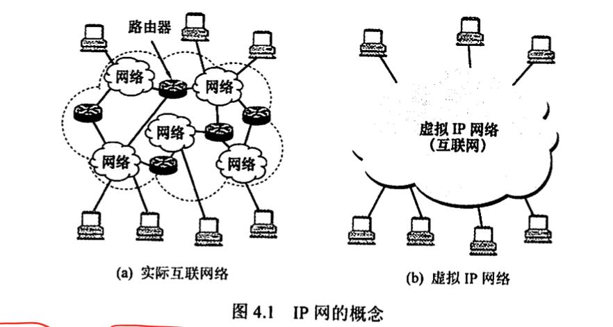

### 4.1.2 路由与转发

- 路由器的功能
  - **路由选择**（宏观）：按照分布式算法，根据从各相邻路由器得到的关于整个网络拓扑结构的变化情况，动态改变选择的路由。（得到路由表）
  - **分组转发**（微观）：根据转发表（从路由表得出）将用户的IP数据报从合适的端口转发出去。

### 4.1.3 SDN的基本概念

- 根据网络层的主要任务抽象地划分层面
  - **数据层面（转发层面）**：实现转发功能
  - **控制层面**：实现路由选择功能
- **软件定义网络SDN（Software Defined Networking）**
  - **采用集中式的控制层面和分布式的数据层面，两个层面相互分离**
  - 控制层面利用控制-数据接口对数据层面上的路由器集中式控制，方便软件来控制网络
  - 远程控制器掌握各主机和整个网络状态，计算最佳路由，通过Openflow协议将转发表下发给路由器
  - 路由器的功能只剩下收到分组、查找转发表、转发分组

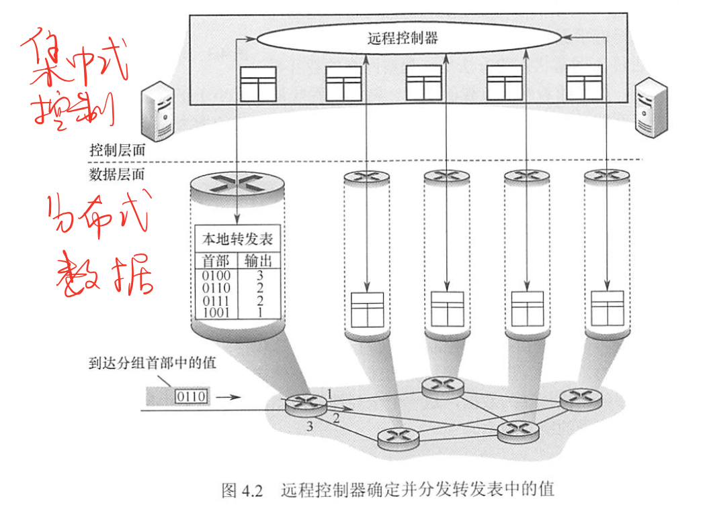

- SDN对上层提供的编程接口为**北向接口**，提供API让开发者设计应用而不必关心底层细节
- SDN控制器和转发设备建立双向会话的接口为**南向接口**

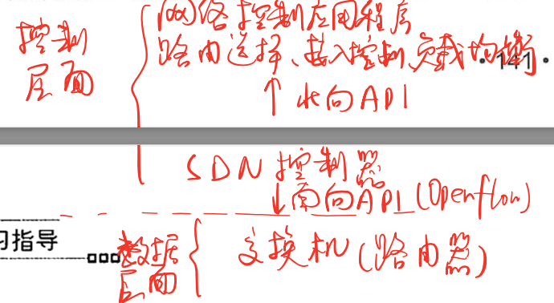

- 优点：利于控制层面全局优化，利于高性能网络转发，灵活可编程与性能平衡，降低成本
- 缺点：安全风险，瓶颈问题

### 4.1.4 拥塞控制

- **拥塞**：出现过量分组引起网络性能下降。链路带宽被充分利用，平均时延急剧增加，且大量分组被丢弃，网络吞吐量骤降

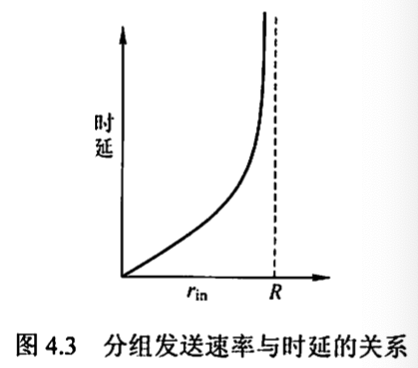

- 判断网络是否进入拥塞状态，观察随着网络负载增加，网络吞吐量变化情况：
  - 明显小于正常吞吐量，进入轻度拥塞状态
  - 下降，已经进入拥塞状态
  - 下降到0，已经进入死锁状态

- 拥塞控制方法
  - **开环控制（静态）**：设计网络事先将有关发生拥塞的因素考虑周期，尽量在工作时不产生拥塞。
  - **闭环控制（动态）**：事先不考虑拥塞的各种因素，采用检测网络系统、及时检测拥塞发生，将拥塞信息传到合适地方，调整网络系统运行，并解决问题。
- 和流量控制区别
  - 流量控制：抑制发送端发送数据的速率，使得接收端来得及接收
  - 拥塞控制：确保通信子网能传送待传送的数据，是全局性问题，涉及网络中所有主机、路由器和导致网络传输能力下降的所有因素

## 4.2 路由算法

### 4.2.1 静态路由与动态路由

- **路由表**：通过各种算法得到，实现转发分组。
- 路由算法分类
  - **静态路由算法**：网络管理员手工配置路由信息，网络拓扑结构或链路状态变化时需要手工修改静态路由信息，不能适应网络状态变化。
    - 简便，开销小，适合拓扑变化不大的小网络
  - **动态路由算法**：路由器的路由表项通过相互连接的路由器之间彼此交换信息，按照一定算法优化出来，路由信息在一定时间内不断更新，适应不断变化的网络
    - 算法复杂，增加网络负担，有时对动态变化反应太快引起振荡，或反应太慢影响网络路由一致性
    - **距离-向量路由算法和链路状态路由算法都是动态路由算法**

### 4.2.2 距离-向量路由算法

> 分散性：只掌握物理相连的邻居

- **发送**：所有结点定期将整个路由选择表传送给所有与之直接相邻的结点。路由选择表包括：
  - 每条路径**目的地**（结点）
  - **路径代价**（抽象概念）
- **接收**：所有结点监听从其他结点传来的路由选择更新信息：
  - **加入新路由**：被告知一条新路由，且在本结点路由表中不存在，则本地加入该新路由
  - **更新最短路径**：发来的路由信息有一条到达某目的地路由与当前使用的路由比，代价更小，则用经过该发送路由信息的结点的新路由代替现有路由
- 更新报文大小正比于通信子网结点个数，在通信子网上传送的路由选择信息容易很大
- 常见算法：**RIP算法**

### 4.2.3 链路状态路由算法

> 全局性：掌握完整网络拓扑结构和链路费用信息

- 每个结点具有完全的网络拓扑信息，执行两个任务：
  - 主动测试所有邻接结点状态
  - 定期将链路状态传播给所有其他结点

- 一个结点检查所有直接链路的状态，并将所得状态信息发送给网上所有其他结点。链路状态报文到达时，结点使用这些状态信息更新自己的网络拓扑和状态视野图，链路状态变化时结点对更新的网络图用Dijkstra算法重新计算路由，求从单一源出发到所有目的结点的最短路径。
- 特征
  - 向本自治系统中所有路由器发送信息
  - 发送的信息是与路由器相邻的所有路由器的链路状态
  - 只有链路状态变化时才向所有路由器发送信息

- 对比
  - 距离-向量路由算法每个结点只和直接邻居交谈，提供从自己到网络所有其他结点最低费用估计
  - 链路状态路由算法每个结点通过广播方式与所有其他结点交谈，但仅告诉它们与它直接相连的链路费用。

### 4.2.4 层次路由

- 网络规模增大，路由表成比例增大，消耗更多路由器缓冲区空间、CPI时间、带宽等。因此需要按照层次方式进行路由选择。

- 因特网将整个互联网划分为许多较小自治系统，每个自治系统有权自主决定本系统采用何种路由选择协议，因此需要自治系统之间的协议来屏蔽这些差异。
- 路由选择协议
  - **内部网关协议IGP**：一个自治系统内部所使用的路由协议
  - **外部网关协议EGP**：自治系统之间使用的路由协议

## 4.3 IPv4

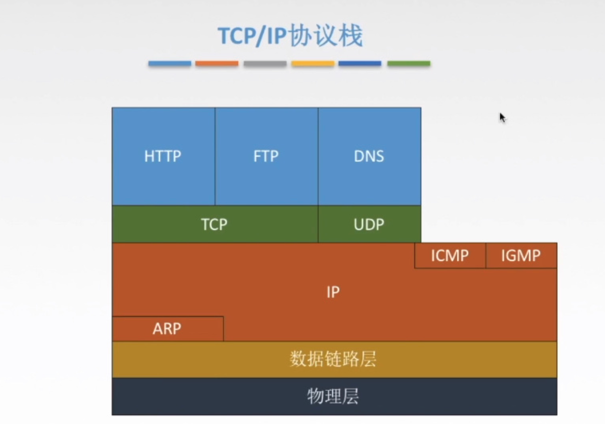

### 4.3.1 IPv4分组

**1.IPv4分组格式**

- IP分组=首部+数据部分，首部固定部分20B，所有IP分组必须有
- 版本：IP协议版本，IPv4/IPv6，目前广泛使用4
- 首部长度：4位，最小5、最大15，**单位32位（4B）**，最常用为20B，即没有可变部分
- 总长度：16位，首部+数据长度之和，**单位字节B**，最大65535B，实际达不到，以太网最大传送单元MTU为1500B，所以IP数据包封装成帧时数据包总长度不能超过下面数据链路层的MTU
- 标识：16位，计数器，每个新数据报+1，分片时每个数据报片的标识号相同
- 标志：3位，只有2位有意义，最低位MF（more fragments）=1表示后面还有分片，MF=0表示是最后一个分片；中间一位DF（don't fragment）=0时才允许分片
- 片偏移：13位，分片后该片在原分组中的相对位置，**单位8B**，因此除了最后一个分片的长度都是8B整数倍
- 生存时间（Time To Live， TTL）：8位，数据报在网络中可通过路由器数最大值，路由器每次转发TTL减1，TTL=0分组丢弃
- 协议：8位，分组数据使用何种协议，6表示TCP，17表示UDP
- 首部校验和：16位
- 源地址：4B，发送方IP地址
- 目的地址：4B，接收方IP地址

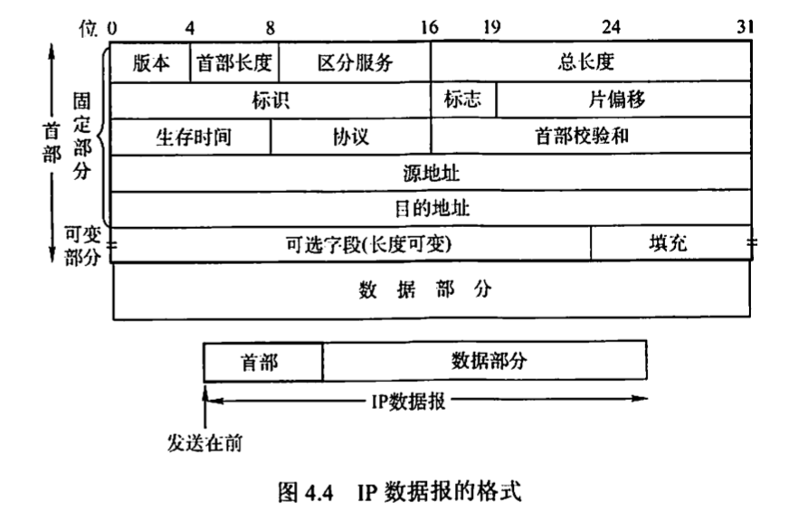

**2.IP数据报分片**

涉及的IP数据报首部字段：标识、标志、片偏移

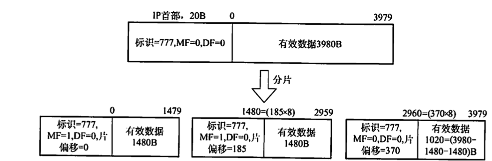

### 4.3.2 IPv4地址与NAT

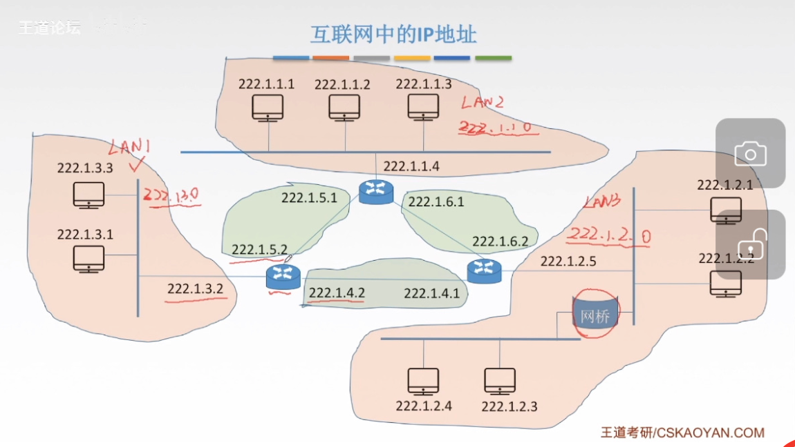

**1.IPv4地址**

- **IP地址**：连接到因特网上每台主机或路由器分配的32bit全球唯一标识符
- IP地址::={<网络号>, <主机号>}
  - 网络号标志主机或路由器连接到的网络，在整个因特网内唯一
  - 主机号标志该主机或路由器，在本网络内唯一

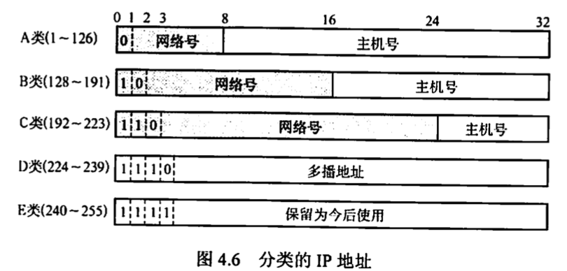

- 有些IP地址有特殊用途，不作主机IP地址

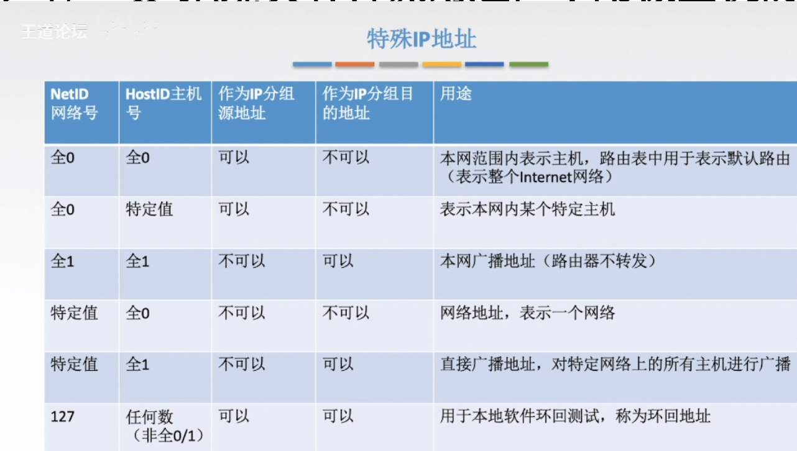

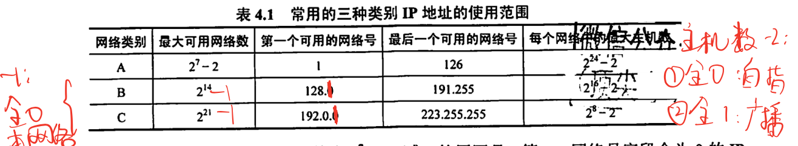

- IP地址特点
  - IP地址是分等级的地址结构，好处：
    - IP地址管理机构只分配网络号，主机号网络自行分配，方便IP地址管理
    - 路由器只根据网络号转发分组，不考虑主机号，减小了路由表存储空间
  - IP地址是标志一台主机或路由器和一条链路的接口，路由器至少有两个IP地址（每个端口至少一个）
  - 转发器或桥接器连接的LAN仍是同一个网络，LAN中所有主机IP的网络号相同
  - IP地址中分配到网络号的网络无论LAN还是WAN都是平等的

**2.网络地址转换NAT**

- 网络地址转换NAT：通过将专用网络地址转换为公用地址，对外隐藏内部管理的IP地址。使得整个专用网只需要一个IP地址就可以与因特网连接，节省了IP地址消耗

- 私有IP地址：划出的部分IP地址，只用于LAN，不用于WAN连接，必须通过网关利用NAT把私有IP地址转为合法全球IP地址才能用于Internet。允许私有IP地址被LAN重复使用。

  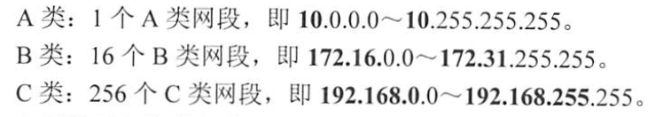

- NAT路由器至少有一个有效的外部全球IP地址，NAT转换表存放{本地IP地址：端口}到{全球IP地址：端口}的映射，这样让多个私有IP地址映射到一个全球IP地址

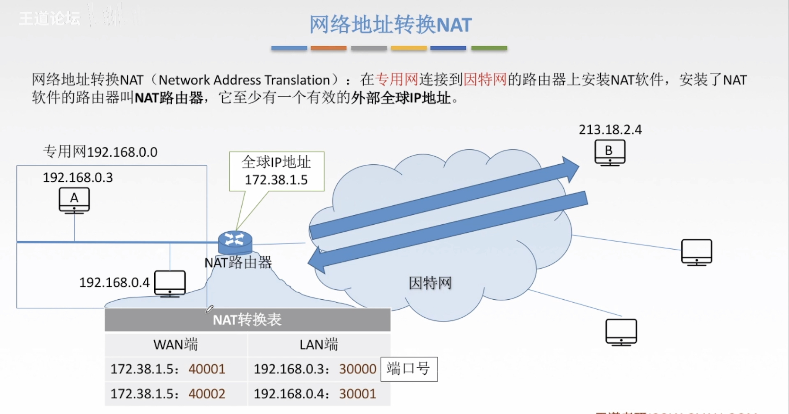

### 4.3.3 子网划分与子网掩码、CIDR

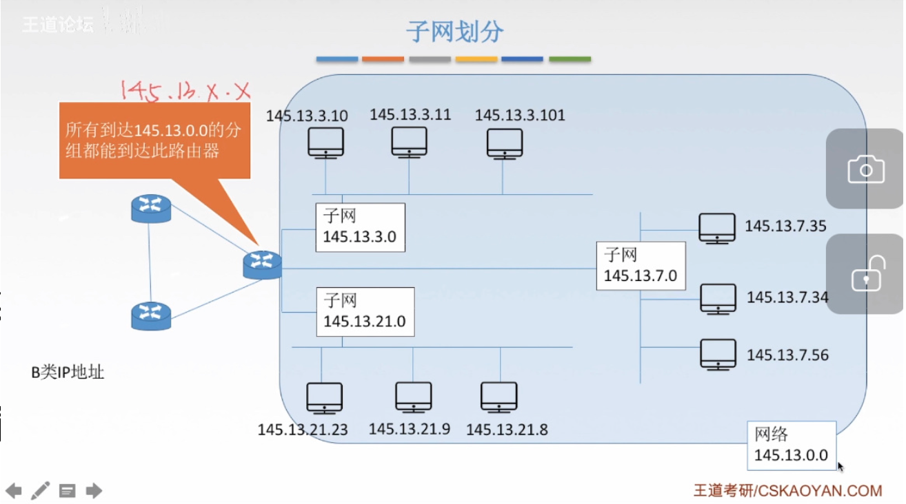

**1.子网划分**

- 两级IP地址缺点：
  - IP地址空间利用率低
  - 给每个物理网络分配一个网络号使得路由表太大而降低网络性能
  - 不够灵活
- **三级IP地址**：在两级IP地址中增加一个**子网号字段**
- 子网划分基本思想
  - 子网划分是**单位内部**的事，单位对外表现为没有划分子网的网络
  - 从主机号借用若干位作为子网号，三级IP地址结构：**IP地址={<网络号>，<子网号>，<主机号>}**
    - 只把IP地址主机号部分再次划分，不改变原网络号
    - 因此从IP地址本身或IP数据报首部无法判断是否进行了子网划分
    - 主机号全0的地址为**子网的网络号**，主机号全1的地址为子网的**广播地址**
  - 其他网络向本单位某主机发送IP数据报，先根据IP数据报的目的网络号找到**连接本单位网络的路由器**，然后路由器按目的网络号和子网号找到**目的子网**，最后把IP数据报直接交付给**目的主机**。

**2.子网掩码**

- 目的：表达原网络中主机号的借位，指示网络号+子网号的位数
- 形式：与IP地址对应的、长32bit的二进制串，前面若干位1、后面全是0，1对应IP地址中的网络号和子网号，0对应主机号。
  - IP地址和子网掩码**按位与**即得到子网网络地址
  - 所有网络必须使用子网掩码，未划分子网则使用默认子网掩码，A、B、C类地址分别是255.0.0.0、255.255.0.0、255.255.255.0
  - 路由器交换路由信息时必须把自己所在网络的子网掩码告诉对方
- 使用子网掩码的情况
  - 主机设置IP地址信息时必须设置子网掩码
  - 同属一个子网的所有主机和路由器相应端口必须设置相同子网掩码
  - 路由器的路由表要包含子网掩码

**3.无分类编址CIDR**

- 定义：在变长子网掩码基础上提出的消除传统A、B、C类网络划分、且可以在软件支持下实现**超网构造**的IP地址划分方法
- CIDR使用**网络前缀**代替子网络的概念，其位数不固定，记法：**IP={<网络前缀>，<主机号>}**。
  - 斜线记法：**IP地址/网络前缀所占位数**（后者相当于子网掩码中的1）
  - 全0和全1主机号地址一般不用
- **CIDR地址块**：网络前缀都相同的连续IP地址
  - 分配到一个CIDR地址块的组织仍可以继续划分子网，如分配到地址块/20，再从主机号借3位、划分8个子网，这样网络前缀就是23位
  - 一个CIDR地址块可以表示很多地址，其聚合称为**路由聚合**或**构成超网**。如图，网络1和网络2前16位相同，则可以构成更大的地址块206.1.0.0/16，到两个网络的路由可以聚合成一条。
  - CIDR地址块中地址数为$2^N-2$，N为主机号位数，主机号全0表示网络号，全1表示广播地址。

- 最长前缀匹配
  - 路由表表项=网络前缀+下一跳地址，查找路由表可能不止一个匹配结果。**应该选择具有最长网络前缀的路由**，这样其地址块越小，路由越具体。
  - 例：
    - 树结构：A为根结点，B、C为叶子
    - A掩码长度最短，B、C更长
    - 目的地址X的数据报，查找路由表时，先用A掩码&X，结果与A的CIDR匹配，但还需要看B、C的
    - B掩码&X与B的CIDR匹配；C掩码&X与C的CIDR不匹配
    - 因此要选B
- CIDR查找路由表方法：为更有效查找最长前缀匹配，将路由表存放在层次式数据结构中，自上而下按层次查找。常用二叉线索。

**4.网络层转发分组的过程**

- 分组转发都是基于目的主机所在的网络，因为网络数远小于主机数，这样可以压缩转发表大小
  - 转发表中每条路由：（目的网络，下一跳地址）
- 转发表中两种特殊路由
  - **主机路由**：对特定目的主机的IP地址专门指明的路由，方便控制和测试网络。对应项的目的网络是a.b.c.d/32，32位子网掩码没有意义，表示特殊的主机路由。
  - **默认路由**：特殊前缀0.0.0.0/0表示，全0掩码和任何目的地址&都全是0，和其IP地址匹配。只要目的网络是不在转发表中的其他网络就用默认路由。
- 路由器执行的分组转发算法
  - 从收到的IP分组首部提取目的主机IP地址（**目的地址**）
  - 若查找到特定**主机路由**，则按该路由的下一跳转发分组；否则从转发表（按前缀长度排序）下一条开始检查
  - 将该行子网掩码和目的地址按位与，若与该行前缀匹配，则查找到，按下一跳处理（直接交付目的主机或通过指定接口发送到下一跳路由器）。否则，对下一行检查。
  - 若转发表有一个**默认路由**，则把分组传送给默认路由；否则报告转发分组出错
- 转发表不指明到某个网络的完整路径，而是通过一步步到达下一跳路由器，最后到达目的网络。

### 4.3.4 ARP、DHCP与ICMP

**1.IP地址与硬件地址**

- **IP地址**：网络层使用的地址，**分层次等级**
  - 网络层及网络层之上使用IP地址，IP地址放在**IP数据报首部**
  - 互联的网络硬件地址体系各不相同，但IP层 抽象的互联网屏蔽了这些复杂细节
- **硬件地址（MAC地址）**：数据链路层使用的地址，**平面式**
  - MAC地址放在**MAC帧首部**
  - IP数据报分组封装为MAC帧后数据链路层看不见IP地址
- 网络层使用IP地址寻址
  - 每个路由器依据其路由表选择到目标网络（主机号全0的地址）需要转发到的下一跳
  - IP分组到达目标网络后，在目标LAN中通过数据链路层的MAC地址以广播方式寻找

**2.地址解析协议ARP**

- **地址解析协议（Address Resolution Protocol，ARP）**：完成IP地址到MAC地址的映射
  - 用于解决**同一个局域网上**主机或路由器IP地址和MAC地址的映射问题。如果不在同一个局域网，ARP把分组发送给路由器，让路由器转发给下一个网络。
  - 由于看到了IP地址，所以**工作在网络层**
- **ARP高速缓存**：存放本局域网上各主机和路由器的IP地址到MAC地址的映射表，简称**ARP表**，使用ARP动态维护
- ARP工作原理
  - 主机A向局域网上某台主机B发送IP数据报，先在其ARP表中查找有无主机B的IP地址
  - 如果有，查出其硬件地址，将其写入MAC帧，通过局域网将MAC帧发送到该硬件地址
  - 如果没有，通过使用目的MAC地址为FF-FF-FF-FF-FF-FF的帧封装并**广播**ARP请求分组
  - 主机B收到该ARP请求后，向主机A**单播**发送ARP响应分组，包含主机B的IP和MAC地址映射关系
  - 主机A收到ARP响应分组后将此映射写入ARP表，然后按其MAC地址发送MAC帧

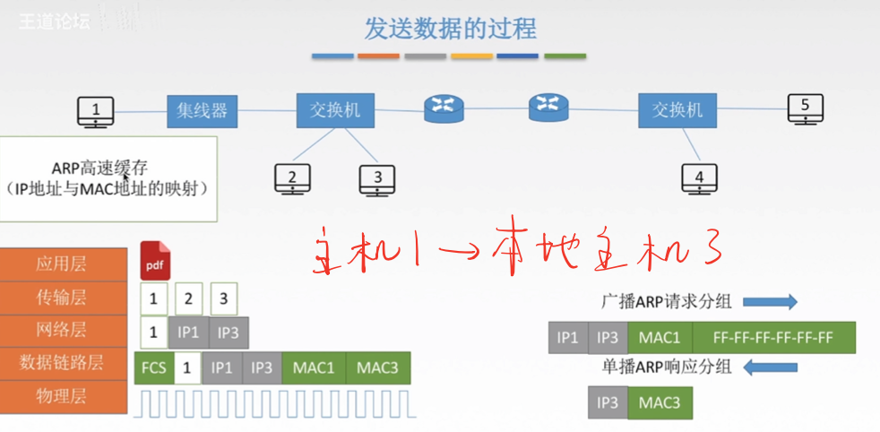

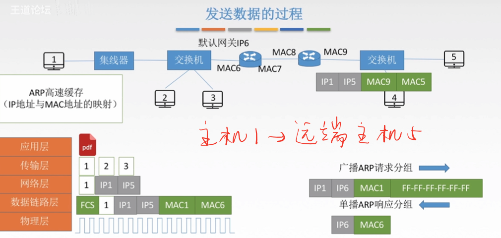

- 使用ARP的4种典型情况（H是主机Host，R是路由器Router，要发送IP数据报）
  - **主机->本地主机**：H1发给H2，则H1在网1用ARP找到H2的MAC地址
  - **主机->路由**：H1发给H3，则H1用ARP找到与网1连接的R1的MAC地址，剩下工作由R1完成
  - **路由->主机**：R1发给H3，则R1在网2使用ARP找到H3的MAC地址
  - **路由->路由**：R1发给H4，则R1在网2使用ARP找到与网2连接的R2的MAC地址，剩下工作由R2完成

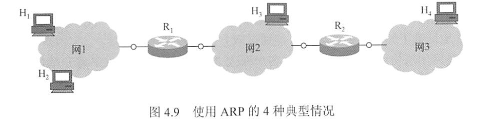

**3.动态主机配置协议DHCP**

- 静态配置：如学校机房给每个主机固定IP地址
- **动态主机配置协议（Dynamic Host Configuration Protocol，DHCP）**：给主机动态分配IP地址
  - DHCP是**应用层**协议，基于**UDP**（因为DHCP的服务器和客户端用广播形式交互，过程中客户端没有分配IP地址，TCP需要IP地址来建立连接）
- 工作原理：使用C/S模式
  - 需要IP地址的主机启动时向DHCP服务器**广播**发送**发现报文**，此时该主机成为DHCP客户
    - 本地网络所有主机都能收到广播报文，但只有DHCP服务器能回答
  - DHCP服务器先在数据库中找该计算机配置信息
    - 找到，则返回找到的信息
    - 找不到，则从服务器的IP地址池取一个地址分配
    - DHCP的回答称为**提供报文**
- DHCP服务器和客户端交换过程（客户端和服务器前的「DHCP」省略）
  - 客户端广播DHCP**发现消息**，来找到网络中的服务器
    - 源地址0.0.0.0，目的地址255.255.255.255
  - 服务器**（多个）**收到DHCP发现消息，广播DHCP**提供消息**，包括提供给客户端的IP地址
    - 源地址服务器地址，目的地址255.255.255.255
  - 客户端收到DHCP提供消息，如果接收该IP地址（接收最先到达的服务器提供消息），广播DHCP**请求消息**向服务器请求提供IP地址
    - 源地址0.0.0.0，目的地址255.255.255.255
  - 服务器广播DHCP**确认消息**，将IP地址分配给客户端
    - 源地址服务器地址，目的地址255.255.255.255

**4.网际控制报文协议ICMP**

- **网际控制报文协议（Internet Control Message Protocol，ICMP）**：为提高IP数据报交付成功机会，让主机或路由器报告差错和异常情况
  - 是IP层协议
- ICMP两种类型
  - ICMP差错报告报文
  - ICMP询问报文
- **ICMP差错报告报文**：目标主机或到目标主机路径上的路由器向源主机报告差错和异常情况，5种类型：
  - 终点不可达
  - 源点抑制
  - 时间超过
  - 参数问题
  - 改变路由（重定向）
- 不应发送ICMP差错报告报文的情况：
  - 对ICMP差错报告报文
  - 对第一个分片的数据报片的所有后续数据报片
  - 对具有组播地址的数据报
  - 对具有特殊地址的数据报
- ICMP询问报文4种类型
  - 回送请求和回答报文
  - 时间戳请求和回答报文
  - 地址掩码请求和和回答报文
  - 路由器询问和通告报文

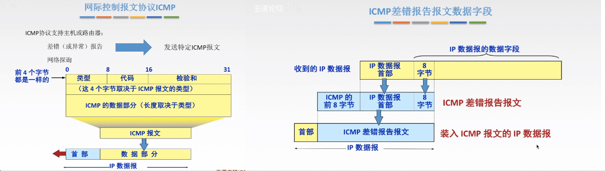

## 4.4 IPv6

### 4.4.1 IPv6主要特点

- 解决IP地址耗尽问题措施
  - 用无类别编制CIDR让IP地址分配更合理
  - 用网络地址转换NAT节省IP分配
  - 用更大地址空间的IPv6（治本）
- IPv6特点：
  - 更大地址空间：IPv4 32位，IP46 128位
  - 扩展的地址层次结构
  - 灵活的首部格式（扩展首部）
  - 即插即用（自动配置）
  - 首部长度必须是8B整数倍（IPv4是4B整数倍）

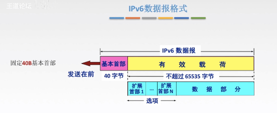

### 4.4.2 IPv6地址

- IPv6数据报的目的地址类型：
  - 单播：传统点对点通信
  - 多播：一对多，分组被交付到一组计算机
  - 任播：IPv6增加的，目的站是一组计算机，但交付时只交付距离最近的一台
- IPv6地址表示法
  - 每4位用1个十六进制数表示，冒号分隔每16位
    - 4BF5:0000:0000:0000:BA5F:039A:000A:2176
  - 冒号分隔的16位以0开头，则0可以省略，全为0则只写一个0
    - 4BF5:0:0:0:BA5F:39A:A:2176
  - 多个全0的16位可以用双冒号::缩写，但只能出现一次
    - 4BF5::BA5F:39A:A:2176

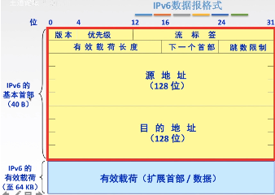

## 4.5 路由协议

### 4.5.1 自治系统

- 自治系统（Autonomous System，AS）：单一技术管理下的一组路由器，使用一种AS内部的路由选择协议和共同的度量来确定分组在该AS内的路由。

- 一个AS内的所有网络由一个行政单位管辖，一个AS内所有路由器必须连通

### 4.5.2 域内路由与域间路由

- **域内路由选择**：AS内部的路由选择
- **域间路由选择**：AS之间的路由选择

**1.内部网关协议（Interior Gateway Protocol，IGP）**

在一个AS内部使用的路由选择协议，如RIP和OSPF。

**2.外部网关协议（External Gateway Protocol，EGP）**

将路由选择信息传递到另一个AS中，如BGP-4。

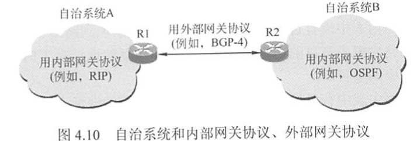

### 4.5.3 路由信息协议RIP

- 路由信息协议（Routing Information Protocol，RIP），IGP中广泛应用的协议
- 分布式的**基于距离向量算法**的**路由选择协议**
- **应用层协议**，使用**UDP**传送数据

**1.RIP规定**

- 每个路由器维护它自身**到其他每个目的网络的距离记录（距离向量）**
- **距离：跳数**Hot Count，从一个路由器到直接连接网络的距离为1，经过1个路由器+1
- RIP优先选择跳数少的路径
- RIP允许一条路径最多包含15个路由器，最多15跳。距离=16表示网络不可达
  - 防止数据报在环路上循环
  - 因此RI P只适合小型互联网
- 两个RIP的路由器30s广播一次RIP路由更新信息，来自动建立并维护路由表

**2.RIP特点**

- 只和**相邻路由器**交换信息
- 交换的信息是当前路由器所知道的**全部信息**，即自己的路由表
- 按固定时间间隔交换路由信息，如30s
  - 经过若干RIP广播，所有路由器都知道整个IP网络的路由表，RIP最终**收敛**

**3.距离向量算法**

路由表项=<目的网络N，距离d，下一跳路由器地址X>

**距离向量算法**：对每个相邻路由器发送的RIP报文：

- 地址X的相邻路由器发送的RIP报文，先把所有项的下一跳改成X，距离+1
- 对每个项：
  - 添加：原路由表**没有目的网络N**，则添加到路由表中
  - 更新：原路由表中**有目的网络N**，**且下一跳是X**，则用收到的项替换原项
  - 变短：原路由表中**有目的网络N**，**且下一跳不是X**，如果收到的项**距离d小于原项距离**，则用收到的项替换原项
- 180s没收到相邻路由器的更新路由表，则将其记为不可达路由器，距离设置为16

RIP优缺点

- 优点：简单、开销小、收敛快
- 缺点
  - 限制网络规模
  - 交换完整路由表，网络越大开销越大
  - 坏消息传得慢：网络出现故障，出现慢收敛现象

### 4.5.4 开放最短路径优先（OSPF）协议

**1.OSPF协议特点**

- OSPF向AS内**所有路由器**发送信息，使用**洪泛法**（路由器传邻居，邻居传邻居的邻居。。。）
  - RIP只向相邻路由器发送信息
- 发送信息是**与本路由器相邻所有路由器**的链路状态（和哪些路由器相邻、代价多少）
  - RIP发送整个路由表，即本路由器知道的所有信息
- 只有链路状态变化时才用洪泛法发送此信息，更新过程收敛快，没有坏消息传得慢问题
  - RIP定期交换路由表信息
- OSPF是网络层协议，不用UDP或TCP，直接用IP数据报传送
  - RIP是应用层协议，在传输层使用UDP

**2.OSPF工作原理**

- 各个路由器频繁交换链路状态信息，最终所有路由器建立一个链路状态数据库，即全网拓扑结构图（在全网范围内一致，称为**链路状态数据库的同步**）
- 每个路由器根据全网拓扑结构图，使用Dijkstra算法计算自己到各目的网络的最优路径，构造路由表
- 链路状态变化时，每个路由器重新计算最优路径、构造新路由表

**3.OSPF5种分组类型**

- 问候分组：发现和维持邻站可达性
  - 每隔10s每两个相邻路由器交换一次问候分组
- 数据库描述分组：给出自己链路状态数据库中所有链路状态项目信息
  - 路由器刚开始工作时，使用数据库描述分组交换已有链路状态信息
- 链路状态请求分组：请求发送某些链路状态项目信息
  - 请求自己缺少的某些链路状态项目信息
- 链路状态更新分组：用洪泛法对全网更新链路状态
  - 某个路由器链路状态发送变化时
- 链路状态确认分组：对链路状态更新分组的确认
  - 其他路由器更新后发送

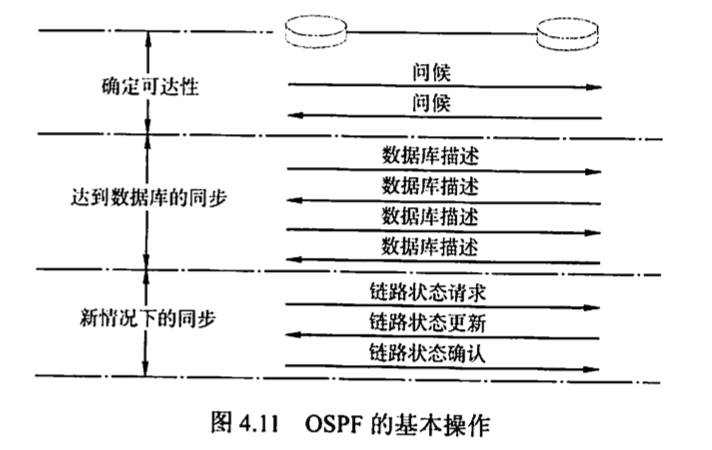

### 4.5.5 边界网关协议BGP

- **边界网关协议BGP（Border Gateway Protocol，BGP）**：不同AS路由器之间交换路由信息的协议，是一种外部网关协议（EGP）
  - 常用于互联网的网关之间
  - AS之间的路由选择一般只能尽可能好，**难以最佳**
  - **应用层**协议，基于**TCP**
- 工作原理
  - 每个AS的管理员选择至少一个路由器作为该AS的BGP**发言人**
  - BGP发言人之间交换路由信息需要先建立**TCP连接**
  - 在此连接上交换BGP报文以建立**BGP会话**，再利用BGP会话交换路由信息
  - 所有BGP发言人都相互交换网络可达性信息后，各BGP发言人就可以找出到达各个AS的较好路由

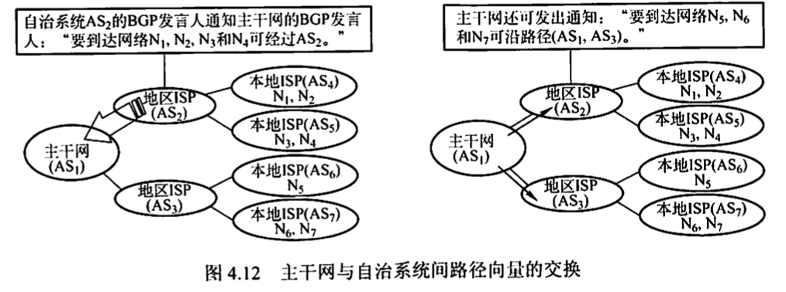

- BGP特点
  - BGP交换路由信息的结点数量级=AS数量级，远小于AS中网络数
  - 每个AS中BGP发言人数很少，因此AS之间的路由选择不会太复杂
  - BGP支持CIDR
  - BGP刚运行时邻站交换整个BGP路由表，此后只有发生变化时才更新有变化的部分，节约开销
- BGP报文
  - 打开报文Open：与相邻另一个BGP发言人建立关系
  - 更新报文Update：发送某路由信息、列出要撤销的多条路由
  - 保活报文Keepalive：确认打开报文、周期性证实邻站关系
  - 通知报文Notification：发送检测到的差错

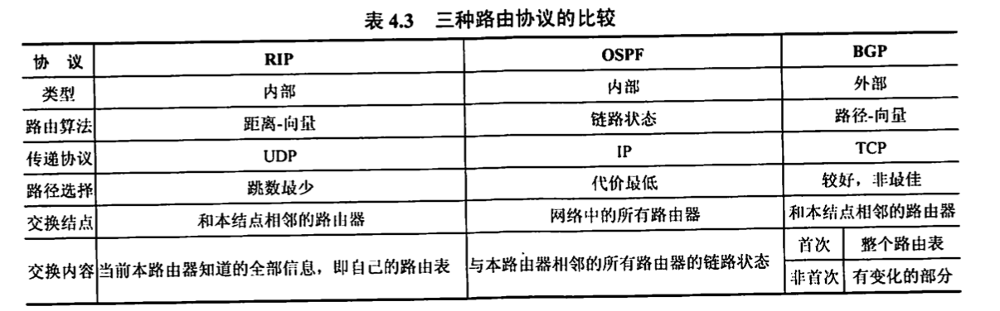

## 4.6 IP组播

### 4.6.1 组播的概念

- **组播**：让源计算机一次发送的单个分组可以抵达用一个组地址标识的若干目标主机，并被它们正确接收
- 组播一定只应用于UDP，TCP是面向连接的协议，两个主机的两个进程之间存在一条连接，会一对一发送。
- 组播让源主机不是给每个目的主机发送一个单独分组，而是把单个分组发给一个**组播地址**（标识一组地址），网络把这个分组的副本投递给该组中每台主机。
- **组播组**：每个组有一个特别分配的地址，要给该组发送的计算机使用这个地址作为分组的目标地址。
  - **IGMP（因特网组管理协议）**：主机使用该协议加入组播组
- 主机组播只发送一份数据，数据在传输路径出现分岔时才将分组复制后继续转发
  - **组播路由器**：能运行组播协议的路由器

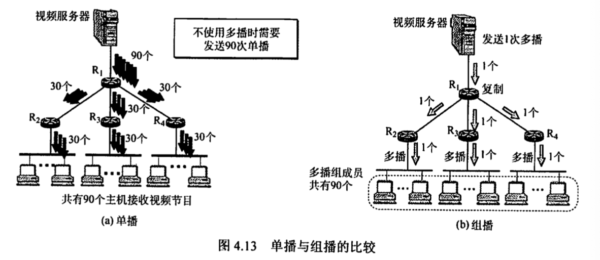

### 4.6.2 IP组播地址

- IP组播使用D类地址格式
  - 前4位1110，地址范围224.0.0.0~239.255.255.255
  - 每个D类IP地址标志 一个组播组
  - 组播地址只用于目的地址，源地址仍使用单播地址
  - 不是所有D类地址都可以用作组播地址
  - （如图）组播IP地址和以太网硬件地址映射关系不唯一，因此收到组播数据报的主机还需要在IP层用软件过滤不是本主机接收的数据
- IP组播分类
  - 硬件组播：只在本局域网上进行
  - 在因特网范围内组播

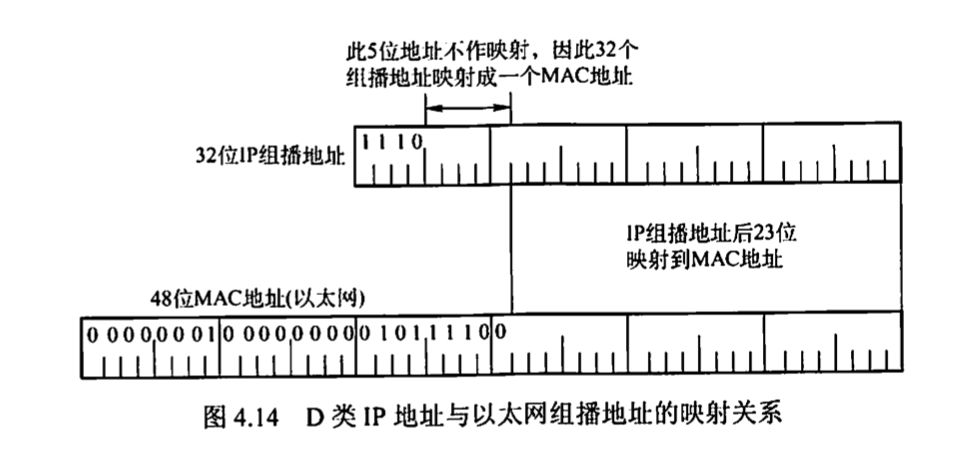

### 4.6.3 IGMP与组播路由算法

- **IGMP（Internet Group Management Protocol，因特网组管理协议）**
  - 使路由器知道组播组成员的信息
    - 让连接到本地局域网的组播路由器知道本局域网上是否有主机参与或退出某个组播组
- 工作阶段
  - 某台主机加入新的组播组，其应该向组播组的组播地址发送一个IGMP报文，声明自己成为该组成员
  - 因为组成员关系是动态的，本地组播路由器要周期性探询本地局域网上的主机，来知道其是否仍是组成员
- 组播路由选择实际上就是要找出以源主机为根结点的**组播转发树**

## 4.7 移动IP

### 4.7.1 移动IP的概念

- **移动结点**：把其连接从一个网络或子网改变到另一个网络或子网的主机
- **移动IP**：支持移动性的因特网体系结构与协议。移动结点以固定的网络IP地址实现跨越不同网段的漫游功能，保证基于网络IP的网络权限在漫游过程中不发生改变。
  - 移动结点可以不改变其IP地址的情况下改变其位置
- 移动IP定义三种功能实体
  - **移动结点**：具有永久IP地址的移动结点。每个移动结点有一个唯一的**本地地址**，移动过程中其本地地址不变。
  - **本地代理**：归属网络：一个移动结点的永久居所。本地代理：在归属网络中代表移动结点执行移动管理功能的实体，根据移动用户的**转交地址**转交移动结点的数据包。
    - 转交地址：标识移动结点现在所处的位置，以便进行路由选择
    - 移动绑定：移动结点的本地地址和当前转交地址的联合。移动结点得到一个新的转交地址时通过绑定向本地代理进行注册，让本地代理了解移动结点的当前位置。
  - **外部代理**：在外网中帮助移动结点完成移动管理功能的实体。

### 4.7.1 移动IP通信过程

- 移动结点**在本地网**，按传统TCP/IP方式通信
- 移动结点**漫游到一个外网**，仍使用固定IP地址通信。移动结点需要向本地代理注册当前位置地址（转交地址）
  - 本地代理接收来自转交地址的注册后，构建通向转交地址的隧道，将发给移动结点的IP分组送到转交地址
  - 在转交地址处解除隧道封装，恢复原始IP分组，送到移动结点，移动结点就能在外网收到这些发送给它的IP分组
- 移动结点**在外网**通过外网的路由器或外部代理向通信对端发送IP数据报
- 移动结点**来到另一个外网**，向本地代理更新注册的转交地址
- 移动结点**回到本地网**，向本地代理注销转交地址，又使用传统TCP/IP方式通信

## 4.8 网络层设备

### 4.8.1 冲突域和广播域

**1.冲突域**

- 连接到同一物理介质上所有结点的集合
  - 结点之间存在**介质争用**
- 第1层设备（集线器、中继器等）所连接的结点属于同一个冲突域，即这些设备不能划分冲突域
- 第2层（网桥、交换机）、第3层（路由器）设备可以划分冲突域

**2.广播域**

- 接收同样广播消息的结点集合
- 第1层、第2层设备连接的结点属于同一个广播域
- 第3层设备可以划分广播域
- 局域网LAN特指使用路由器划分的广播域

### 4.8.2 路由器的组成和功能

- **路由器**：具有多个输入/输出端口的专用计算机，任务是**连接不同（异构）网络**并完成路由转发
  - 是网络层设备，实现了下三层：物理层、数据链路层、网络层
- 源主机和目标主机在同一个网络上，**直接交付**，不需要通过路由器
  - 同一个网络中传递数据无须路由器参与
- 源主机和目标主机不在同一个网络上，路由器按照转发表指出的路由将数据报转发给下一个路由器，即**间接交付**
  - 跨网络通信必须通过路由器转发
  - 路由器隔离了广播域
- 路由器结构
  - **路由选择**：核心构件是路由选择处理机，构造和维护路由表（通过路由选择算法）
  - **分组转发**：交换结构、一组输入端口、一组输出端口

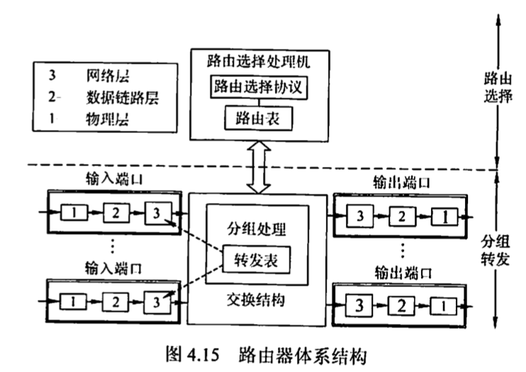

### 4.8.3 路由表与路由转发

- 路由表
  - 路由表根据路由选择算法得出
  - 路由表表项=目的网络IP地址+子网掩码+下一跳IP地址+接口
  - 如图路由表包含到互联网的默认路由（0.0.0.0）

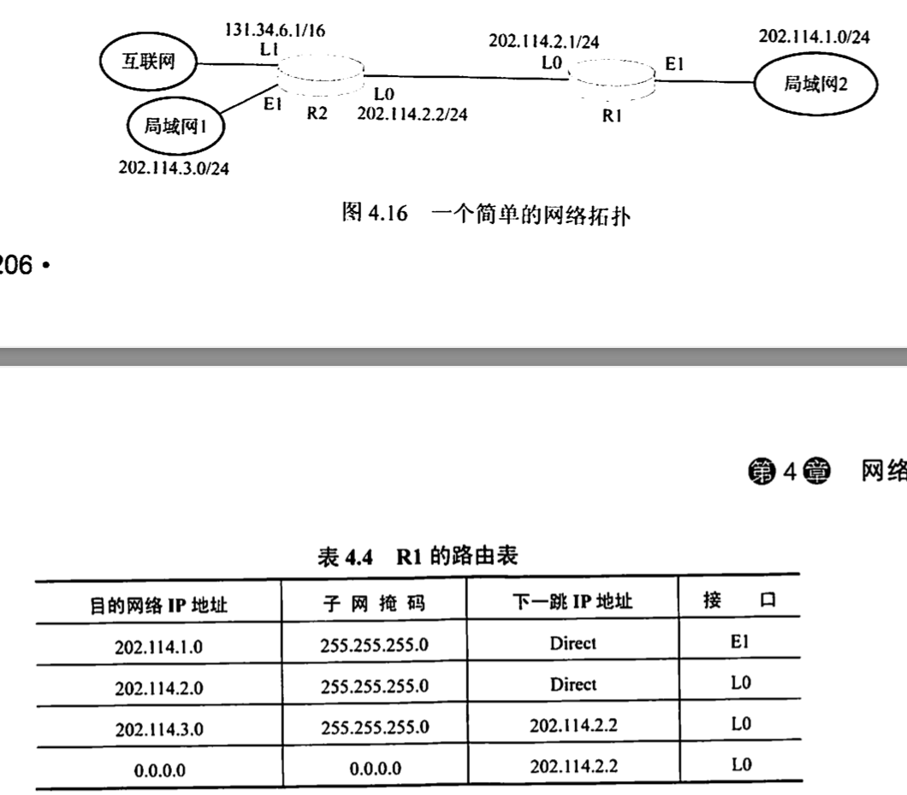

- 转发表
  - 从路由表得出

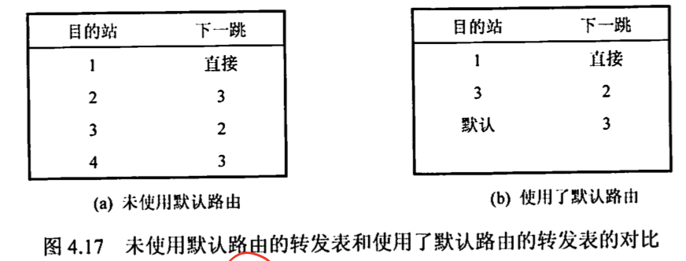
