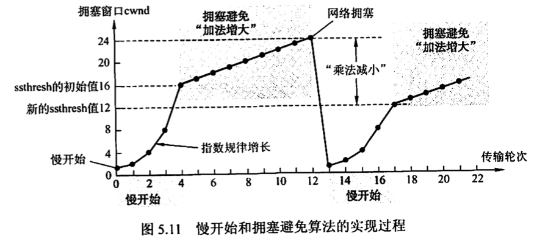

<h1>计算机网络笔记</h1>

[toc]

# 第一章 计算机网络体系结构

# 第二章 物理层

# 第三章 数据链路层

# 第四章 网络层

# 第五章 传输层

## 5.1 传输层提供的服务

### 5.1.1 传输层的功能

- 传输层在五层架构中的位置
  - 传输层向上面的应用层提供通信服务
  - 传输层使用网络层的服务
  - 属于**面向通信部分的最高层**、**用户功能的最底层**
- 传输层的功能
  - 传输层提供应用**进程**之间的**逻辑通信（端到端通信）**
    - 网络层提供的是**主机**之间的逻辑通信
    - 逻辑通信：传输层之间的通信好像是水平方向传送数据，但并无物理连接，而是通过下三层的服务
  - **复用和分用**
    - 复用：发送方**不同的应用进程**可以**使用同一个传输层协议**传送数据（多种快递通过同一个快递员运送）
    - 分用：接收方的传输层剥去报文首部后可以将数据交付到目的应用进程（快递站分拣）
  - 对收到的报文进行**差错检测**
    - 网络层只检查IP数据报首部，不检验数据部分是否出错
  - 提供两种不同传输协议：面向连接的**TCP**和无连接的**UDP**
    - 网络层无法同时实现两种协议，要么面向连接的虚电路、要么无连接的数据报

### 5.1.2 传输层的寻址与端口

**1. 端口的作用**

- **端口**
  - 让应用层各种应用进程将其数据通过端口向下交付给传输层
  - 让传输层知道应将其报文段中的数据向上通过端口交付给应用层的相应进程
- 端口是**传输层服务访问点（TSAP）**
  - 就像**IP地址**是**网络层**的SAP
  - 就像**MAC地址**是**数据链路层**的SAP
  - 端口标识进程，IP地址和MAC地址标识主机

**2. 端口号**

- **端口号**：标识应用进程，长16bit，能表示65536个不同端口号

  - 端口号只有本地意义，只表示本主机应用层的各进程，不同主机相同的端口号没有意义

- 根据端口号范围将端口分类：

  - 服务器端使用的端口号

    - 熟知端口号：0～1023，指派给TCP/IP最重要的一些应用程序

    

    - 登记端口号：1024～49151，必须登记防止重复

  - 客户端使用的端口号：49152～65535，仅在客户进程运行时才**动态选择**，通信结束后该端口号不复存在，可以留给其他客户进程以后使用

**3. 套接字**

- **套接字Socket**
  - Socket=（IP地址：端口号）
  - 唯一标识网络中一台主机和其上一个应用进程

### 5.1.3 无连接服务与面向连接服务

- 面向连接服务的**传输控制协议TCP**
  - 面向连接服务：通信双方通信之前必须先**建立连接**，数据传输结束后**释放连接**
  - 传输层向上提供一条**全双工可靠逻辑信道**
  - **不提供广播或组播服务**，只能点对点
  - 提供面向连接的**可靠传输服务**，增加很多**开销**，如确认、流量控制、计时器和连接管理等
  - 适用于可靠性更重要的场合，如文件传输协议FTP、超文本传输协议HTTP、远程登录TELNET等
- 无连接服务用户**数据报协议UDP**
  - 无连接服务：两个实体之间通信不需要先建立连接，直接将信息发送到网络中，尽力传送
  - UDP是无连接的非可靠传输层协议，传输层向上提供一条**不可靠逻辑信道**
  - 在IP层之上只提供两个附加服务：**多路复用**，对数据的**错误检查**
  - 传送数据前不需要建立连接，远程主机收到UDP报文后不需要给出确认
  - 简单，**执行速度快，实时性好**
  - 适用于小文件传送协议TFTP、DNS、SNMP和实时传输协议RTP，应用场景如视频会议、流媒体等对实时性要求高、可靠性要求低的场合

## 5.2 UDP协议

### 5.2.1 UDP数据报

**1. UDP概述**

- UDP特点
  - 仅在IP层数据报服务上增加了**复用分用、差错检测**两个最基本服务
  - 常用于**一次性传输较少数据**的网络应用（TCP额外开销占比太多）、**多媒体应用**（实时性要求比可靠性高）
  - **不保证可靠交付**，维护可靠性的工作用户在用户层完成
  - **面向报文**，UDP对应用层的报文不合并、不拆分，保留其边界；对IP层上交的数据报，去除首部后即交付给应用层，一次交付一个完整报文，因此报文不可分割，是**UDP数据报处理的最小单位**
- UDP的优点
  - 无须建立连接，不引入连接建立时延
  - 无连接状态，不跟踪TCP维护连接状态所需的接收发送缓存、拥塞控制参数等参数，因此UDP一般能支持更多活动客户机
  - 分组首部开销小
  - 应用层能更好控制要发送的数据和发送时间，UDP没有拥塞控制因此网络拥塞不影响主机发送效率，UDP时延较小、但可能有些数据丢失
  - 支持一对一、一对多、多对一等通信，TCP只能一对一

**2. UDP的首部格式**

- UDP首部共8B，4个字段，每个字段都是2B

- 各字段意义
  - 源端口：源端口号，需要回信时用，不需要时全0
  - 目的端口：目的端口号
  - 长度：UDP数据报长度（首部+数据），单位B，最小值8
  - 检验和：检测UDP数据报是否有错，可选，不用时全0

- 传输层从IP层收到UDP数据报时，根据首部中的目的端口，把UDP数据报通过相应端口上交给应用进程（快递站分发）。若目的端口号不正确，丢弃报文并发送「端口不可达」

### 5.2.2 UDP校验

- 伪首部：不是真的首部，是为了计算校验和时临时添加在UDP数据报前面的，既不向下传送也不向上交付

- 校验和：计算方法和IP数据报首部校验和类似，但IP数据报**只检验首部**，UDP检验**首部和数据部分**

- 发送方：

  - 把全0放入校验和字段并添加伪首部
  - 把UDP数据视为许多16b的字串接起来，若数据部分不是偶数个字节，则末尾填入一个全0字节（但不发送）
  - 按二进制反码计算出这些16b字的和，将其反码写入校验和字段并发送

- 接收方：

  - 收到的UDP数据报加上伪首部，非偶数字节还需要补上全0字节
  - 二进制反码求16位字的和，无差错时结果全1，否则有差错，丢弃

  

## 5.3 TCP协议

### 5.3.1 TCP协议的特点

- TCP协议特点
  - 面向连接的传输层协议，TCP连接是一条逻辑连接
  - 每条TCP连接只有两个端点，只能**端到端**（进程到进程）
  - 提供**可靠交付服务**，保证传送的数据无差错、不丢失、不重复且有序
  - 提供**全双工通信**，通信双方任何时候都能发送数据，因此两端都有发送缓存和接收缓存
    - **发送缓存**存放：1.发送应用程序传送给发送方TCP准备发送的数据2.TCP已发送但尚未收到确认的数据
    - **接收缓存**存放：1.按序到达但尚未被接受应用程序读取的数据2.
  - **面向字节流**，把应用程序的数据仅视为一串无结构字节流
  - UDP报文长度由发送应用进程决定，TCP报文长度根据接收方给出的窗口值和当前网络拥塞程度决定

### 5.3.2 TCP报文段

- TCP传送数据单元为**报文段**
  - 既可以运载数据，又可以建立连接、释放连接、应答
  - 分成首部+数据部分，TCP报文段作为**IP数据报的数据部分**封装在IP数据报中
  - 首部前20B固定，首部最短20B，4N字节可选项

### 5.3.3 TCP连接管理

- TCP连接建立解决的问题
  - 双方都要确认对方存在
  - 双方协商一些参数
  - 能对运输实体资源进行分配
- TCP连接的端口：**套接字Socket**，每条TCP连接唯一地被两个套接字确定
- TCP连接采用**客户/服务器**模式：
  - 客户：主动发起连接建立的应用进程
  - 服务器：被动等待连接建立的应用进程

**1. TCP连接建立**

三次握手：

- 一、客户TCP首先向服务器TCP发送**连接请求报文段**
  - 同步位SYN为1，选择一个初始序号seq=x
  - SYN报文段不携带数据，但消耗一个序号
  - TCP客户进程进入**SYN-SENT同步已发送状态**
- 二、服务器TCP收到连接请求报文段，如同意建立连接，则发回**确认**，并为该TCP连接**分配缓存和变量**
  - SYN和ACK都为1，确认号ack=x+1（ACK=1，ack才有意义）
  - 为自己选择一个初始序号seq=y
  - 确认报文段不携带数据，也消耗一个序号
  - TCP服务器进入**SYN- RCVD同步收到状态**

- 三、客户收到确认报文段，向服务器给出**确认**，为该TCP连接**分配缓存和变量**
  - ACK=1，确认号ack=y+1，序号seq=x+1
  - 可以携带数据，若不携带数据则不消耗序号
  - TCP客户进程进入**ESTABLISHED已建立连接状态**

**2. TCP连接释放**

四次握手：

- 一、客户打算关闭连接时，向TCP发送**释放连接报文段**，停止发送数据，主动关闭TCP连接
  - 报文段终止位FIN=1，序号seq=u，等于前面已传送数据的最后一个字节的序号+1
  - 不携带数据，也消耗一个序号
  - TCP客户进行进入**FIN-WAIT-1终止等待1状态**
  - TCP是全双工的，此时只是发送FIN的一端不能发送数据了，对方还可以发送数据
- 二、服务器收到连接释放报文段后发出**确认**
  - 确认号ack=u+1，序号seq=v，等于前面已传送数据的最后一个字节的序号+1
  - 服务器进入**CLOSE- WAIT关闭等待状态**
  - 从客户到服务器的连接已释放，TCP连接半关闭，服务器发送的数据客户仍要接受
- 三、若服务器已经没有要发送的数据，则通知TCP释放连接，发出**连接释放报文**
  - FIN=1，序号=w，等于这期间传送数据的最后一个字节的序号+1，重复确认号ack=u+1，服务器进入**LAST-ACK最后确认状态**
- 四、客户收到连接释放报文段后，发出**确认**
  - ACK=1，确认号ack=w+11，序号seq=u+1
  - 计时器设置的时间2MSL（最长报文段寿命）后，客户机才进入**CLOSED连接关闭状态**

总结：**ACK、SYN、FIN一定为1**

### 5.3.4 TCP可靠传输

TCP可靠传输机制：校验（和UDP一样，这里不讲）、序号、确认、重传。

**1. 序号**

- 序号字段保证数据能有序提交给应用层
- TCP把数据视为无结构但有序的字节流，**序号建立在传送的字节流上**，而不是报文段
- 序号字段的值指**本报文段发送数据的第一个字节的序号**
  - 图中报文段的序号分别为0、3、6、8

**2. 确认**

- TCP首部确认号是**期望收到对方下一个报文段数据的第一个字节序号**，即下一个报文段的序号
  - 上图中B的确认号分别是3、6、8
- **累计确认**，即TCP只确认数据流中到第一个丢失字节为止的字节
  - 若B收到了0～2和6～7，但没收到3～5，则B到A下一个报文段的确认号还是3

**3. 重传**

两种事件导致TCP重传报文段：

- 超时
  - 原因：TCP下层IP数据报选择的路由变化很大，RTT方差很大
  - TCP采用自适应算法，保留报文段的加权平均往返时间$RTT_s$
  - 超时计时器的超时重传时间（Retransmission Time-Out，RTO）略大于$RTT_s$
- 冗余ACK（冗余确认）
  - 每当比期望序号大的失序报文段到达，就发送一个冗余ACK，指明下一个期待字节的序号
    - A发送1～5，2丢失，则3～5对B就是失序报文段
    - B发送3个对1号报文段的冗余ACK，表示希望接受2号
  - 当发送方收到同一个报文段的3个冗余ACK，就认为这个被确认报文段之后的报文段已经丢失
    - A收到1号报文段的3个冗余ACK，认为2号已经丢失，此时立即重传2号，不需要等超时，这称为**快速重传**

### 5.3.5 TCP流量控制

- 流量控制：消除发送方发送太快导致接收方缓存区溢出，是一个速度匹配服务，TCP的流量控制也基于**滑动窗口**
- 接收窗口rwnd：**接收方**根据自己接收缓存的大小，动态调整**发送方**发送窗口大小
- 拥塞窗口cwnd：**发送方**根据其对当前网络拥塞程度的估计确定的窗口值，与网络带宽、时延有关

- 和数据链路层流量控制的区别
  - 传输层是**端到端的**，数据链路层是相邻结点的
  - 传输层的窗口**可以动态变化**，数据链路层不能

### 5.3.6 TCP拥塞控制

- **拥塞控制**：防止过多数据注入网络，保证网络中路由器或链路不会过载
- 和流量控制区别
  - 拥塞控制是全局性过程
  - 流量控制是端到端问题
- 接收窗口rwnd ：**接收方**根据目前接收缓存大小许诺的最新窗口值，反映**接收方容量**
- 拥塞窗口cwnd：**发送方**根据自己估算的网络拥塞程度设置的窗口值，反映**网络当前容量**
- 发送窗口上限值=min[rwnd, cwnd]

**1. 慢开始、拥塞避免**

- 慢开始
  - TCP刚连接好，cwnd=1（单位：最大报文段长度MSS）
  - 每收到一个新报文段的确认，cwnd+1，**指数增长**
  - 没经过一个传输轮次（即RTT），cwnd加倍
  - cwnd增大到**慢开始门限ssthresh**，改用拥塞避免算法
  - 若2cwnd > ssthresh，则下一个RTT后的cwnd=ssthresh而不是2cwnd
- 拥塞避免
  - 每经过一个RTT，cwnd+1，**线性增长**
- 网络拥塞处理
  - 发送方判断网络出现拥塞（未按时收到确认），则把ssthresh设为**此时cwnd值的一半，cwnd重新置1**

**2. 快重传、快恢复**

- 快重传
  - 发送方连续收到3个重复ACK，则直接重传该未收到的报文段
- 快恢复
  - 发送方收到3个冗余ACK时，把ssthresh设置为此时cwnd的一半
  - 与慢开始不同，它把cwnd设置为**新ssthresh的值**，然后再线性增加

总结：

- TCP连接建立和网络出现超时，采用慢开始、拥塞避免**
- 发送方收到冗余ACK，采用**快重传、快恢复**

# 第六章 应用层

## 6.1 网络应用模型

### 6.1.1 客户/服务器模型

- C/S模型特点
  - 客户需要知道服务器程序地址
  - 客户是服务请求分，服务器是服务提供方
  - 网络中计算机地位不平等
  - 客户之间不直接通信
  - 可扩展性不佳
  - 服务器性能好坏决定整个系统性能，大量用户请求服务时，服务器成为系统瓶颈

### 6.1.2 P2P模型

- P2P模型特点
  - 每个结点同时有上传、下载功能
  - 对等方（Peer）直接通信
  - 减轻了服务器压力，提高了系统效率和资源利用率
  - 多个客户可以直接共享文档
  - 可扩展性好
  - 健壮性好
  - 提供服务占用内存和算力

## 6.2 域名系统DNS

- **域名系统（Domain Name System，DNS）**：因特网使用的命名系统
- DNS采用C/S模型，协议UDP，53号端口

### 6.2.1 层次域名空间

- 层次结构名称：域可以划分子域，形成顶级域、二级域等，用.分隔

- 标号
  - 不区分大小写
  - 除-外不能有其他符号
  - 每个标号不超过63个字符，完整域名不超过255个字符
  - 从左到右域名由低到高
- 顶级域名分类
  - 国家或地区顶级域名：cn中国，us美国
  - 通用顶级域名：com公司，net网络服务机构，org非营利性组织，gov政府
  - 基础结构域名：arpa

### 6.2.2 域名服务器

> 域名到IP地址的解析由域名服务器上的程序完成。

**1. 根域名服务器**

**2. 顶级域名服务器**

**3. 授权（权限）域名服务器**

**4. 本地域名服务器**

### 6.2.3 域名解析过程

## 6.3 文件传输协议FTP

### 6.3.1 FTP的工作原理

### 6.3.2 控制连接与数据连接

## 6.4 电子邮件

### 6.4.1 电子邮件系统的组成结构

### 6.4.2 电子邮件格式与MIME

### 6.4.3 SMTP和POP3

## 6.5 万维网WWW

### 6.5.1 WWW的概念与组成结构

### 6.5.2 超文本传输协议HTTP