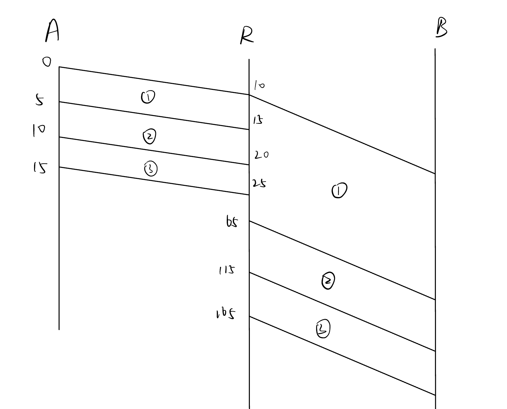
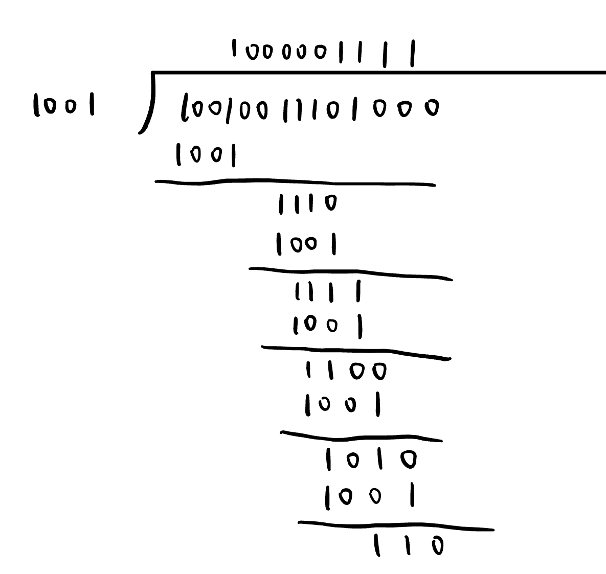
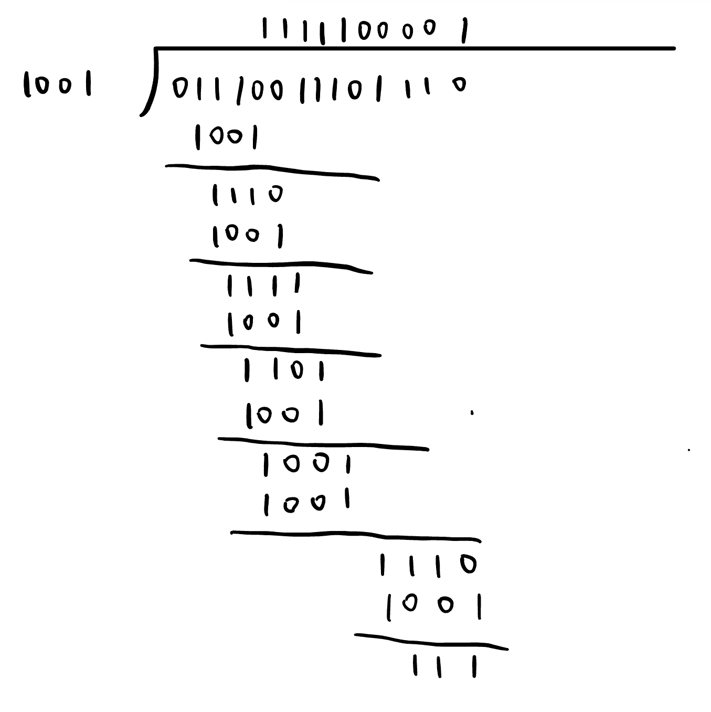

<h1>
  Computer Network Homework 1
</h1>

<h4>
  2050633 卢嘉霖
</h4>

### 1.

For a), **transport layer** provides reliable, connection-oriented path through flow control, segmentation/desegmentation, and error control. 

For b), **data link layer** is responsible for medium access control. It handles wireless channel access control, determining which user has access to the shared media.

For c), **data link layer** has the function of framing, i.e. encapsulating packets into frames, adding header and trailer information.

For d), **network layer** handles logical addressing and routing, determining the routing path and the appropriate outgoing interface for IP datagrams.

### 2.

a)

ASK: Amplitude Shifted Keying, 

FSK: Frequency Shifted Keying, 

PSK: Phase Shifted Keying, 

QAM: Quadrature Amplitude Modulation 

b)

Low Earth Orbit (LEO) satellites

Medium Earth Orbit (MEO) satellites

Geosynchronous Earth Orbit (GEO) satellites

c)

Twisted Pair

Coaxial Cable

Fiber Optic

d)

FDM: Frequency Division Multiplexing,

TDM: Time Division Multiplexing,

WDM: Wavelength Division Multiplexing,

CDM: Code Division Multiplexing,

### 3.

Not always. There are several reasons.

- When the network is congested, queuing delays will be higher in packet switching, it may not perfor better than circuit switching in the same system.
- In packet switching, each packet needs to be processed at each node, which increases end-to-end delay compared to circuit switching.
- In packet switching, each packet may encounter queuing delay as they wait for being transmitted at each node, which increases end-to-end delay compared to circuit switching.

### 4. 12, 8.45%, 0.149

a)

$6Mbps / 500Kbps = 12$

Thus at most 12 users can be hosted.

b)
$$
P(overload)=P(N>12)\\=1-P(N≤12)\\=1-BinomialCDF(12, 30, 0.3) \\=8.45\%
$$

c)

According to *Shannon's Theory*,

$30MHZ\times \log_2(1+SNR)≥6Mbps$

$SNR≥0.149$

### 5. 90msec

Transmission Delay(A->R)=$50kbits/10Mbps=5msed$

Transmission Delay(R->B)=$50kbits/1Mbps=50msed$

As is shown in the graph below, if the time packet 1 starts to be transmitted from A to R is $0$, packet 3 arrives R at $25msed$ and starts to be transmitted from R to B at $115msed$.

Thus, the queuing delay of packet 3 at R is $115-25=90msed$.

### 6. 1, 0, not transmitted, 1

$A·S=\frac{1}{8}\sum_{i=1}^m A_iS_i=1$

$B·S=\frac{1}{8}\sum_{i=1}^m B_iS_i=-1$

$C·S=\frac{1}{8}\sum_{i=1}^m C_iS_i=0$

$D·S=\frac{1}{8}\sum_{i=1}^m D_iS_i=1$

Thus $S=A-B+0C+D$.

Station A transmitted 1, 

station B transmitted 0, 

station C did not transmit, 

station D transmitted 1.

### 7. 4

As is discussed in class, the horizontal-vertical parity check code can detect at most 3 erroneous bits and correct at most 1 bit.

Considering detection capability, the code distance must be ≥ 3 + 1 = 4.

Considering correction capability, the code distance must be ≥ 2*1 + 1 = 3.

Thus the Hamming distance is 4.

### 8. 9, 1001001011110

a)

$n+k≤2^k-1,n=9$

The minimum value of k is 4, thus 4 check bits are needed.

b)

- Determine the position of data bits and check bits.

| 13   | 12   | 11   | 10   | 9    | 8     | 7    | 6    | 5    | 4     | 3    | 2     | 1     |
| ---- | ---- | ---- | ---- | ---- | ----- | ---- | ---- | ---- | ----- | ---- | ----- | ----- |
| 1    | 0    | 0    | 1    | 0    | $P_4$ | 1    | 0    | 1    | $P_3$ | 1    | $P_2$ | $P_1$ |

- Group data bits and check bits.

|            | $D_1:P_1$ | $D_2:P_2$ | $D_4:P_3$ | $D_8:P_4$ |
| ---------- | --------- | --------- | --------- | --------- |
| $D_3:1$    | $\surd$   | $\surd$   |           |           |
| $D_5:1$    | $\surd$   |           | $\surd$   |           |
| $D_6:0$    |           | $\surd$   | $\surd$   |           |
| $D_7:1$    | $\surd$   | $\surd$   | $\surd$   |           |
| $D_9:0$    | $\surd$   |           |           | $\surd$   |
| $D_{10}:1$ |           | $\surd$   |           | $\surd$   |
| $D_{11}:0$ | $\surd$   | $\surd$   |           | $\surd$   |
| $D_{12}:0$ |           |           | $\surd$   | $\surd$   |
| $D_{13}:1$ | $\surd$   |           | $\surd$   | $\surd$   |

- Calculate check bits
  - $P_1=D_3\oplus D_5\oplus D_7\oplus D_9\oplus D_{11}\oplus D_{13}=0$
  - $P_2=D_3\oplus D_6\oplus D_7\oplus D_{10}\oplus D_{11}=1$
  - $P_3=D_5\oplus D_6\oplus D_7\oplus D_{12}\oplus D_{13}=1$
  - $P_4=D_9\oplus D_{10}\oplus D_{11}\oplus D_{12}\oplus D_{13}=0$

- The encoded Hamming codeword : $1001001011110$

### 9. 10010011101110, can be detected

a)

As is shown in the graph below, the remainder is $110$.

Thus $T(x)=10010011101110$

b)

As is shown in the graph below, the calculated remainder is not 0, thus the errors are detected.

