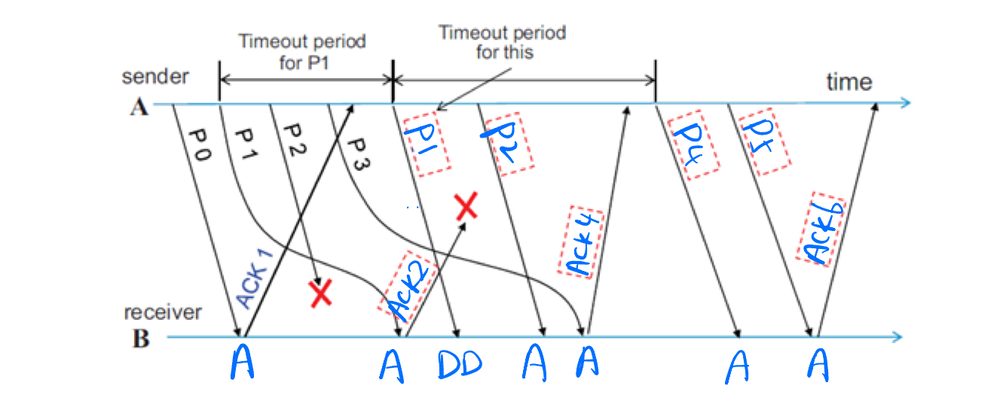
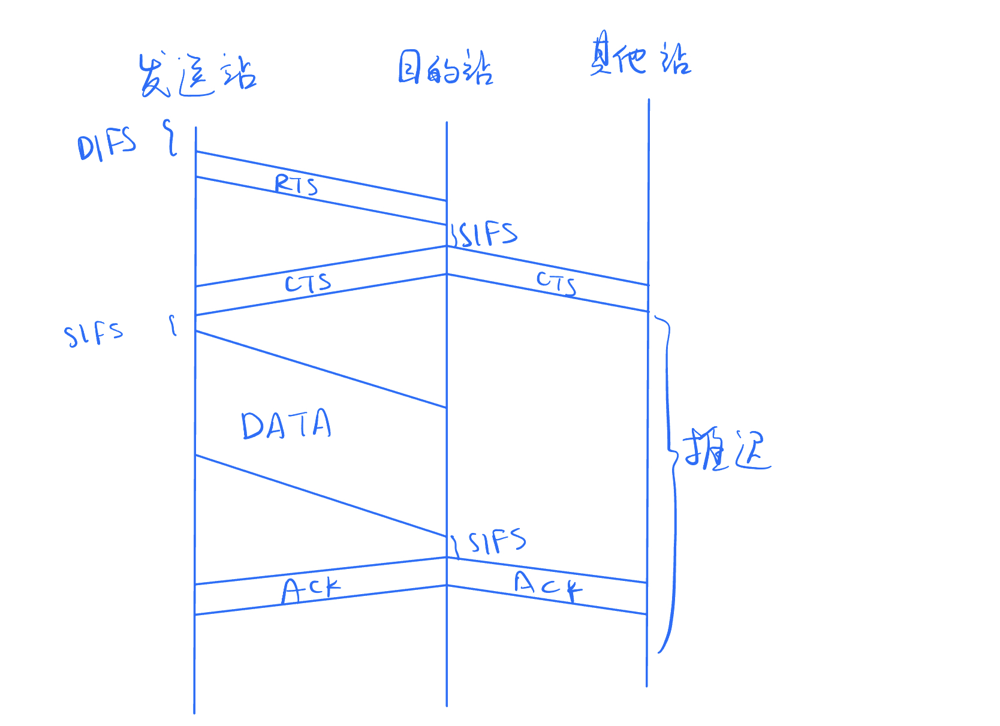

# Computer Network Homework 2


### **2050633 卢嘉霖**


### 1.



Explanations:

- Boxes

  - P1: P1 is received by the receiver end but ACK2 is not received by the sender end. At the end of timeout perid for P1, the sender end sends P1 again.

  - P2: The sender end has sent P1 so P2 follows.

  - P4: The sender end receives ACK4, so it starts to send P4.

  - P5: The sender end has sent P4 so P5 follows.

  - ACK2: The receiver end has received P0, so it can receive P2 and sends ACK2.

  - ACK4: The receiver end has received P0~P2, so it can receive P4 and sends ACK4.

  - ACK6:  The receiver end has received P0~P4, so it can receive P6 and sends ACK6.
- Actions
  - All actions marked with "A": The receiver end receives package successfully.
  - DD: The receiver end has received P1, so it discards the duplicated P1.

### 2.

a)

1. 当发送站要发送数据，侦听信道
2. 信道空闲时，发送站等待帧间间隔时间后发送整个数据帧
3. 信道忙时，则使用指数退避算法选取回退值，信道忙时退避计时器不变，信道空闲时退避计时器计时
4. 退避计时器到0时，发送站发送整个帧并等待ACK
5. 收到ACK后开始发送第二帧，从(2)开始；若规定时间内未收到ACK，则重传该帧
6. 重传失败超过规定次数后放弃发送

此外，802.11规定发送站发送前使用RTS/CTS帧进行信道预约。具体如下：

- 发送站发送前广播一个请求发送RTS（Request To Send）帧，能被范围内包括目的站的站点收听
- 若信道空闲，目的站广播一个允许发送CTS（Clear To Send）帧，抑制其他站点在预约期内发送，给发送站发送许可

RTS/CTS机制如图所示：



b)

1. 无线介质上信号强度动态变化范围大、且接收信号强度远小于发送信号、信号衰减干扰等因素影响，实现碰撞检测硬件花费大
2. 无线通信存在“隐蔽站”问题，无法检测碰撞

c)

解决隐蔽站（The Hiddent Terminal）问题。例如，A、C站彼此距离远无法通信，但都能与B站通信，则A、C站同时与B站通信会发生碰撞。

d)

- 网桥监听经过它的数据流量，记录源MAC地址和端口的映射关系，并构建转发表
- 定期更新转发表中的MAC地址记录
- 删除长期不发送数据的主机记录

e)

- 桥接器/交换机在链路层工作，能够根据MAC地址进行决策。集线器在物理层工作，仅传输比特，不理解帧的内容。

- 桥接器/交换机通过学习和过滤MAC地址来决定数据帧的转发，根据目标地址选择合适的端口进行转发。集线器广播所有传入的数据，所有连接的设备都会收到传输的信息。

- 桥接器/交换机在各个端口之间形成独立的冲突域，通过全双工通信避免碰撞。集线器全部设备在同一冲突域内，可能发生碰撞，需要使用CSMA/CD协议来处理。

- 桥接器/交换机提供更高的性能和较低的延迟，适用于大型网络和要求高性能的环境。集线器由于碰撞可能导致性能下降，适用于小型网络或不要求高性能的场景。


### 3.

a)

For this network's IPv4 address, 32-26=6 bits are avaible for assigning host IP address. Additionally, we consider the exclusion of the network address(host portion all 0s, e.g. 192.168.8.0) and the braodcast address(host portion all 1s, e.g. 192.168.8.63), thus the total number of usable host IP address is 2^6-2=62.

b)

- Unicast Address: Used to identify a single network interface. Such as 192.168.8.101.
- Broadcast Address: Used to send packets to all hosts on a particular subnet. Its host portion is set to all 1s. Such as 192.168.8.255.
- Multicast Address: Used to send packets to a group of interfaces that have joined a multicast group. It has leading bits of the host portion set. Such as 224.0.0.1.

c)

- **ARP request**: When a host wants to send data to another IP on the network, it first checks its ARP cache to see if it already has the destination MAC address mapped to that IP. If the mapping is not in the ARP cache, the host sends out an ARP request packet. This packet contains the destination IP address, and is sent to the broadcast MAC address, so all devices on the network receive it.
- **ARP reply**: The device with the target IP address recognize the ARP request and respond by sending back an ARP reply packet with its MAC address. The original host receives this ARP reply, and can now update its ARP cache with the IP to MAC mapping.Next time the host wants to communicate with this IP, the MAC address will already be in its cache so no ARP request is needed.

### 4.

a)

```python
def Dijkstra(Graph, source):
	unvisited = []
  
  dist[source] = 0
  for each vertex v in Graph:
    if v != source:
      dist[v] = infinity
      previous[v] = None
      add v to unvisited
  
  while unvisited is not empty:
    u = vertex in unvisited with minimum dist[u]
    remove u from unvisited

    for each neighbor w of u:
      alt = dist[u] + Graph.getEdgeWeight(u, w)
      if alt < dist[w]:
        dist[w] = alt
        previous[w] = u
        
  return dist, previous
```

b)

| Step | Set N                | D(B), p(B) | D(C), p(C) | D(D), p(D) | D(E), p(E) | D(F), p(F) |
| ---- | -------------------- | ---------- | ---------- | ---------- | ---------- | ---------- |
| 0    | A                    | 4, A       | **1, A**   | $\infin$   | $\infin$   | $\infin$   |
| 1    | A, **C**             | **3, C**   | 1, A       | $\infin$   | 4, C       | $\infin$   |
| 2    | A, C, **B**          | 3, C       | 1, A       | 8, B       | **4, C**   | $\infin$   |
| 3    | A, C, B, **E**       | 3, C       | 1, A       | **5, E**   | 4, C       | 7, E       |
| 4    | A, C, B, E, **D**    | 3, C       | 1, A       | 5, E       | 4, C       | **6, D**   |
| 5    | A, C, B, E, D, **F** | 3, C       | 1, A       | 5, E       | 4, C       | 6, D       |

c)

No, we cannot directly use Dijkstra algorithm.

BER cannot be directly added like distance. Instead, the total success rate is $\Pi_i(1-BER_i)$. Therefore, we use logarithmic operations to convert it to addition: For each link, consider its "distance" $\log(1-BER)$. Then the total distance is $\Sigma_i\log(1-BER_i)$.

However, this requires finding the path with maximum "distance", different from Dijkstra's shortest path. So we add a negative sign: "Distance" = $-\log(1-BER)$. Now, the path with minimum sum of "distance" has the minimum total error rate, i.e. more reliable. 

After defining and calculating the "distance" of each link this way, we can directly use Dijkstra's algorithm to find the "shortest" path, which is the most reliable path.

### 5.

| Cycle | n(B), D(B)    | n(C), D(C)    | n(D), D(D)    | n(E), D(E)    | n(F), D(F)    |
| ----- | ------------- | ------------- | ------------- | ------------- | ------------- |
| 0     | (·, $\infin$) | (·, $\infin$) | (·, $\infin$) | (·, $\infin$) | (·, $\infin$) |
| 1     | **(A, 4)**    | **(A, 1)**    | **(B, 9)**    | **(C, 4)**    | **(E, 7)**    |
| 2     | **(C, 3)**    | (A, 1)        | **(E, 5)**    | (C, 4)        | **(D, 6)**    |
| 3     | (C, 3)        | (A, 1)        | (E, 5)        | (C, 4)        | (D, 6)        |

### 6.

a)

**先进先出队列**：客户端对服务器的请求量过大时需要排队访问，此时客户端的访问请求被放入服务器的FIFO队列，保证先来先得。

b)

**优先级队列**：操作系统给进程分配CPU时间片时，先根据进程属性、等待时间等得到进程的优先级队列，然后按优先级从高到低进行分配。

c)

**轮询调度**：CPU使用时间片轮转分配各进程；动态分配信道算法中的令牌传递协议通过集中控制的监控站以循环方式轮询每个结点，以实现信道分配。

d)

**加权公平队列**：网络交换机和路由器会根据流量比例使用WFQ调度算法。
