# Computer Network Homework 3


### **2050633 卢嘉霖**


### Q 1.1 

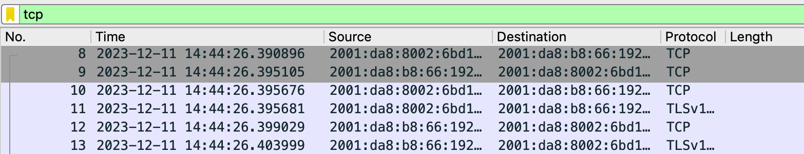

IP address used by my own computer: **2001:da8:8002:6bd1:dd26:efbc:a1e0:deb5**

IP address of sse.tongji.edu.cn: **2001:da8:b8:66:192:168:66:4**


### Q 1.2

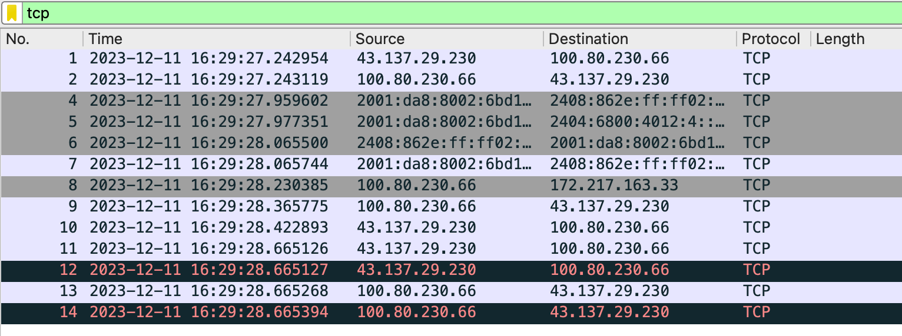

I used filter statement **"tcp"** to show packets of TCP protocol.

As is discussed in Q1.1, connection with sse.tongji.edu.cn still exists.

I launched QQ, so as we can see there is another main connection(between **100.80.230.66**(IPv4 IP address of this computer) and **43.137.29.230**).


### Q 2.1

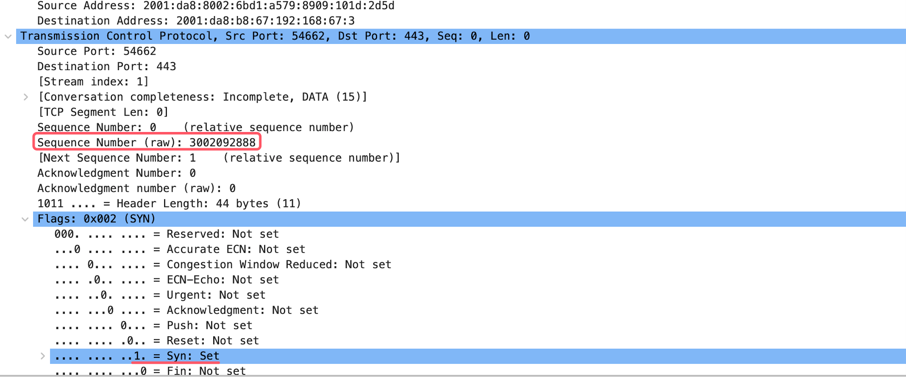

a)

The details of the **first** TCP segment is as shown above. Its "Sequence Number (raw)" field shows the sequence number of the TCP SYN segment used to initiate the TCP connection is **3002092888**.

b)

The "Flags: 0x002 (SYN)" indicates that the **SYN flag is set to 1**, which means this TCP segment is a SYN segment.

### Q 2.2

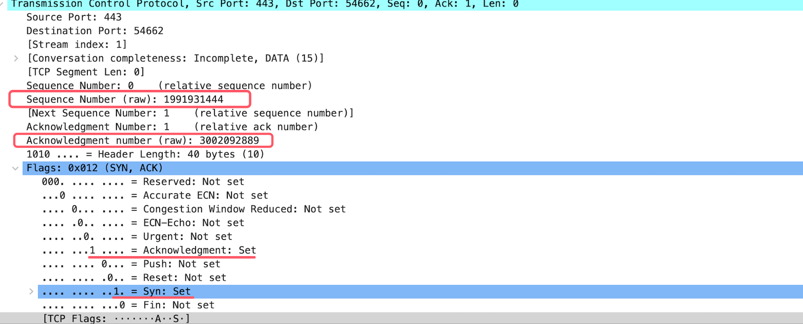

a)

Similar to Q1.1, "Sequence Number (raw)" field shows the sequence number of the SYN ACK segment is **1991931444**.

b)

As we can see in "Acknowledgement Number (raw)", **Acknowledgement field is set to 3002092889**.

c)

The destination determines the value in the acknowledgment field of the SYN-ACK segment by taking the initial sequence number (**3002092888**) received from the source(i.e. the SYN segment), incrementing it by 1(**3002092889**), and setting the Acknowledgement Number to it.

d)

The "Flags: 0x012 (SYN)" indicates that the **SYN and ACK flag is set to 1**, which means this TCP segment is a SYN ACK segment.


### Q 2.3

The three-way handshake is a fundamental mechanism in TCP. I don't think it is possible to establish a TCP connection with less “handshakes”.

1. The SYN packet indicates that client is willing to connect. Without the first handshake, a connection would not be established at all.
2. The SYN-ACK packet indicates that server is willing to connect. Without the second handshake, the client remains unaware of whether the server is ready to establish a connection.
3. The ACK packet confirms the connection and informs both side that the connection is established. The third handshake officially initiates the connection, and both client and server become aware that the connection has been established.


### Q 2.4

a)

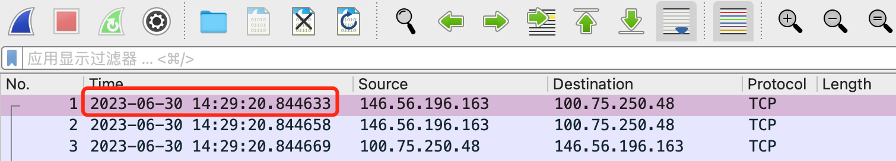

No. 1 TCP segment was received at **2023-06-30 14:29:20.844633**

b)

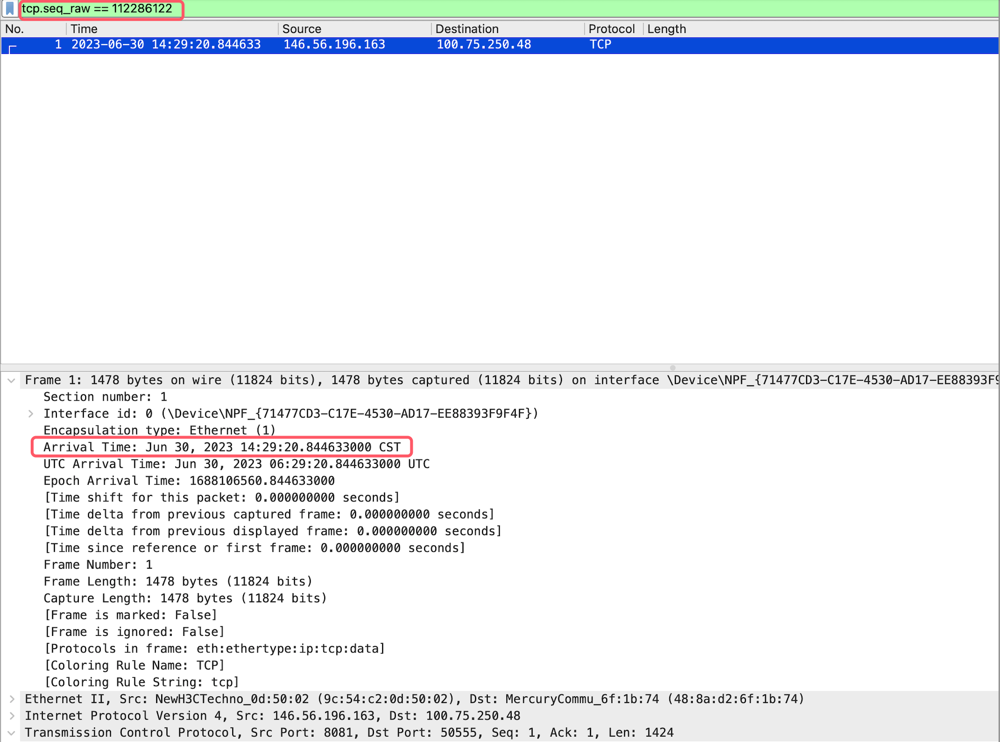

I find the ACK for the No.1 packet by entering filter statement "tcp.seq_raw == ```the  sequence number (raw) of the No.1 packet```", and obviously it was received at "Arrival Time = **Jun 30, 2023 14:29:20.844633000 (CST)**"

c)

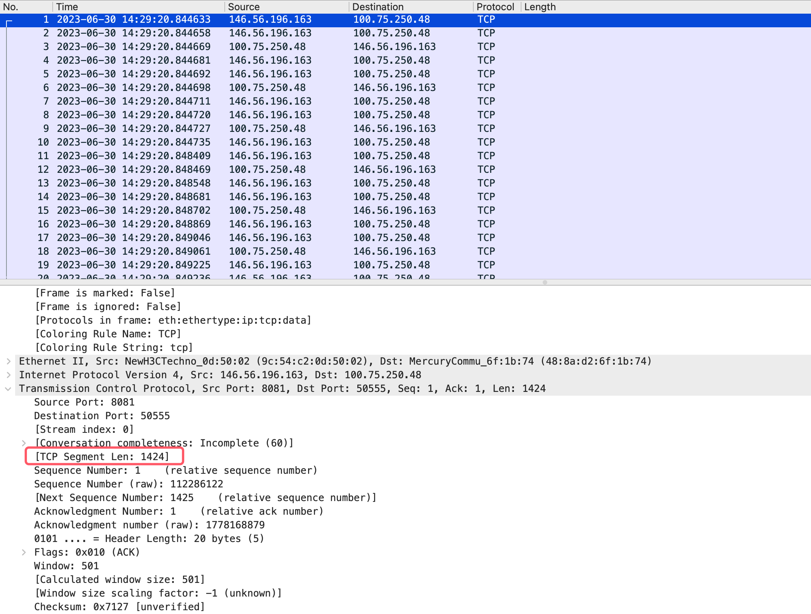

As shown in "Transmission Control Protocol" part, the No.1 TCP segment length is **1424 bytes**.

d)

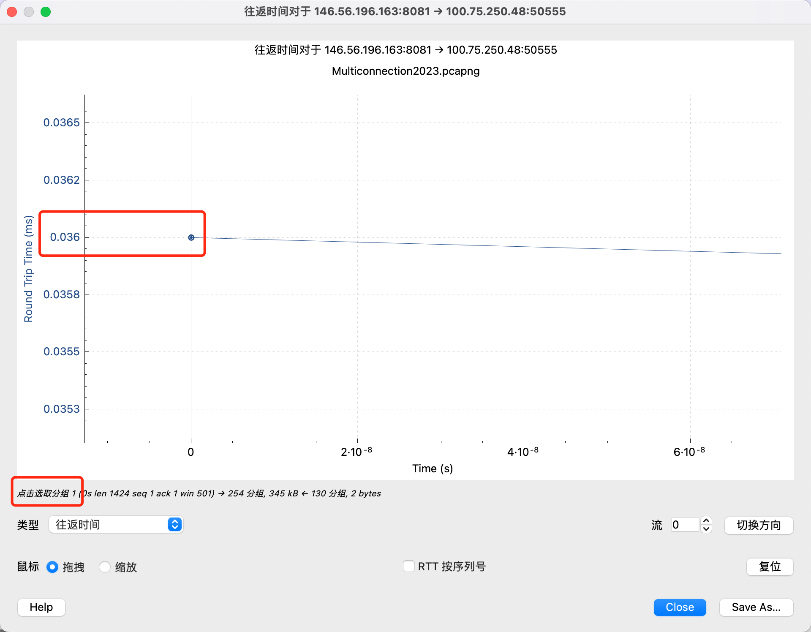

I selected the No.1 segment in the list and clicked *Statistics → TCP Stream Graph → Round Trip Time Graph* in the menu. And I clicked "switch direction" and scaled the diagram to find the point corresponding to the No.1 segment and its RTT value **0.036ms**.

### Q 2.5

a)

<div>
  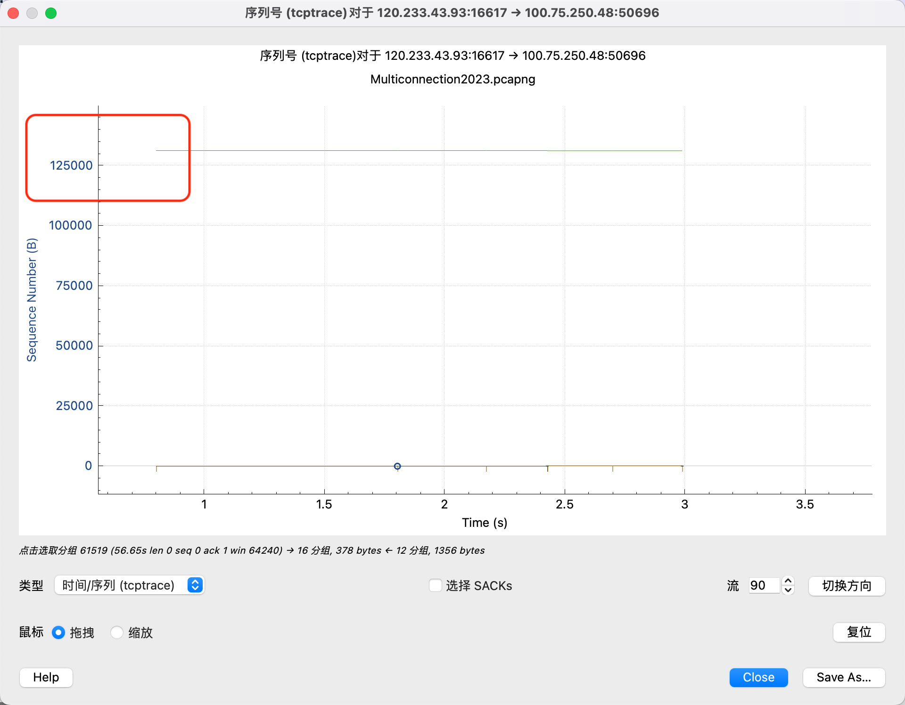
  
</div>

I used the filter **"(ip.src == 100.75.250.48 && ip.dst == 120.233.43.93) || (ip.src == 120.233.43.93 && ip.dst == 100.75.250.48) && tcp"**.

As we can see, with different directions of transmission, the plots and sequence numbers are different.

The related concept is that TCP connection is **full-duplex**, which allows data to be transmitted in both directions simultaneously, with each direction having its sequence and acknowledgment numbers.

Telephone conversations are alse full-duplex.

b)

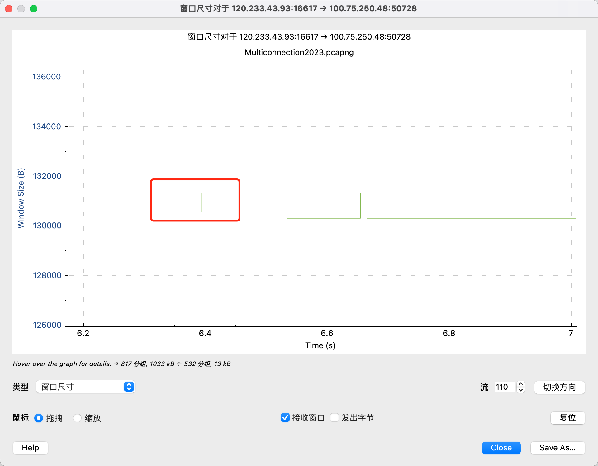

I indicate the receiver's buffer is full by noticing that the sender's window size is reduced on the graph without packet loss. Here TCP's flow control mechanisms let the sender to reduce the amount of data it sends.

c)

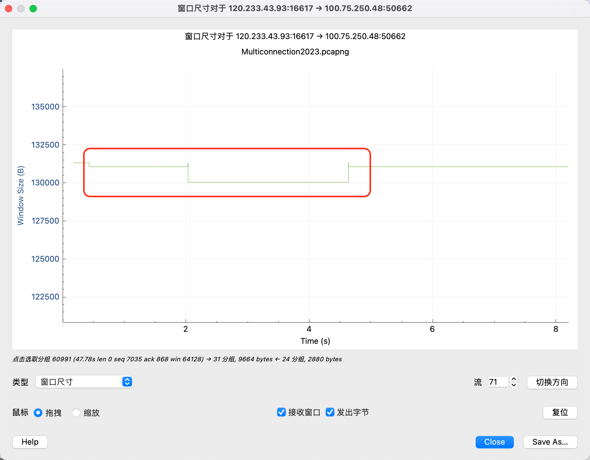

As we can see from the window size plot graph, congestion can make window size reduced.

I think this congestion is not serious because the reduction of the window size is not serious, and the window size starts to recover shortly.

d)

When retransmission is needed, the TCP connection takes actions such as decreasing the scale of congestion window size, initiating fast retransmission mechanisms, and increasing the retransmission timeout based on the exponential backoff algorithm.

Here are several potential causes of transmission failure: network congestion, packet loss or error, performance issues of routers or switches, etc. To prevent them, we can take measures such as load balancing, improving network equipment performance, using more reliable transmission media, and optimizing TCP stack settings.

### Q 2.6

To calculate the throughput of a TCP connection, we can

1. Choose a specific time period for measurement.
2. Count all the bytes sent over the TCP connection during this time, but don't include the TCP and IP header bytes.
3. Note the start and end times of this period to find out its length.
4. $throughput = \frac{total\ bytes(B)}{time\ period(s)}(B/s)$


### Q 2.7

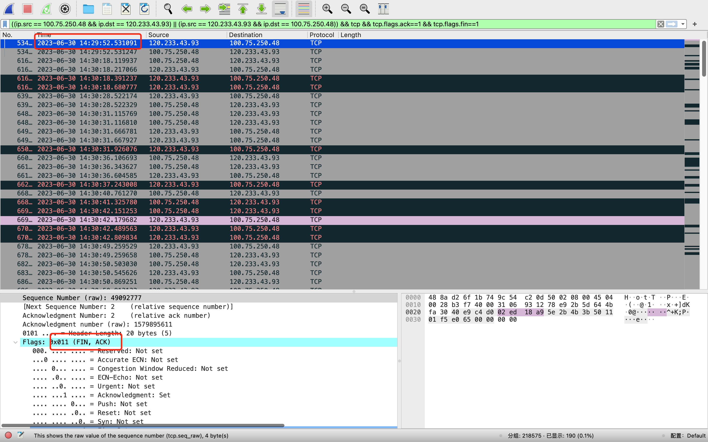

I used the filter **"((ip.src == 100.75.250.48 && ip.dst == 120.233.43.93) || (ip.src == 120.233.43.93 && ip.dst == 100.75.250.48)) && tcp && tcp.flags.ack\==1 && tcp.flags.fin==1"**.

The TCP connection was terminated at **2023-06-30 14:29:52.531091**.

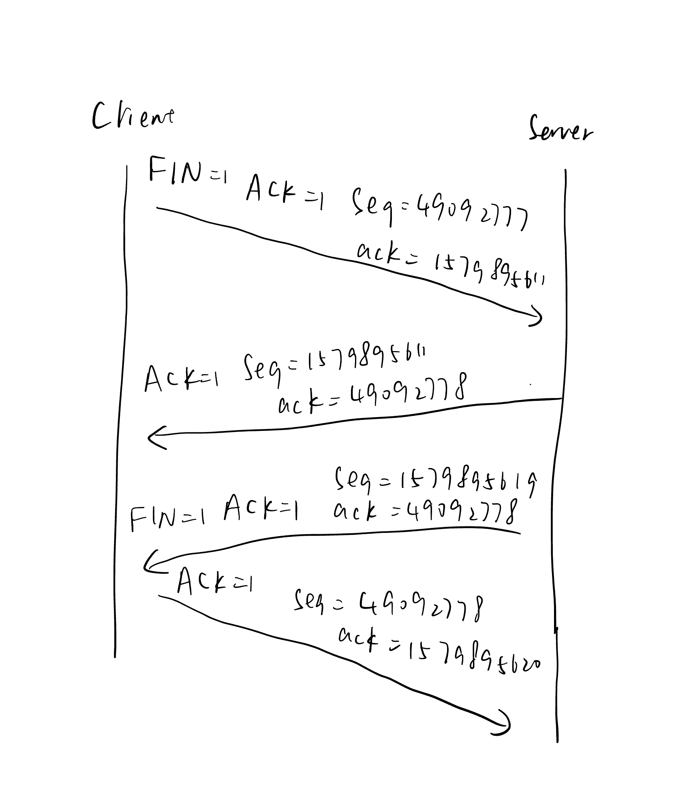

The "four-way handshake" process ensures that both the client and server have successfully closed their respective ends of the connection. It can be divided into several steps. 

1. Client Initiates Closure: The client sends a TCP segment with the FIN=1 and ACK=1 flag set, indicating its intention to close the connection. Seq is 49092777 and ack is 1579895611.

2. Server Acknowledges: The server acknowledges this request by sending a TCP segment back to the client with ACK=1. ack is 49092778, which is 1+49092777(Seq of the first segment). Seq=1579895611. At this point, the server has not yet closed the connection; it has only acknowledged the client's intention to close.

3. Server Initiates Closure: Once the server is ready to terminate the connection, it sends its own TCP segment with the FIN=1 and ACK=1. Seq and ack are the same as the second segment.

4. Client Acknowledges: Finally, the client acknowledges the server's FIN segment with a TCP segment with the ACK flag set.

### Q 2.8

To end a TCP connection well, you need a four-step process called a "four-way handshake." This is important to make sure all data is sent, received, and confirmed. If you cut this process short, some data might not be fully sent or received, which can cause communication problems or lost data.

The four-way handshake is also key in stopping data from getting lost. If you stop the connection right after the sender says they're done (FIN message), you might lose data that's still being sent or waiting to be received. This is really important for keeping the data correct and complete.

In addition, the four-way handshake has a part called TIME_WAIT. This helps with packets that are late or in the wrong order. It makes sure old data isn't mixed up with new data. Without this, there's a bigger chance of mixing up data, especially when there are network delays or mixed-up packets.


### Feedback

1. Spent about 6 hours.
2. The title of the homework document is a bit small. I overlooked paragraph between 2.3 and 2.4, resulting in using my own data for 2.4 unnecessarily.
3. Many things, not systematically learned, get overlooked, leading to mistakes, such as needing to look at both transmission directions in charts.
