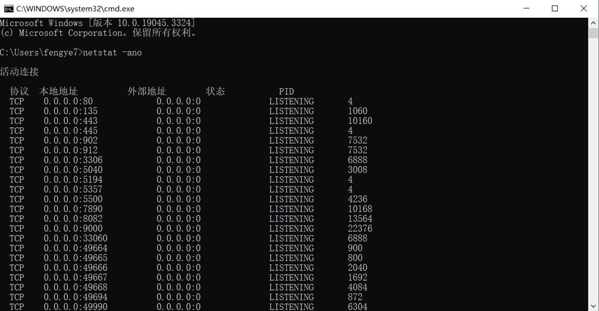
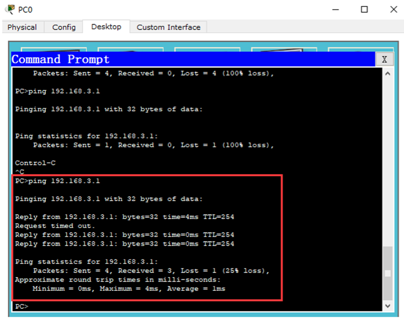
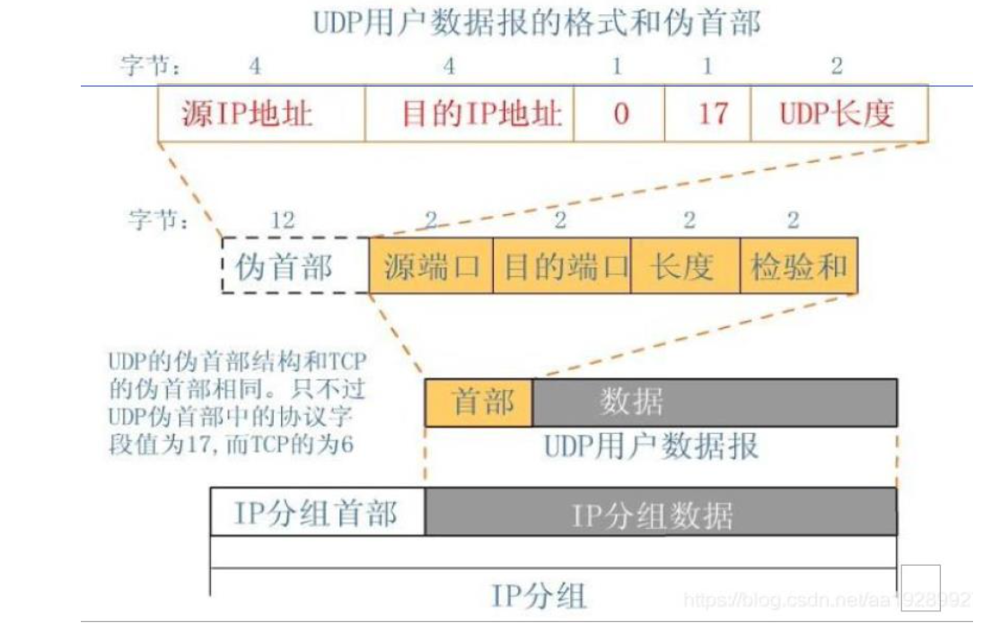
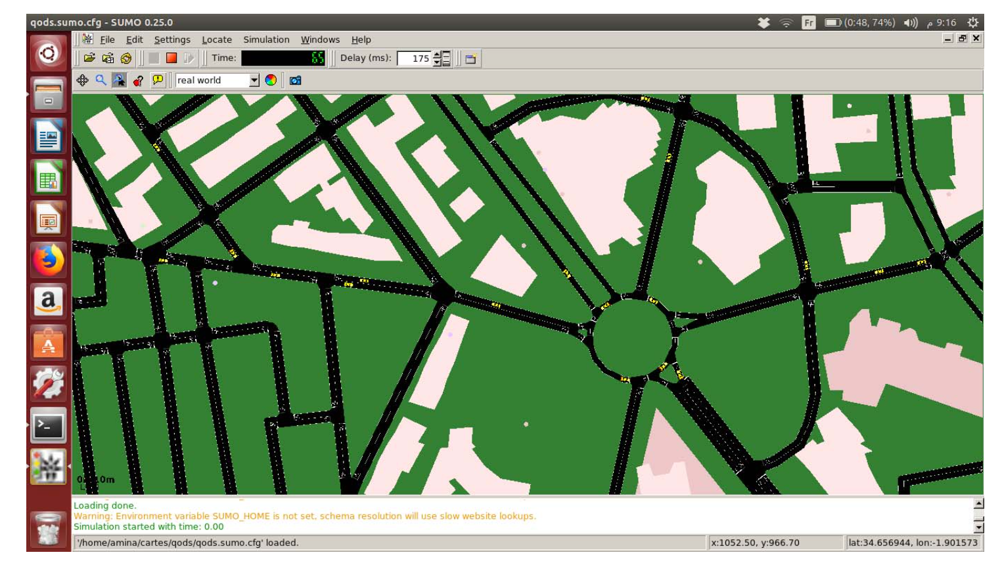

[toc]

<div style="page-break-after: always;"></div>
# 一、计算机网络基础知识实验

## 1、 进程运行原理实验

**实验目的**

1. 为全面理解计算机网络中进程和服务的内涵及其运作机制，应深入研究进程与服务的基本概念，包括进程的定义、服务的作用、进程与线程的关系等。
2. 应熟练掌握Windows系统中与进程和服务管理相关的各种工具和命令，如任务管理器、服务管理控制台、net命令等，学会查看和控制进程，启动和停止服务等。
3. 应仔细观察网络环境中的各种进程的特点，如它们所使用的端口号以及端口对应服务的关联关系，这对于分析并找出异常进程十分重要。
4. 还需重点学习如何查看系统中的各项服务，以及管理服务的启动方式、启动账户、依赖关系等内容，学会修改系统服务的配置来优化系统性能。


**实验原理**

- 进程(Process)是指一个程序在计算机内存中运行时的一次执行过程，它拥有独立的内存空间、代码、数据和其他资源。进程是计算机的基本运行单位，一个运行中的应用程序往往包含多个进程。

- 网络进程是指与网络通信相关的进程，它需要开启一个或多个网络端口以实现数据的接收和发送。常见的网络进程包括Web服务器、数据库服务器等，这些进程持续监听并响应预定的网络端口。

- 系统服务(Service)是一种特殊的进程，它们通常在后台长期运行以为其他进程提供服务，没有直接的用户界面。例如打印服务、网络服务等。系统服务启动后会一直处于待命状态，根据需求为其他进程提供功能支持。

- 在Windows系统中，我们可以通过任务管理器查看当前的进程和系统服务情况。也可以使用netstat、sc等命令来显示端口使用、控制系统服务。这些都有助于我们对进程和服务有更直观的了解。


**实验设备**

- **操作系统**: Windows 11

- **相关软件**: 记事本、Word、写字板、画图、计算器


**实验内容**

通过任务管理器查看当前系统正在运行的进程。


**实验步骤**

1、启动Windows操作系统，进入桌面环境。

2、通过“Ctrl + Alt + Del”组合键打开任务管理器，定位到“进程”选项卡。

3、在“进程”选项卡下观察各个进程的CPU和内存占用情况，注意它们的变化规律。

4、分别启动记事本、Word、写字板、画图以及计算器等多种应用程序。

5、利用任务管理器查看新启动的应用程序进程，并使用“Tasklist”、“Taskkill”等命令行工具监控和管理进程。

6、输入“services.msc”命令打开“服务”窗口，查看当前系统运行的各项服务项目。

7、记录下实验中观察到的重要进程名称、PID号、端口号、服务名称与状态等数据。

8、综合记录实验过程中的观察现象、监测数据结果等，分析进程与服务之间的关系，完成实验报告。


**实验结果**

可以看到下图中正在运行的进程。


切换到“性能“选项卡，可以看到CPU等具体的运行情况。


进入cmd窗口，输入Tasklist、Taskkill命令。


Ctrl + R 输入service.msc可以查看系统所有的服务和对应的状态。


**实验分析与讨论**

1.**解析进程与网络进程的概念**

(1)进程是操作系统中执行计算任务的基本单位，它拥有自己的地址空间、代码、数据等资源。而网络进程具有开启网络端口进行数据收发的特点，端口号与其提供的网络服务对应。

(2)通过观察发现，某些进程的CPU或内存占用率很高，这通常是由于它们正在执行复杂的计算或处理大规模数据导致的。

2.**任务管理器的作用**

(1)任务管理器提供了一个直观的图形界面，用户可以通过它查看当前系统的进程信息、资源占用情况，以及结束运行异常的应用程序进程。

(2)但需要注意，随意结束进程可能会导致相关程序不正常运行或系统不稳定，此时应该辨别进程的重要性。

3.**服务的管理**

(1)服务是一种特殊的进程，它们通常持续运行以支持其他进程的功能，没有自己的用户界面。

(2)通过“服务”管理窗口，我们可以查看服务列表、启动或停止服务，来完成对系统服务的监控与配置。

4.综上所述，图形界面与命令行都可以有效管理进程和服务，但命令行在批处理及自动化任务上会更具优势。

<div style="page-break-after: always;"></div>
## 2、 网络端地址实验

**实验目的**

网络端地址用于标识计算机网络进程，网络进程是计算机网络传输主体，由 于语言表达上问题，容易误将计算机作为计算机网络的传输主体。

(1) 明确计算机网络交互的主体是进程。计算机网络两台计算机之间的交 互，实质上是两个进程之间的交互。

(2) 了解网络端地址构成及使用。端地址是用于标识网络上任意一台计算机 上的任意一个网络进程，具有唯一性和不变性，只有通过访问网络端地址才能通 过网络同该进程交互。但在日常使用应用协议时，常常忽略端口地址，自动采用 该应用协议缺省端口地址作为网络端地址。


**实验原理**

- 什么是网络端口？

在网络技术中，端口包括逻辑端口和物理端口两种类型。

物理端口是用于连接物理设备之间的接口，如ADSL Modem、集线器、交换机、路由器上用于连接其他网络设备的接口。

逻辑端口是指逻辑意义上用于区分服务的端口，比如用于浏览网页服务的80端口，用于FTP服务的21端口等。

我们这里讲的是逻辑端口。

- 端口的作用

端口号的主要作用是表示一台计算机中的特定进程所提供的服务。网络中的计算机是通过IP地址来代表其身份的，它只能表示某台特定的计算机，但是一台计算机上可以同时提供很多个服务，如数据库服务、FTP服务、Web服务等，我们就通过端口号来区别相同计算机所提供的这些不同的服务，如常见的端口号21表示的是FTP服务，端口号23表示的是Telnet服务，端口号25指的是SMTP服务等。

- 端口的分类

TCP与UDP段结构中端口地址都是16比特，可以有在0---65535范围内的端口号。

1. 按照端口号分类：

公认端口：0~1023。它们紧密绑定于一些服务，通常这些端口的通讯明确表明了某种服务的协议，如：80端口对应与HTTP通信，21端口绑定与FTP服务，25端口绑定于SMTP服务，135端口绑定与RPC（远程过程调用）服务。

注册端口：1024~49151。它们松散的绑定于一些服务，也就是说有许多服务绑定于这些端口，这些端口同样用于其他许多目的，如：许多系统处理端口从1024开始

动态或私有端口：49152~65535。理论上，不应为服务分配这些端口，通常机器从1024开始分配动态端口。例外：SUN的RPC端口从32768开始。

2. 按照协议类型分类：按协议类型划分可分为TCP端口、UDP端口、IP端口、ICMP。

TCP端口：即传输控制协议端口，需要在客户端和服务器之间建立连接，这样可以提供可靠的数据传输。常见的包括FTP的21端口，Telnet的23端口，SMTP的25端口，HTTP的80端口。

UDP端口：即用户数据报协议端口，无需在客户端和服务器端建立连接，安全性得不到保障。常见的DNS的53端口，SNMP（简单网络管理协议）的161端口，QQ使用的8000和4000端口。

保留端口：UNIX有保留端口号的概念，只有超级用户特权的进程才允许给它自己分配一个保留端口号。这些端口号介于1~1023之间，一些应用程序将它作为客户与服务器认证的一部分。

- 端口使用的注意事项

不要使用端口号小于1024的端口。

端口号一般习惯为4位整数，在同一台计算机上端口号不能重复，否则，会产生端口号冲突。 

客户端端口号因存在时间很短暂又称临时端口号，大多数TCP/IP实现给临时端口号分配1024---5000之间的端口号。大于5000的端口号是为其他服务器预留的 。

- 网络端地址实验拓扑结构如下：

  


**实验设备**

一台连接到互联网的计算机


**实验内容**

任何开放的互联网 Web 网站按照业界习惯，都使用 80 端口地址作为 HTTP 协 议的端地址。浏览器地址栏支持端地址使用，当没有输入端地址时，就会自动采 用应用协议的缺省端地址，HTTP 协议的缺省端地址是 80。实验使用 Chrome 浏览 器访问互联网上任意一个网站，通过设置网络端地址，来验证其作用。主要实验 内容:

(1) 端地址设置成 81 端口时，浏览器无法浏览网页。

(2) 端地址设置成 80 端口时，浏览器可以正常浏览网页。


**实验步骤**

- 启动浏览器，通过访问同一个网址的不同端口，实验中使用了同济大学官网， 实际可以是任何一个网址。

- 在浏览器中输入以下地址进行访问：

[https://www.tongji.edu.cn:8080](https://www.tongji.edu.cn:8080/)

[https://www.tongji.edu.cn:80](https://www.tongji.edu.cn:80/)

[http://www.tongji.edu.cn:8080](http://www.tongji.edu.cn:8080/)

[http://www.tongji.edu.cn:80](http://www.tongji.edu.cn/)

在CMD命令行环境中输入命令：netstat -ano，观测结果。


**实验结果**

(1) 访问非 80 端口。地址栏中输入“http://www.tongji.edu.cn:81”。浏览器显示无法获得该 URL 地址网页，Web 服务器端口地址不是 81。

(2) 访问 80 端口，地址栏中输入“http://www.tongji.edu.cn:80”。浏览器能正常显示网站主页内容。

netstat -ano命令结果如下：




**实验分析与讨论**

1. 实验内容过程记录

在浏览器中尝试访问提供的URL，观察连接成功与否以及页面响应。

使用netstat -ano命令查看当前计算机的网络连接状态。

2. 相关端口号使用举例

HTTP服务默认使用80端口。

HTTPS服务默认使用443端口。

FTP服务使用20和21端口。

SMTP邮件发送服务使用25端口。

POP3邮件接收服务使用110端口。

Telnet远程登录服务使用23端口。


<div style="page-break-after: always;"></div>
# 三、物理网络实验

## 3、网络线的制作和测试实验

**实验目的**

本实验的最终目的，是接通一根网线，该网线由以下两部分组成：首先是非屏蔽双绞线(UTP)。它使用塑料绝缘外皮包裹着8根信号线。这8根信号线每2根为一对，相互缠绕，形成总共4对扭曲在一起的线对。其次是水晶头，其外观晶莹透亮。双绞线的两端都需要安装RJ-45插头，以便插入网卡、集线器或交换机上的RJ-45接口。通过本实验，我们将测试这两部分是否可以正确接通，形成一根合格的网线。

**实验原理**

有两种接通方法：

- 直通线接法
  - 端1：白橙 橙 白绿 蓝 白蓝 绿 白棕 棕
  - 端2：白橙 橙 白绿 蓝 白蓝 绿 白棕 棕
- 交叉线接法
  - 端1：白橙 橙 白绿 蓝 白蓝 绿 白棕 棕
  - 端2：白绿 绿 白橙 蓝 白蓝 橙 白棕 棕


**实验设备**

- 压线钳
- 通断仪
- 双绞线
- 水晶头


**实验步骤**

本次实验采用直通线制作。首先准备实验所需的工具和材料。然后进行线缆剥皮，使用斜口钳剪断需用的双绞线部分，剥去该部分的绝缘外皮，露出里面的金属芯线。接着进行线序排列，将剥露的双绞线中橙色线对向左拨，棕色线对向右拨，绿色线对向前拨，蓝色线对向后拨，使其按照 EIA/TIA 568B 标准的顺序排列（白橙、橙、白绿、蓝、白蓝、绿、白棕、棕）。

排列完成后，使用剪刀或斜口钳将双绞线剪短，只留约1.4厘米长度。然后依次将双绞线的每根线放入 RJ-45 接头的插针内，第一根插针应该是白橙色线，其他各线依次排列好。逐一检查每根线是否按正确顺序放置就位。放置完成后，使用 RJ-45 压接钳将水晶头里的八片小铜片压实，完成 RJ-45 接头的封装。

制作完成的双绞线插入通断仪的测试接口。打开通断仪的电源开关，观察指示灯的闪烁情况，判断双绞线制作是否成功。


**实验结果**

通断仪两边编号为1～8的指示灯两两对应同时亮，是直通线接通方法的理想结果，表明对应导线将通断仪两侧接口连接，双绞线制作成功。


<div>
  
  

</div>


**实验分析与讨论**

1. 线缆剥皮操作需注意露出的双绞线长度不宜过长，否则不易操作，也不宜过短，否则难以插入水晶头。
2. 线缆剥皮操作要注意不能过于用力、反复用压线钳碾压，否则会造成双绞线断裂
3. 压实操作需要注意方向，否则可能无法压实或损坏水晶头

<div style="page-break-after: always;"></div>
## 6、虚拟无线隐藏节点实验

**实验目的**

1. 了解无线网络的传输机制，加深对 CSMA/CA 协议的理解。
2. 了解移动自组网络的传输机制，加深对中间节点路由协议原理的理解。 
3. 培养初步的观察力和分析能力，形成最基本的研究能力。


**实验设备**

实验由一台安装虚拟机 VMWare 的计算机担当，使用 Ubuntu 环境。


**实验内容**

1、无线局域网络隐藏节点实验

隐藏节点实验主要是揭示无线节点传输过程中可能发生的冲突以及解决的 过程。实验场景非常典型化，设置了两个发送节点和一个接收节点，实验中需要 控制的是节点之间的距离可以自由调整，RTS/CTS 控制可以启用或不启用，然后 观察数据包丢失现象来获得实验结论。实验场景如下:


圆圈表示无线信号覆盖的区域。
 2、移动自组网络 manet 实验 自组网络实验主要是揭示其典型的传输过程。工程上，经常将数据发送节点，

称为源(source) 节点，主要用于采集数据，接收节点，称为汇聚(sink) 节点， 将收集到的数据统一发送给数据中心。实验将使用 50 个节点，其位置随机确定 的，其中，确定 1 个汇聚节点和 10 个源节点，源节点将同时向汇聚节点发送数 据，不能直接传输到达的数据，将由其他中间节点进行路由，实验允许采用 OLSR、 AODV、DSDV 和 DSR 路由协议，缺省采用 AODV 路由协议。通过观察数据包传输来 理解自组网络运行机制。

AODV 无线自组织按需距离矢量协议. 当一个节点需要给网络中的其他节点 传送信息时，如果没有到达目标节点的路由，则必须先以组播的形式发出 RREQ(路由请求) 报文。RREQ 报文中记录着发起节点和目标节点的网络层地址， 邻近节点收到 RREQ，首先判断目标节点是否为自己。如果是，则向发起节点发送 RREP(路由回应);如果不是，则首先在路由表中查找是否有到达目标节点的路由， 如果有，则向源节点单播 RREP，否则继续转发 RREQ 进行查找。


**实验步骤**

一、无线局域网络隐藏节点实

虚拟实验由 wifi-hidden-stations.cc 实现。具体步骤:

1、编译 wifi-hidden-stations.cc。

1. 复制 wifi-hidden-stations.cc 到 NS_HOME/scratch
2. 编译wifi-hidden-stations.cc:./waf –run scratch/wifi-hidden-stations.cc

 2、运行目标代码。

1) 将目录移动到 NS_HOME/scratch/build
2) 运行目标代码:./wifi-hidden-stations.cc 

3、显示运行动画

1) 将目录移动到执行目录 netanim
2) 启动 netanim 动画工具程序:./NetAnim
3) 显示运行动画。打开 wifi-hidden-stations.xml 

二、移动自组网络 manet 实验

虚拟实验由 manet-routing.cc 实现。具体步骤: 

1、编译 manet-routing.cc。

1) 复制 manet-routing.cc 到 NS_HOME/scratch
2) 编译 manet-routing.cc:./waf –run scratch/manet-routing.cc 

2、运行目标代码。

1) 将目录移动到 NS_HOME/scratch/build 
2) 运行目标代码:./manet-routing.cc 

3、显示运行动画

1) 将目录移动到执行目录 netanim
2) 启动 netanim 动画工具程序:./NetAnim 
3) 显示运行动画。打开 manet-routing.xml


<div style="page-break-after: always;"></div>
## 8、以太网组网实验

**实验目的**

物理网络是计算机网络的基本组织单元，其各个节点之间可以进行数据通信。物理网络是 互联网的基础架构，无论对于理解网络基本原理还是网际互联原理都非常关键。实验利用以 太网交换机组成一个独立的双绞线以太网物理网络，实现网络节点之间的互通。

(1)理解局域网组网原理

(2)理解掌握以太网组网步骤 

(3)了解以太网网络地址格式


**实验原理**

以太网是当今有线局域网主体，目前家庭和企业安装的有线局域网全部采用以太网，即使使用无线网络连接主机，无线网络最终还是要借助以太网连接互联网才能上网。以太网主要 由以太网网络设备、以太网卡以及双绞线组成。双绞线以太网组网如下图所示:


**实验设备**

以太网组网实验拓扑结构如下图所示，反映了典型的以太网组网方式:


两台计算机和一台交换机担当实验设备，使用两根双绞线网络，将两台计算机以太网网卡 同交换机连接起来。计算机 Host1 作为操作平台和测试操作平台，另一台计算机 Host2 作为 测试平台。也可以使用家用无线路由器代替交换机，开展本实验。


**实验内容**

1. 以太网组网实验 

(1)将两台计算机和交换机连接成一个局域网。需要用双绞线网线将网卡和交换机端口连 接起来。现有操作系统都使用 TCP/IP 协议为网络协议，不直接支持物理网络通信，需要通 过 TCP/IP 协议使用网卡，必须为网卡配置 IP 地址，为处理方便，所有子网掩码设置为 255.255.255.0，计算机 Host1 网卡 IP 地址设置为 192.168.0.12;计算机 Host2 网卡 IP 地址设 置为 192.168.0.10。

 (2)利用 ping 命令对两台计算机间的连通进行测试。


2. 以太网网卡地址查看实验

使用 ipconfig 命令查看网卡物理地址，了解以太网地址格式。


**实验步骤**

**实验一:以太网组网实验**

 (1)用两根双绞线网线分别将两台计算机网卡同交换机端口连接起来，这样就形成了局域 网。

 (2)为主机配置 IP 地址，主机网卡 IP 地址设置如下:
 Host1:IP 地址=192.168.0.12，子网掩码=255.255.255.0
 Host2:IP 地址=192.168.0.10，子网掩码=255.255.255.0

(3)Host1 测试 Host2 是否连通。打开 Host1 命令行窗口，输入 ping 命令“ping 192.168.0.10”， 可以看到联通，由于交换机处理有个延缓过程，命令要多打几次，才能实验成功。

**实验二:以太网网卡地址查看实验**

Host1 查看自身以太网物理地址，打开命令行窗口，输入命令“ipconfig:ipconfig/all“， 可以看到 Host1 以太网卡的 IP 地址就是 192.168.0.12，物理地址是 40-2C-F4-ED-74-74。


**实验分析与讨论**

本实验同样是实现两台客户机之间的互通实验，但是实现使用的方法是利用双绞线将两台 客户机连接到一台交换机，形成独立的局域网络，从而使在该局域网中的两台计算机实现数 据互通。该实验成功的基础在于当今计算机大部分在主板上已经集成了以太网卡，因此可以 直接通过双绞线将以太网卡与交换机连接从而构成一个局域网。

在实验过程中我们可以发现当今大多数计算机采用的是 TCP/IP 协议，在本实验中通过更 改其 IPv4 地址进行试验，其 IP 地址由四个 3 位二进制数组成，在本实验中需要保证两台客 户机的 IP 地址不同，且以太网中不能存在其他网络的 IP 地址与对方的 IP 地址相同，否则会 影响实验结果。

实验中存在一些注意事项，在更改计算机的 IP 地址后立刻使用 ping 命令进行连通测试可 能会失败，因为交换机处理存在延缓过程，可能无法立刻进行互通，所以需要多尝试几次 ping 命令直至成功，若仍无法互通则是实验步骤出现问题。与此同时在实验过程中存在未能 解决的疑问，如实验中出现了 Host1 能够接收到 Host2 的信息，但是 Host2 在接收 Host1 发 送的信息时却会存在超时的现象，这个问题并未得到解决，希望在今后能够尝试发现问题。


<div style="page-break-after: always;"></div>
## 10、VLAN配置实验

**实验目的**

对于企业而言，可能含有许多部门，为便于管理，常常以部门为单位，构建 多个物理子网。传统网络工程，只有相近的办公室才可以组成同一个物理子网， 鉴于种种原因，很可能同个部门的两个办公室位于不同楼层，甚至不同大楼。

虚拟局域网(Virtual Local Area Network，VLAN)，标准编号为 IEEE802.1Q， 可以实现将两个相距较远的办公室组成同一个物理子网。实验利用交换机提供虚 拟局域网功能，实现 VLAN 划分。

1. 掌握配置交换机的常用功能
2. 掌握交换机VLAN划分操作
3. 掌握VLAN的概念、原理、应用范围


**实验原理**

虚拟局域网(VLAN)是一组逻辑上的设备和用户，这些设备和用户并不受物 理位置的限制，可以根据功能、部门及应用等因素将它们组织起来，相互之间的 通信就好像它们在同一个网段中一样，由此得名虚拟局域网。

VLAN 是一种比较新的技术，工作在 OSI 参考模型的第 2 层和第 3 层。在计 算机网络中，一个二层网络可以被划分为多个不同的广播域，一个广播域对应了一个特定的用户组，默认情况下这些不同的广播域是相互隔离的。不同的广播域 之间想要通信，需要通过一个或多个路由器。这样的一个 VLAN 就是一个广播域， VLAN 之间的通信是通过第 3 层的路由器来完成的。

在同一个 VLAN 中的工作站，不论它们实际与哪个交换机连接，它们之间的 通讯就好像在一台独立的交换机上一样。同一个 VLAN 中的广播只有 VLAN 中的成 员才能听到，而不会传输到其他的 VLAN 中去，这样可以很好的控制不必要的广 播风暴的产生。同时，若没有路由的话，不同 VLAN 之间不能相互通讯，这样增加了企业网络中不同部门之间的安全性。网络管理员可以通过配置 VLAN 之间的 路由来全面管理企业内部不同管理单元之间的信息互访。交换机是根据工作站的 MAC 地址来划分 VLAN 的。所以，用户可以自由的在企业网络中移动办公，不论 他在何处接入交换网络，他都可以与 VLAN 内其他用户自由通讯。

与传统的局域网技术相比较，VLAN 技术更加灵活，它具有以下优点:网络设 备的移动、添加和修改的管理开销减少;可以控制广播活动;可提高网络的安全性。

- VLAN原理

虚拟局域网（VLAN，Virtual Local Area Network）能够将地理位置上分散的主机集合到同一个局域网中。以太网交换机，作为网桥的一种发展形式，最初设计用于扩展物理网络的覆盖范围。通过利用交换机内的软件特性，我们可以将其上的端口进行逻辑上的分组。这样，每个逻辑端口组形成的虚拟网络可以被视为一个独立的物理网络。每个VLAN都代表一个广播域，而不同的VLAN之间的通信是相互隔离的。要实现不同VLAN间的通信，必须通过第三层的路由功能。VLAN的配置方式既灵活又多样。

- VLAN主要配置命令
  - 进入 VLAN 的配置模式：vlan database。
  - 创建 VLAN：vlan NO name NAME。(NO 表示 VLAN 编号的数字，NAME 表示 VLAN 别名。每个交换机都缺省包含一个编号为 1 的 VLAN)。
  - 物理端口划归指定 VLAN：switchport access vlan NO，NO 代表 VLAN 组编 号。
  - 显示 VLAN 配置情况：show Vlan。
  - 删除 VLAN：no vlan NO，NO 代表 VLAN 编号。


**实验设备**

- 实验设备：
  - 机房电脑
  - Cisco2950交换机，具有24个默认10M百兆端口
- 软件：Cisco Packet Tracer虚拟实验设备
- 操作系统：Windows10


**实验步骤**

- 按照下图连接设备，构成网络。


- 通过Config图形化界面为三台PC机配置IP及掩码，依次如下：
  - PC0配置：192.168.1.1 mask 255.255.255.0 F0/1 VLAN10
  - PC1配置：192.168.1.11 mask 255.255.255.0 F0/2 VLAN20
  - PC2配置：192.168.1.21 mask 255.255.255.0 F0/3 VLAN 30


- 通过图形化界面，为PC0/PC1/PC2分别配置Vlan10，Vlan20，Vlan30


- 使用 ping 命令测试三台主机之间是否连通


**实验结果**

用PC0分别ping PC1、PC2，用PC1分别ping PC0、PC2，用PC2分别pingPC1、PC0，发现均请求失败。


**实验分析与讨论**

- VLAN 的作用在于其将物理上的网络连接与逻辑上的网络连接分开了。连接到同 一台交换机的几台机器未必是同一个 VLAN 下，不连在一台交换机的机器未必不 在同一个 VLAN 下。这样，一台交换机连接的机器也可以使其不能够互相访问， 而物理空间上相隔很远的机器可以通过设置同一个 VLAN 的方式使其可以自由地 连接。如此一来，机器间的互相访问就和实际的上物理连接脱离了关系。使得访 问更加灵活，修改连接关系更加方便;控制广播活动更加容易;也可提高网络连接的安全性。
- 这次实验将交换机划分成三个VLAN，三台计算机作为测试平台。在划分开始之前那，由于三台计算值在同一个局域网内，因此互相ping的结果是连通的。
- 在修改交换机配置前，三台PC由于默认配置可以连通；修改后主机在不同的VLAN，无法互相通信，因此ping程序无法连通。


<div style="page-break-after: always;"></div>
## 18、虚拟LTE蜂窝网络组网实验

**实验目的**

本实验是 LTE-EPC 蜂窝网络信元切换实验，构建一个多信元场景，每个基站 相隔足够远，以致于信元间的重叠区非常小，通过模拟移动终端的移动，根据 基站的信号强度，自动进行信元切换，让学生了解 LTE-EPC 网络的信元的构成 原理。

1. 理解无线局域网的信元的构成及机制; 

2. 理解 LTE-EPC 网络 X2 切换原理和机制; 

3. 理解基于 X2 接口的内部切换仿真流程。

   

**实验原理**

信元，特指无线广域网无线信号覆盖区，区内都包含一个信号塔作为基
站，负责同进入区域内智能终端的无线信号发送和接收，理想的信元是一个正
六边形。

智能终端通过所在信元的基站接入 LTE 网络，智能终端在移动过程中，不 断进出不同信元，就需要在不同的信元之间进行切换，信元切换是改变用户服 务小区的连接方式的过程。

X2 接口是 LTE 基站切换的接口标准。X2 接口主要功能是在 LTE 系统内，UE 在连接状态下从一个基站切换到另一个基站的移动性管理，技术上，前后两个 基站分别称为源基站和目标基站。X2 接口控制面还可以对各 eNodeB 之间的资 源状态、负责状态进行监测，用于 eNodeB 负载均衡、负荷控制或者准入控制的 判断依据。此外还负责 X2 连接的建立、复位、eNodeB 配置更新等接口管理工作。

**X2 切换算法**

X2 切换算法主要有 a3-rsrp-handover-algorithm 和 a2-a4-rsrq- handover-algorithm 两种。

1. A3-rsrp-handover-algorithm

A3 切换算法也成为最强的小区切换算法，想法是为每个 UE 提供最佳的参考 信号接收功率(RSRP)。这是通过在检测到更好的小区(即具有更强的 RSRP) 后执行切换来完成的。选择事件 A3(邻居小区的 RSRP 比服务小区的 RSRP 更 好)来实现这一概念。UE 触发切换到测量报告中的最佳小区。使用此算法的仿 真可能会导致在短时间内连续切换到先前的源 eNodeB，尤其是在启用衰落模型 时。通常通过在切换中引入一定的延迟来解决该问题。该算法通过将滞后和触 发时间参数包含到 UE 测量配置中来实现此目的。

2. A2-A4-rsrq-handover-algorithm。

A2A4 切换算法利用从事件 A2 和事件 A4 获取的参考信号接收质量(RSRQ)测量。因此，该算法将向相应的 eNodeB RRC 实例添加 2 个测量配置。

3. No OpHandover Algorithm。 

最简单的实现切换算法。它基本上不执行任何操作，即不调用任何“移交管 理” SAP 接口方法。如果用户希望在仿真中禁用自动切换触发功能，则可以选择此切换算法。


**实验内容**

了解在移动终端 UE 移动过程中，进入不同信元之间而进行信号切换处理情况， 模拟控制智能手机移动方向，进行向上、下、左、右或随机方向，引起不同的 信元之间的切换，还选择不同的切换算法，充分反映信元切换状况。实验结束 后会生成日志文件，验证相邻信元切换情况。


**实验步骤**

1. 运行虚拟实验子项目。 

   (1) 打开一个终端窗口。

   (2)  切换到执行目录，/home/jary/Desktop/ns3/ns-allinone-3.30/ns- 3.30/。

   (3)  运行 lte-ex-3.cc。sudo ./waf --run lab-lte-handover


运行后，将生成/home/yan/ns3/ns-allinone-3.28/ns-3.28/xml/lab-lte- handover.xml 跟踪文件以及通信数据 pcap 文件。

2. 运行 NetAnim。

(1)  打开一个新终端窗口。

(2)  切换到执行目录，/home/jary/Desktop/ns3/ns-allinone-3.30/netanim-3.108/。

(3)  运行 NetAnim。./NetAnim

(4)  打开实验跟踪文件。File lte-ex-3.xml，将以动画方式呈现实验场

景，如图所示。


3. 验证日志文件数据验证。打开生成的日志文件 log.out，分析在移动过程中 移动终端和信元之间的切换，信元的区域可以使用红框所示，如图所示。在 日志中，可以看到 Service 表示切换处理过程。


**实验分析与讨论**

通过这次实验，我了解了 LTE-EPC 网络的信元的构成原理，包括切换原理与机 制和内部仿真流程等。


<div style="page-break-after: always;"></div>
# 四、SOCKET编程实验

## 4、UDP协议网络编程实验

**实验目的**

UDP 协议应用面没有 TCP 协议广，但影响也很大，如微信和 QQ 等都是典型的 UDP 应用。UDP 网络编程原理基本相同。本实验是使用 Socket 来编写一个基于 UDP 简 易通信程序，进行即时通信。

(1) 理解客户机/服务器模型，了解端口在网络传输中的作用。

(2) 了解无连接通信方式及编程方式。 

(3) 了解掌握基于 Socket 的 UDP 应用编程的基本步骤。


**实验原理**

本实验旨在介绍 UDP 编程原理，遵循客户机/服务器模型。创建两个网络程序进 行简单通信，基本功能是客户机从发送窗口任意一段字符串给服务器，服务器接 收来自客户机的字符串，然后将字符串返回给客户机，客户机在另一个显示框口 显示返回消息。

客户机由 UDPClient 类担当，通过端口号 555，访问服务器，客户机端口号不需 要指定，系统会自动赋予;服务器由 UDPServer 类担当，服务端口号为 5555。实 验时服务器必须首先启动，才能让客户机能访问。
 Java 的 Socket 接口类中，已实现了 UDP 协议若干对象，主要有 DatagramPacket 类和 DatagramSocket 类。

(1)  DatagramPacket 类。代表 UDP 数据对象。

(2)  DatagramSocket 类。代表 UDP 协议对象，对象包含了代表 UDP 端口的属性，两个主要方法 send(DatagramPacket)和 receiver(DatagramPacket)， 采用无连接的传输服务，直接同对方进行数据发送和接收。UDP 即时通信 实验程序处理流程图如下所示:


**实验内容**

在 Java 项目 Socket 下，开发 UDPServer 和 UDPClient 两个类。

(1)  开发服务器程序 UDPServer 类，将源代码全部复制进去。

(2)  开发客户机程序 UDPClient 类，UDPClient 包含图形化界面，代码较长，将源代码全部复制进去。

(3)  测试交互。先运行 UDPServer，后运行 UDPClient，然后在 UDPClient界面中输入字符串发送，进行即时通信。


**实验步骤**

1. 运行 Eclipse 开发平台，按照要求:复制 UDPServer 和 UDPClient 代码。
2. 先运行 UDPServer，然后运行 UDPClient 如下所示:


**实验分析与讨论**

通过这个实验，让我更好的了解了如何通过 Java 代码完成一个基于 UDP 协议的 网络通信，并且更好的对未来软件发展有了一个大致方向。


<div style="page-break-after: always;"></div>
## 5、TCP应用协议编程实验

**实验目的**

传输控制协议(Transmission Control Protocol，TCP 协议)是使用最广泛的传 输层协议，其功能蕴含了开放系统互连参考模型的传输层协议和会话层协议。本 实验是基于 Socket 来编写一个基于 TCP 简单通信程序，同时具有并发能力。

- 进行基于Java语言的Socket编程，编写一个基于TCP的简单通讯程序，且具有并发能力
- 了解基于TCP网络应用服务器的基本编程架构。
- 了解面向连接和无连接的区别，了解TCP编程基本步骤。 
- 了解并发服务原理及编程方式。


**实验原理**

- **并发服务**

TCP 采用面向连接方式，服务器一旦同一个客户机建立了会话，就无法同其他客户再建立会话，严重影响用户体验。并发服务能力是指服务器具有同时建立多个会话，允许多个客户访问的能力，日常使用的 TCP 服务器均是并发服务器。但并发服务不属于网络技术而属于编程技术研究范畴，并发服务器程序有着特殊的编程架构，典型架构有两部分代码组成，第一 部分是主进程，负责请求调度，接受客户请求申请，建立会话并为每个请求创建服务处理线程;第二部分是服务处理线程，负责具体会话处理，为客户请求提供服务，可以被主进程不 断创建。

假定有两个客户访问同一个 TCP 服务器，TCP 服务器启动后，只有主进程在运行，开启服 务端口 PORT，等待客户端访问。第一个客户访问 PORT 端口，主进程接收到请求 1，创建一 个服务线程 1 负责处理请求 1，随后的会话发生在客户机 1 和服务线程 1 之间，主进程等待 下一次请求到来;第二个客户访问 PORT 端口，主进程接收到请求 2，再创建另一个服务线 程 2 负责处理请求，随后的会话发生在客户机 2 和服务线程 2 之间，主进程继续等待下一个 请求。如果同时又 N 个客户访问服务器，这时候就有 N+1 个线程(进程)在运行;主进程 永远等待客户访问。并发处理的数量理论上没限制，主要取决于计算机处理能力，设计 CPU 核数量和内存大小。

- **TCP 实验程序编程**

TCP 服务器编程除了要遵循客户机/服务器模型，还要让服务器具备并发能力，所以需要创建三个类，客户端一个，服务器两个：主进程和服务线程。基本功能同 UDP 编程实验类似，客户机从发送窗口发送任意一段字符串给服务器，服务器接收来自客户机的字符串， 然后将字符串返回给客户机，客户机在另一个窗口显示。

 客户机由 TCPClient 类担当，通过端口号 5588 访问服务器;服务器主进程由 MainServer 类 担当，服务端口号为 5588，主要功能是接受客户机访问并创建服务线程来处理，实验时主进 程必须首先启动，才能让客户机能访问服务器;服务线程由 ServiceServer 担当，承担实际服 务处理功能。

Socket 接口中，已实现了TCP 协议若干对象，主要有 ServerSocket 类和 Socket 类。 

1.ServerSocket 类。代表 TCP 协议对象，包含了代表 TCP 端口的属性，主要方法有 accept( )。 accept( )用于接受客户会话请求创建 Socket 会话对象，然后，通过会话对象进行 数据通信。

 2.Socke 类。代表 TCP 会话对象，主要方法 getInputStream()和 getOutputStream()分别用于 应用数据流的接收和发送，进行双向通信。应用数据大小不限，TCP 发送前会自行分割，收 到后会自行拼接，其功能已封装在接口内。当不再需要通信，close()方法用于关闭会话。

客户机同服务器主迸程交互主要是建立 TCP 会话，客户机同服务线程交互是通过会话进行 数据收发。

 (1)MainServer 类，作为服务器主进程，负责接受客户会话请求，创建服务线程，涉及三个 环节。

1. 创建 TCP 服务 Socket： Java 提供了 ServerSocket 专门作为 TCP 服务 Socket，已封装 了传统 Socket 的多种功能，创建端口并实施监听，核心代码如下:

   ```java
   ServerSocket server = new ServerSocket(5555);
   ```

2. 等待来自客户端的会话请求，一旦成功就会创建 Socket 会话对象，该对象代表同客户 端的 TCP 会话，通过该对象才能进行数据通信，核心代码如下:

   ```java
   Socket client = server， accept ( ) ;
   ```

3. 创建 ServiceServer 祕线程，将 Socket 会话对象传递过去启动线程运行负责同客 户灌的数据传输及处理，核心代码如下:

```java
ServiceServer service = new ServiceServer(client); 
Thread thread = new Thread(service);
thread. start();
```

 (2)ServiceServer 程序，作为服务线程负责实际数据处理和服务，需要实现 Runnable 线 程接口，核心处理代码包含在 run()方法中，由 MainServer 启动线程运行，涉及三个环节。 

1. 从会话对象 Socket 获得数据流，发送是输出流，接收是输人流，核心代码在构造方 法中：

```java
public ServiceServerCSocket c)throws IOException{
 this. client = c;
 is = new ObjectInputStream(client. getlnputStream());
 os=new ObjectOutputStreamCclient. getOutputStream());
 }
```

2. 利用输入输出流同客户端进行数据交互，核心代码片段如下:

   ```java
    //发送
    Object obj = is. readObject() ;
    BufferedReader in = new BufferedReaderCnew InputStreamReaderCclient.
    getlnputStream() )) ;
    //接收
    out = new PrintWriterCclient. getOutputStream()); 
   ```

3. 交互结束，关闭会话对象，核心代码片段如下:

   ```java
    in.close();
    out.close();
    client.close(); 
   ```

(3)客户端 TcpClient 程序，作为客户端程序使用面向连接方式进行通信，包含三个步骤

1. 请求同TCP服务器建立会话，指定服务器地址和服务端口，该对象代表同服务器的网络 连接，通过该会话对象可以进行数据传输，核心代码如下：

   ```java
   //1.Open a Socket
    serviceSocket = new Socket(this.txtFieldIP.getText()，5555);
   ```

2. 从会话对象Socket获得数据流，发送是输出流，接收是输入流，核心代码在构造方法中: 

   从会话对象Socket获得数据流，发送是输出流，接收是输入流，核心代码在构造方法中:

   ```java
   out = new PrintWriter(serviceSocket.getOutputStream());
   in = new BufferedReader(new InputStreamReader(serviceSocket.getInpuStream());
   ```

3. 交互结束，关闭会话对象，核心代码片段如下:

   ```java
    serviceSocket.close();
   ```

 (4)测试控制代码。
 测试控制代码包含在 TcpClient程序中，主要嵌人到 main()中，目的是创建两个测试客户 以检验并发访问，核心代码片段如下:

```java
public static void main(String[ ] args) {
  // TODO Auto-generated method stub
  TcpClient clientl = new TcpClient(wJinw);
  clientl. pack();
  clientl. setSize(400， 360);
  clientl. setVisible(true);
  TcpClient client2 = new TcpClient("zhang");
  client2. pack();
  client2. setSize(400， 360);
  client2. setVisible(true);
}
```


**实验设备**

- 机房电脑
- JDK1.8
- Eclipse IDE


**实验步骤**

运行 Eclipse 开发平台，并选择已创建 Socket 项目。

 (1) 创建 java 包”socket”，用于存放实验代码

右击项目 Socket/src->”New”->”Package”。 输入包名”Name=socket”->”Finish”。

(2) 开发数据类 User。User 代表用户对象，是辅助类。

1. 创建 User 类。在包”Socket”下创建 User 类，右击”src/Socket”->”New”->”Class”。 Name=User，取消”public static void main(String[] args)”->”Finish”。
2. 开发。输入源代码，用课本附录 3 中 User 源代码完全覆盖初始代码。
3. 保存及编译。 Ctrl+S 或菜单“File”—“Save”。

(3) 开发客户端 TcpClient 类。

 1.创建 TcpClient 类。在包“Socket”下，创建 TcpChent 类，右击“src/Socket’’ —“New — “Class”—Name=TcpClient—取消“public static void main(Sring[ ] args)” —“Finish”。 

2.输入实验代码。用附录 3 中 TcpClient 源代码完全覆盖初始代码。 

3.保存。保存包含了编译， Ctrl+S 或“File”—“Save”。

 (4) 开发基于线程的服务处理类 ServiceServer 类。

1. 创建 ServiceServer 类，在包”Socket”下，创建 service Server 类，右击”src/Socket” —”New” —”Class” —输入类名;Name=ServiceServer —取消”public static void main(String[] args)” —”Finish”。
2. 输入实验代码，用课本附录 3 中 ServiceServer 源代码完全覆盖初始代码。
3. 保存。保存包含编译，键入”Ctrl+S”或”File” —”Save”。

(5) 开发服务调度类 MainServer 类。

1. 创建 MainServer 类，右击”Socket/src/Socket” —”New” —”Class” —Name=MainServer，选 择”public static void main(String[] args)” —”Finish”。
2. 输入源代码，用课本附录3中MainServer源代码完全覆盖初始代码。
3. 保存。保存包含编译，键入”Ctrl+S”或”File” —”Save”。

 (6) 运行实验。

1. 运行MainServer。
2. 运行客户端TCPClient，发送文本，用鼠标拖动zhang窗口，出现两个窗口。

点击“连接”，在下面 MainServer 控制台上，会显示用户连接信息。在发送区域，分别 输入文本并发送。

TCPClient 上的接受曲线是，在数据前面加上用户标识”Jin”和”zhang”;左下角是 MainServer 控制台，显示处理请求过程，实验成功。


**实验分析与讨论**

本实验主要目的是了解 Socket 编程，学会利用 Socket 编程实现一个基于 TCP 协议的简易 通信装置，并且使用编程的并发性解决 TCP 协议中服务器一旦同一个客户机建立了会话，就 无法同其他客户再建立会话的问题。

在实验过程中需要对 Eclipse 编译器进行环境搭建，本次实验使用的是 java 1.8 版本的 jdk， 否则会有部分 package 无法编译，所以在进行实验前需要构建好 Eclipse 环境。在进行实验 过程中时，需要先运行 MainServer 类进行服务器搭建，然后才能运行 TCPClient 类，否则用 户无法与服务器产生通信，且运行 TCPClient 类之后用户需要在界面点击”连接“按钮与服 务器进行连接，若用户在连接之前尝试与服务器断开连接，则系统会显示连接出错。

本实验算是对于 Socket 编程的一次基础了解，以及对并发性、TCP 协议等基础概念做了一 定的了解，了解如何通过程序的编写来完善网络通信的功能，属于基础实验类型之一。


<div style="page-break-after: always;"></div>
# 二、数据通信实验

## 7、异步串联通信收发实验

**实验目的**

数据通信是物理层的核心功能，其基本原理属于通信学范畴。实验利用计算机的串行口进 行两台计算机间的字符收发，展示通信基本原理，加深了解物理层作用。

(1)理解异步串行通信基本原理。

(2)熟悉掌握 RS-232 通信标准以及 RS-232 帧格式。

(3)了解波特率等主要通信参数的作用和使用。

**实验原理**

1. **串行传输模式**

串行传输模式是指任何通信用户单独只能占用一条通信信道，对二进制数据按照顺序依次 发送，每次只能传输一个数位，0 或 1。串行传输模式被广泛应用在远程通信中。
 	2. **ASCII 编码**

计算机内部所有的数据都使用二进制数字。当需要标识非数字信息时，就需要用数字组成 码来标识。编码标准是指规定各个字符使用什么样的二进制数字来表示。 ASCII，美国信息交换标准编码，是基于拉丁字母的一套电脑编码标准，主要用于显示现代 英语和其他西欧语言，使用一个字来表示英语字母。

3. **RS-232 接口**

RS-232 接口是 1970 年由美国电子工业协会联合贝尔实验室，调制解调器厂家及计算机终端生产厂家共同制定的用于异步串行传输的标准。主要内容就是定义数据终端设备 DTE 和 数据通信设备 DCE 之间的接口标准。RS-232 传输对象是字符，每次传输一个字符，可持续传输多个字符。RS-232 异步串行传输模式，其物理信号采用电压作为传输信号，电压处于±15V 之间，其信号状态标准: 

(1)空闲状态信号，用负电压来表示。 

(2)数位 0，用正点压表示。 

(3)数位 1，用负电压表示。

4. **波特率**

波特率也称调制速率，指单位时间内通信信号变化的次数。波特率决定着每个数位的传输速率，显然，设计揭发两端的两个设备配置，为保证两者在发送信号和检测信号时的时间同步，就必须设置成相同的波特率。发送设备和接收设备采用相同波特率成为波特率匹配。如果接发双方波特率不匹配，就会发生传输错误，称为帧错误。

**实验设备**

实验设备主要由两台带串口的计算机组成，一根串行交叉线用于连接两个计算记得串口。
使用超级终端工具软件作为异步串行通信的实验操作平台。

**实验内容**

进行两台计算机之间的异步串行通信，一端从键盘输入字符发送，另一端观看接收到的内 容。使用超级终端工具软件作为实验操作平台。

(1)异步串行通信实验。相同通信参数下的通信，进行相互间的字符接发送。 

(2)波特率通信实验。不同波特率条件下的通信，其他参数保持相同，进行相互间的字符 接发送。

**实验步骤**

按照实验拓扑结构要求，将两台计算机的 COM 口用串口反接连接线连接起来，实验拓扑结构如下图所示:


**实验一:异步串行通信实验**

(1) 建立异步串行链接。

- Host1 运行超级终端创建连接。输入连接名:”testCOMA”->”确定” 
- 设置通信参数。接受缺省通信参数。点击”确定“。
- Host2 建立串行传输连接，操作完全同 Host1 一样。新建超级终端连接 testCOMB，接受缺 省通信参数。

(2) Host2 至 Host1 字符发送实验。在两端建立超级终端连接后，进行字符收发，由 Host2 发送，Host1 接收。

- Host2 发送字符。从键盘键入”Hello From Host2”，请注意该工具软件并不会屏幕上回显输入内容。
- Host1 接收字符。Host1 超级终端会自动接收，并显示接收到的内容。可以看到接收到的 字符串”Hello From Host2”。

(3) Host1 至 Host2 字符发送实验。由 Host1 发送，Host2 接收。

- Host1 发送字符。从键盘键入”Hello From Host1”，请注意该工具软件并不会屏幕上回显输入内容。 
- Host2 接收字符。Host2 超级终端会自动接收，并显示接收到的内容。可以看到接收到的字符串”Hello From Host1”;结果完全正确。

**实验二:波特率通信实验**

重新设置 Host1 通信参数，保留 Host2 原有通信参数，使用不同的波特率。 

(1) 重新设置 Host1 通信参数。将 Host1 通信参数设置为:波特率(4800)、校验位(无)、 数据位(8)、停止位(1)。

- 断开连接。点击断开连接图标，中断通信连接。
- 修改通信参数。 “文件”->“属性”。点击”配置“。修改参数，端口设置:波特率(4800)、校验位(无)、 数据位(8)、停止位(1)->”确定“->”确定“ 3重新建立通信连接。点击链接图标重新建立连接。

(2) 通信测试。

- Host2 发送字符。从键盘键入”12 35 46 77“，屏幕上并不会显示输入内容。
- Host1 接收字符。Host1 超级终端将显示接收到的内容。屏幕上显示乱码。当通信双方采用不同波特率，将导致通信错误，显示乱码。

**实验结果**

异步串行通信实验结果：接收终端接收到来自发送终端的字符串。


波特率通信实验结果：两终端波特率不同时，接收到乱码。


**实验分析与讨论**

本实验主要在于掌握异步串行通信的基本原理，采用的是 RS-232 通信标准，并且了解超 级终端软件的操作基础。在此标准下，两个用户之间需要建立通信需要保证两台客户机之间 用串行交叉线进行连接，但是通信双方需要保证采用的波特率一样，否则双方数据之间的传 输会出现错误。

本次实验目前只考虑了波特率作为通信参数的影响和作用，但是波特率不是在进行异步串 行传输通信时影响通信的唯一标准，在接下来的实验中会研究校验方式等因素对于异步串行 通信的影响。

在使用超级终端软件进行异步串行通信的时候，需要注意的是在客户机上不会出现本客户 机发送的信息，只能接收到另一台客户机所发送的信息，而且在键入信息的时候，超级终端 软件只支持以行为单位输入、撤销字符，而无法对已经输入的上一行字符进行撤销操作。


<div style="page-break-after: always;"></div>
# 五、网际网络实验

## 9、主机路由实验

**实验目的**

本课程涉及主机路由，主机路由就是在自己的电脑上配置路由功能，基本通过软件实现。而路由器中路由表一般通过硬件实现。在主 机中，保存着一张路由表，也就是主机路由。这张路由表根据实际情况的不同而不同。本实验即熟悉 window 主机路由命令，将利用主机命令进行一系列操作。本实验旨在通过Windows系统的Route命令，掌握主机路由的基本概念和操作，进一步理解路由表的动态维护和数据包的转发机制。


**实验原理**

**路由**

路由是一种网络通信机制，其核心任务是确定数据包从源主机到目标主机的最佳路径。在这个过程中，路由器扮演了至关重要的角色。它们不仅负责存储和管理路由表，还负责数据包的转发。

- **数据包转发与路由表**: 当一个数据包到达路由器的一个接口时，路由器首先会检查该数据包的目标IP地址。然后，它会在路由表中查找与这个IP地址最匹配的条目，以确定下一跳的地址和出口接口。

- **动态与静态路由**: 路由可以是静态设置的，也可以是动态更新的。静态路由通常由网络管理员手动配置，而动态路由则通过路由协议（如RIP， OSPF等）自动更新。

- **子网与子网掩码**: 在路由表中，除了目标IP地址外，还有一个重要的概念是子网掩码。它用于划分IP地址的网络部分和主机部分，以便路由器能更准确地匹配目标。

- **跃点数（Metric）**: 这是一个用于衡量到达目标地址所需成本的数值。路由器会优先选择跃点数最低的路径。

- **路由协议与路由算法**: 路由协议定义了路由器如何与其他路由器通信，以及如何更新其路由表。常见的路由协议有RIP， OSPF， BGP等。路由算法则是路由协议的核心，负责计算最佳路径。

- **主机路由**: 除了专用的路由器设备外，普通的计算机也可以进行路由。这通常是通过在操作系统级别配置路由表来实现的。这种情况下，计算机既是数据包的源或目标，也是转发数据包的设备。

- **命令行路由操作**: 在Windows系统中，`route`命令提供了一种手段，用于查看和修改主机级别的路由表。这对于网络故障排查和高级网络配置是非常有用的。

通过理解这些基础原理，我们可以更深入地掌握路由的工作机制，以及如何通过命令行工具进行路由配置和故障排查。

**windows 主机路由命令**

 ```bash
ROUTE [-f] [-p] [-4|-6] command [destination]  [MASK netmask] [gateway] [METRIC metric] [IF interface]
 ```

- -f 清除所有网关项的路由表。如果与某个命令结合使用，在运行该 命令前，应清除路由表。
- -p 与 ADD 命令结合使用时，将路由设置为在系统引导期间保持不 变。默认情况下，重新启动系统时，不保存路由。忽略所有其他命令， 这始终会影响相应的永久路由。
- -4 强制使用 IPv4。
- -6 强制使用 IPv6。
- command 其中之一:
  -  PRINT 打印路由
  -  ADD 添加路由
  -  DELETE 删除路由
  -  CHANGE 修改现有路由
- destination 指定主机。
- MASK 指定下一个参数为“网络掩码”值。
- netmask 指定此路由项的子网掩码值，如果未指定，其默认设置为 255.255.255.255。
- gateway 指定网关。
- interface 指定路由的接口号码。
- METRIC 指定跃点数，例如目标的成本。

**实验设备**

- 实验设备：机房电脑
- 操作系统：Windows 10

- 网络环境：局域网

- 软件：命令提示符cmd


**实验步骤**

- 打开命令提示符，注意要以管理员身份运行。

- 使用`route PRINT`命令查看当前的路由表。

- 记录显示的路由表项。

- 使用`route ADD`命令添加新的路由。

```plain
route ADD [目标网络] MASK [子网掩码] [网关地址] METRIC [跃点数]
```

- 再次使用`route PRINT`命令，观察路由表的变化。

- 使用`route CHANGE`命令尝试修改现有的路由。

```plain
route CHANGE [目标网络] MASK [新子网掩码] [新网关地址] METRIC [新跃点数]
```

- 再次使用`route PRINT`命令，观察路由表的变化。

- 使用`route DELETE`命令删除刚才添加的路由。

```plain
route DELETE [目标网络]
```

- 再次使用`route PRINT`命令，观察路由表的变化。


**实验结果**

- `route PRINT`命令显示了当前的IPv4和IPv6路由表。
- 使用`route ADD`后，新的路由项出现在路由表中。具体来说，使用命令 `route ADD 192.168.2.0 MASK 255.255.255.0 192.168.1.1 METRIC 2`，添加了一个到192.168.2.0网络，子网掩码为255.255.255.0，通过192.168.1.1网关，跃点数为2的路由，重新打印后发现IPv4中多了一行即为刚添加的内容。
- 使用`route CHANGE`后，选定的路由项得到修改。具体来说，使用命令`route CHANGE 192.168.2.0 MASK 255.255.255.0 192.168.1.2 METRIC 3`，修改到192.168.2.0网络的路由，将网关改为192.168.1.2，跃点数改为3，对应IPv4中内容也有变化。
- 使用`route DELETE`后，相应的路由项从路由表中消失。具体来说，使用 命令`route DELETE 192.168.2.0`，删除到192.168.2.0网络的路由


**实验分析与讨论**

- 实验结果显示，路由表能够根据`route`命令动态地进行修改。

- 实验中主要遇见的问题是运行route add等命令时提示权限不足，这时应该切换到管理员身份运行方可继续进行试验。


<div style="page-break-after: always;"></div>
## 11、静态路由配置实验

**实验目的**

静态路由，是指由人工根据网络拓扑结构创建路由表。路由器需要依靠路由表来转发 IP 数据包，该实验是路由器实验中最基础的实验，后续的几个实验都以静态路由为基础。静态路由也是理解路由原理最直观的途径。实验模仿两个远程子网的互联，两个子网在本地各界 一个路由器，路由器之间用远程网络相连，使用静态路由实现远程子网互联。 

(1)深入了解 IP 路由基本原理。

(2)了解和掌握配置静态路由配置方法。


**实验原理**

静态路由是指通过人工编辑方法，在路由器中直接设置路由表。其基本原理是基于预先设定的、固定的路由路径来转发数据包，而不是基于当前网络状态或动态学习的路由信息。

静态路由表可以由多条路 由条目组成，下表是静态路由表典型结构：

| 目标网络              | 掩码 | 下一跳         |
| --------------------- | ---- | -------------- |
| Local Network Address | M.S  | Deliver direct |
| Network Address       | M.S  | IP.R           |

表中代表两类路由条目，第一类目标网络是本地网络地址，指直接跟路由器端口相连的 IP子网网络地址，M.S 是网络掩码，路由器就会直接发送 IP 数据包给该目标节点；第二类目 标网络是非本地网络，路由器会转发到 IP.R 地址，该地址往往是通往目标节点的邻居路由器接入地址。

静态路由最大的优点是能解释路由的基本原理，因为路由由手工配置出来，一般适用于比较简单的网络环境，工程实践采用动态路由为主。


**实验设备**

- 机房电脑两台、路由器两台、交换机一台
- 操作系统：Windows 10

- 网络环境：局域网

**实验内容**

两个以太网子网各自在本地连接一个路由器，然后将两个路由器的串口连接起来配置成远程连接子网，使得两个以太网子网经过该连接子网实现互通。 

(1)以太网子网配置。使得主机和所连接路由器的以太网端口节点同处一个子网，RouterA 和 Host1 为一组，RouteB 和 Host2 为一组。主机的缺省网关设置成路由器以太网端口节点地址。

(2)配置静态路由。为两个路由器各自配置静态路由表，开启路由功能。

(3)验证子网互通。测试两台主机 Host1 到 Host2 连通。

涉及配置命令：

(1)端口 IP 地址配置命令:ip address\<address>\<subnet mask>
 其中，address 代表 IP 地址，subnet mask 代表地址掩码。

(2)静态路由表添加命令:ip route<Dest.address>\<subnet mask><NextHop.address> 其中，Dest.address 代表目标网络地址，subnet mask 代表目标网络地址掩码，NextHop.address 代表下一跳地址。

(3)查看静态路由表命令:show ip route

**实验步骤**

按照实验设备要求，按下图完成实验拓扑结构连接，并打开相关设备电源。


(1)配置主机 Host1 和 Host2 网卡地址，测试连通性。

- 配置主机网卡地址，主机网卡 IP 地址设置如下:
  Host1:IP 地址=192.168.1.254，子网掩码=255.255.255.0，网关=192.168.1.1
  Host2:IP 地址=192.168.2.254，子网掩码=255.255.255.0，网关=192.168.2.1 
- 测试子网联通。Host1 打开命令行窗口，测试 Host2 是否连通。
  输入“ping 192.168.2.1”，没有联通，因为两个节点在不同两个子网中，同关节点还不存在， 无法通过网关连通。

(2)路由器 RouterA 配置。启用 Host1 超级终端，进行网关设置、远程连接子网设置和静态路由设置。

- 进入配置模式。
  进入特权模式:routerA>en，Enable Secret Password=cisco
  进入配置模式:routerA#config t
- 网关配置，以太网端口作为 192.168.1.0/24 子网网关。 进入以太网端口配置模式:routerA(config)#int g0/0
  设置 IP 地址:routerA(config-if)#ip address 192.168.1.1 255.255.255.0 开启端口:routerA(config-if)#no shut 退出端口配置模式，使端口配置生效:routerA(config-if)#exit
- 远程连接子网配置。
  进入串口配置模式:routerA(config)#int s0/0
  设置 IP 地址:routerA(config-if)#ip address 202.168.1.1 255.255.255.0 开启端口:routerA(config-if)#no shut 退出端口配置模式，使端口配置生效:routerA(config-if)#exit
- 配置静态路由表。
  添加对端路由:routerA(config)#ip route 192.168.2.0 255.255.255.0 202.168.1.2 退出配置模式，使配置生效:routerA(config)#exit
  查看路由表:routerA#sh ip route

(3)路由器 RouterB 配置。启用 Host2 超级终端，进行网关设置、远程连接子网设置和静态路由配置，操作方式同 RouterA。

(4)测试子网连通。测试 Host1 是否连通 Host2，列出传输路径，Host1 打开命令行窗口。 测试连通性:ping 192.168.2.254，连通就表示实验成功，网关、连接子网和静态路由均发挥作用。跟踪路由:tracert 192.168.2.254，经过了 192.168.1.1 和 202.168.1.2 两个中间节点，恰好是网关地址(路由器 A 的以太网端口地址)和路由器 B 的串口地址。

**实验结果**

ping命令检测连通性：




**实验分析与讨论**

本实验是路由器实验的基础实验，在往后的路由器实验中都是采用静态路由的方法，故本 实验需要好好掌握。本实验的需要两台路由器、两台计算机和一台交换机，两台计算机通过 网线直连路由器，并且使用单根串行交叉线将两个路由器的串口对接起来，用于模拟路由器 之间的远程网络，另外，两台计算机同样需要连接到交换机。

本实验只是利用交换机模拟两个远程子网互联的情况，在连入用于模拟子网互联的交换机 的计算机中，两台计算机如果处于不同子网中，则需要保证同关节点存在，网关、连接子网 和静态路由正常发挥作用。

<div style="page-break-after: always;"></div>

<div style="page-break-after: always;"></div>
## 12、组播实验

**实验目的**

组播是一对多的传输模式，即一个节点向组播地址发送一个 IP 数据包，所有该组播的成 员都将接收这个 IP 数据包，具有较高传输效率。组播应用非常广泛，视频会议就是组播的 典型应用，正确使用组播对于提高网络传输效率非常有价值。但组播不会自动跨域子网，需 要对路由器进行适当设置。实验模仿两个远程子网的互联，两个子网各界一个路由器，路由 器之间用远程网络相连，安排一个组播发送节点和两个组播接收节点，配置路由器使得组播 能跨越子网。

(1)了解组播协议基本原理 

(2)掌握路由器组播配置技能


**实验原理**

IP 组播地址指位于 224.0.0.0 到 239.255.255.255 之间的 IP 地址段。组播在一个 IP 子网内 部使用没任何问题，只要直接使用以太网组播地址，其成员均能接收 IP 数据包。担当组播 跨越 IP 子网时，路由器并不会自动支持组播路由。组播地址使用始终处于动态变化中，不断有成员加入，也不断有成员离开，无法像单播地址那样实现在路由器中设置组播路由。

组播协议包括组成员管理协议喝组播路由协议。组成员管理协议用于管理组播组成员的加 入和离开。互联网组播协议(Internet Group Multicast Protocol IGMP)是组成员管理协议， 运行在主机和组播路由之间。路由器为建立组播路由必须了解每个组员在网络中的分布，当 新成员加入某个组播时，通知路由器，由路由器设置该组播地址，一旦接收到该组播地址数 据包就予以转发;日常会定时主动查询组播成员，以维护组播成员构成状况，适应组播成员 的动态变化。IGMP 协议运行原理如下:

(1)当主机上的一个进程加入组播组时，就必须发送一个 IGMP 请求消息给路由器， 让该主机加入组播组。IGMP 协议以主机身份方式而非进程方式加入组播组，多个进程加入 同一组播，只需要发送一条 IGMP 请求消息。进程退出组播组时，则主机不需要发送 IGMP 请求消息。

(2)组播路由器收到 IGMP 请求消息。路由器为每个组播维护一个组播组成员表。将 发送请求的主机加入组播组成员表中。

(3)组播数据包转发。当路由器收到组播数据包时，就会将该数据包转发到属于组播 组成员的主机所连接的端口上。

(4)组播路由器定时发送 IGMP 查询消息来维护组播组成员表。 

1. 组播路由器定时通过各个端口发送一个 IGMP 查询消息，了解主机是否还包含属于组播组的进程。
2. 尚处于组播组成员的主机通过发送 IGMP 响应消息来恢复 IGMP 查询，否则，就不用响应 IGMP 查询。
3. 组播路由器根据收到的响应消息维护当前组播组成员表。凡是没有相应的主机就表示已退出组播组，相应的主机继续保留在组播组内。

组播路由协议负责在路由器之间交互信息来建立组播树。协议无关组播 PIM(Prutocal Independent Multicast)是一个组播路由协议，利用单播路由协议所产生的单播路由表为 IP 组播提供转发路径。


**实验设备**

- 机房电脑两台
- 路由器两台
- 交换机一台
- 操作系统：Windows 10
- 网络环境：局域网


**实验步骤**

1. 连接路由器

   - 打开路由器电源

   - 使用 console 线将计算机串口 com1 与路由器 console 口直接相连;

   - 建立 HyperTerminal:开始→程序→附件→通讯→超级终端→名称=router→连接 =com1→Baut Rate=9600，8，no parity， 1 stop bit;
   - 进入特权模式:router01>en(able) ，Enable Secret Password=cisco

2. 查看端口状态:

   - 记录以太 0/0 口 IP 地址:router01# sh interface fast 0/0

   - 记录串口 0/0 口 IP 地址:router01# sh interface ser 0/0

3. 配置快速以太 f0/0
   - 进入配置模式:router01#config t
   - 进入以太口:router01(config)#in f0/0
   - 删除旧 IP 地址: router01(config-if)#no ip address\<ipaddress>\<subnet mask>
   - 添加 IP 地址: router01(config-if)#ip address \<ipaddress>\<subnet mask> 
   - 开启端口功能:router01(config-if)#no shut
   - 开启端口功能:router01(config-if)#no shut
4. 配置串口 s0/0
   - 退到配置模式:router01(config-if)#exit
   - 进入串口:router01(config)#in s0/0
   - 设置新 IP 地址
5. 静态路由
   5.1 添加对端路由: router01(config)#ip route 192.168.y.0 255.255.255.0 202.168.1.z # 对端网络地址和广域端口地址;
   5.2 查看路由表:router01# sh ip route
   5.3 测试组播不成功
   - 配置计算机 IP 地址:McastSend.exe
   - 测试连通(从计算机):MCastReiver.exe# 对端计算机

6. 配置组播
   6.1 开启组播功能: router01(config)#ip multicast-routing
   6.2 配置串口组播方式: router01(config)#int s0/0/0 # 对端网络地址和广域端口地址; router01(config-if)#ip pim dense-mode #
   6.3 配置以他口组播方式:router01(config)#int
   router01(config-if)#ip pim dense-mode #
   6.4 查看组播:router01# sh ip mroute

router01# sh ip pim inyter router01# sh ip pim nei

测试连通(从计算机): 192.168.y.254# 对端计算机

7. 查看运行配置:router01# sh running config

   可以看到 Host1 也开始接收组播数据，而且注明是从 Host2 主机获得，组播的到了路由器的 转发，跨越了子网，组播实验。成功。


**实验分析与讨论**

本实验的基础在于组播这一概念。组播技术的初衷是在 IP 网络中，以"尽力而为"的形式 发送信息到某个目标组，这个目标组称为组播组，这样在有源主机向多点目标主机发送信息 需求时，源主机只发送一份数据，数据的目的地址是组播组地址，这样，凡是属于该组的成 员，都可以接收到一份原主机发送的数据的拷贝，此组播方式下，只有真正信息需要的成员 会收到信息，其他主机不会收到。

组播技术解决了单播情况下数据的重复拷贝及带宽的重复占用，也解决了广播方式下带宽 资源的浪费。在组播方式中，信息的发送者称为“组播源”，信息接收者称为该信息的“组播 组”，支持组播信息传输的所有路由器称为“组播路由器”。加入同一组播组的接收者成员可 以广泛分布在网络中的任何地方，即“组播组”没有地域限制。需要注意的是，组播源不一定 属于组播组，它向组播组发送数据，自己不一定是接收者。多个组播源可以同时向一个组播 组发送报文。

组播协议分为主机与路由器之间的组成员关系协议和路由器与路由器之间的组播路由协 议，常用的组播协议除了本次实验用到的 IGMP 之外，还有 CGMP，PIM-SM 等。 组播路由实验是属于比较重要的一个实验，因此需要好好掌握。

<div style="page-break-after: always;"></div>
## 14、RIP动态路由实验

**实验目的**

- 探索和学习RIP路由信息协议，熟悉RIP的配置流程和网络间互通性测试。
- 了解和掌握路由信息协议 RIP 概念
- 配置 RIP 动态路由，实现网际通信


**实验原理**

RIP（Routing Information Protocol，路由信息协议）是一种距离矢量协议，用于小型同类网络，RIP是一种简单的内部网关协议，用于在路由器之间交换路由信息。RIP使用跳数作为衡量路径的开销，规定最大跳数为15。RIP协议分为RIPv1和RIPv2两个版本：RIPv1属于有类路由协议，不支持VLSM，以广播形式更新路由信息，更新周期为30秒；而RIPv2则属于无类路由协议，支持VLSM，并以组播形式更新路由。


**实验设备**

- 机房电脑两台
- 路由器两台
- 交换机一台
- 串行线
- 操作系统：Windows 10

- 网络环境：局域网

**实验步骤**


1. 连接路由器
   打开路由器电源
   使用 console 线将计算机串口 com1 与路由器 console 口直接相连;
   建立 HyperTerminal:开始→程序→附件→通讯→超级终端→名称=router→连接 =com1→Baut Rate=9600，8，no parity， 1 stop bit;
   进入特权模式:router01>en(able) ，Enable Secret Password=cisco

2. 查看端口状态:router01# sh interface
   记录 IP 地址;

3. 配置快速以太网 f0/0
   进入配置模式:router01#config t
   进入以太口:router01(config)#in f0/0
   删除旧 IP 地址: router01(config-if)#no ip address \<ipaddress>\<subnet mask>
   添加 IP 地址: router01(config-if)#ip address \<ipaddress>\<subnet mask>  开启端口功能:router01(config-if)#no shut

4. 配置串口 s0/0
   退到配置模式:router01(config-if)#exit

   进入串口:router01(config)#in s0/0
   设置 IP 地址: router01(config-if)#ip addr 202.168.1.1 255.255.255.0

5. 配置串口 s0/1
   退到配置模式:router01(config-if)#exit
   进入串口:router01(config)#in s0/1
   设置 IP 地址: router01(config-if)#ip addr 202.168.2.1 255.255.255.0
   设置带宽: router01(config-if)#band 256

6. 配置 RIP 动态路由
   添加 RIP: router01(config)#router rip #如果路由功能关闭，rip 必须重新配置;  指定邻居网络:router01(config-router)# network 192.168.1.0 router01(config-router)# network 202.168.1.0
   router01(config-router)# network 202.168.2.0
    查看 RIP 路由表:router01# sh ip route rip

7. 测试
   配置计算机 IP 地址:192.168.x.254
    router01#no ip domain-lookup
    router01#trace ip 192.168.2.250

8. 跟踪调试
   router01#debug ip rip#查看信息发送端口

9. 被动接口设置
   进入 RIP 设置: router01(config)#router rip
   以太网端口配置成被动模式: router01(config-router)#passive-interface f0/0  查看调试:以太口不再发送

**实验结果**

- 路由器配置RIP前，主机之间相互ping失败


- 路由器配置RIP后，主机之间可以相互ping


**实验分析与讨论**

本实验属于 OSPF 动态路由协议实验的对比实验，采用了另一种动态路由协议——即 RIP 动态路由协议，相比 OSPF 动态路由协议，RIP 动态路由协议更加简单、更适用于中小型网 络，是一种基于距离矢量(Distance-Vector)算法的协议，它通过 UDP 报文进行路由信息的 交换，使用的端口号为 520。

RIP 使用跳数(Hop Count)来衡量到达目的地址的距离，称为度量值。在 RIP 中，缺省情 况下，路由器到与它直接相连网络的跳数为 0，通过一个路由器可达的网络的跳数为 1，其 余依此类推。也就是说，度量值等于从本网络到达目的网络间的路由器数量。为限制收敛时 间，RIP 规定度量值取 0~15 之间的整数，大于或等于 16 的跳数被定义为无穷大，即目的 网络或主机不可达。由于这个限制，使得 RIP 不可能在大型网络中得到应用。

相比 OSPF 动态路由协议实验，OSPF 占用的实际链路带宽比 RIP 少;OSPF 使用的 CPU 时 间比 RIP 少;OSPF 适用的内存比 RIP 大;RIP 在网络上达到平衡用的时间比 OSPF 多。但虽 然 OSPF 看似相比远胜于 RIP 动态路由协议，但 OSPF 实现更加复杂，在中小型网路得情况下， 使用 RIP 动态路由协议的情况却更多。

实验过程中有如下注意点：

1. 在配置RIP路由协议之前，由于路由器之间没有交换路由信息，不同网段的主机无法互相通信，Ping命令通常会失败。
2. 当仅在一个路由器上启用RIP后，与该路由器直接相连的主机可以互相通信，但与另一个未运行RIP的路由器相连的主机之间仍无法通信。
3. 当两个路由器都启用RIP后，它们可以交换路由表信息，使整个网络中的主机都可以相互通信。这展示了在保证网络互联互通方面，RIP的重要作用。

<div style="page-break-after: always;"></div>
## 15、OSPF动态路由实验

**实验目的**

动态路由是指由软件根据网络拓扑结构自动构建路由表，适合于较大规模网络的路由配 置。最难能可贵的是动态路由能自动适应网络故障，一旦发生网络故障，会根据网络故障发 生情况重新生成路由表，及时消除故障的影响。动态路由配置技能是路由器管理的主要工程 技能，必须熟悉和掌握。实验模仿两个远程子网的互联，两个子网各接一个路由器，路由器 之间用远程网络相连，使用开放式最短路径优先协议(OSPF)实现远程子网互联。 

1. 了解动态路由表生成基本原理。
2. 了解最短路径优先算法基本思想。
3. 了解掌握 OSPF 动态路由技能。


**实验原理**

开放式最短路径优先协议，是目前路由配置管理中应用最广泛的动态路由协议之一。

OSPF 路由协议的核心算法称为最短路径优先，SPF 算法以 Dijkstra 算法为基础。Dijkstra 算 法可以为图中任意两个节点，找出一条最短路径。SPF 算法原理:用路由器相互连接的拓扑 图构建一个图，在图中以所在路由器为源点，寻求其到其他路由器节点的所有最短路径，最 多将找到若干条最短路径，网络中所有路由器节点都分布在这些最短路径上。

由最短路径很容易计算获得下一跳路由，下图是最短路径路由计算示意图。


上图表示找到了一条以 S 为源节点到节点 4 的最短路径，用反证法就不难证明从 S 到路径 上其他中间节点的路径也是最短路径，对于这条最短路径上所有节点而言，如果作为目标节 点，则具有共同下一跳，即这条最短路径上的第二个节点，节点 1.上图中节点 1，2，3，4 为目标节点的下一跳路由都是节点 1.因此，由这些最短路径就能生成完整路由表。 链接状态信息是指两个路由器之间连通性，利用链接状态信息可以方便地构建网络拓扑图， 以便进行最短路径计算。因此 OSPF 路由协议也称链路状态协议，其处理步骤如下:

(1)广播链接状态信息。每个路由器生成各自同相邻路由器之间的链接状态信息，然 后通过广播方式将链接状态信息发送给所有其他路由器。

(2)每台路由器使用 SPF 算法计算路由表。路由器一旦受到从其他路由器发送过来地 最新链接状态信息，就需要重新构建整个网络拓扑图，并用 SPF 重新计算各自的动态路由表。 以自身为原点，寻找其他节点为目标节点的最短路径并生成路由表。

(3)路由器将定时检测连接状态。一旦发生改变如发生故障，就会重新生成链接状态 信息并广播。

**实验设备**

OSPF 动态路由实验拓扑结构如下图所示:


实验设备主要由两台路由器、两台计算机和一台交换机组成。是用两根串行交叉线将两个 路由器的串口对接起来，创建两个远程传输子网，便于动态路由选择;将路由器以太网端口 和两台计算机网卡都用网线直接连接交换机，由交换机担当网络连接;通过串行线将计算机 串口 com 同路由器 console 口连接起来，两台计算机超级终端作为路由器管理的操作平台。 为处理方便，所有 IP 子网掩码都设置成 255.255.255.0，配置参数如下: 

(1)RouterA:以太网端口 g0/0，IP 地址设置为 192.168.1.1;串口 s0/0/0，IP 地址设置成 202.168.1.1;串口 s0/0/1，IP 地址设置为 202.168.2.1

(2)RouterB:以太网端口 g0/0，IP 地址设置为 192.168.2.1;串口 s0/0/0，IP 地址设置成 202.168.1.2;串口 s0/0/1，IP 地址设置为 202.168.2.2

(3)主机 host1 网卡地址设置为 192.168.1.254，网关地址设置成 192.168.1.1

(4)主机 host2 网卡地址设置为 192.168.2.254，网关地址设置成 192.168.2.1

**实验概况**

两个以太网子网，各自在本地链接一个路由器，然后将两个路由器的两个串口连接起来配 置成两个远程连接子网，使得两个以太网子网经过这两个连接子网中任意一个实现互通。

(1)以太网子网配置。使得主机和所连接路由器的以太网端口节点同处一个子网， RouterA 和 Host1 为一组，RouterB 和 Host2 为另一组。主机的缺省网关设置成路由器以太网 端口节点地址。

(2)配置 OSPF 动态路由。为两个路由器各自配置网络连接状态，设置两个连接子网 的通道成不同地传输速率，OSPF 动态路由协议将以传输速率作为最优路由度量标准，选择 其中一条通道，自动建立起路由表。

(3)验证子网互通。测试两台主机 Host1 和 Host2 之间的连通。

**OSPF路由层次性**

就像个缩小规模的外部网关协议，OSPF 允许自治系统划分成多个区域，进一步限制路由 信息广播，以控制网络上的广播;OSPF 还允许区域之间进行通信，以保证自治系统的通信 畅通;区域中的一个路由器必须配置成同其他区域的路由器进行通信。

**主要涉及命令**

(1)OSPF 动态路由设置命令:router ospf\<AREA>，其中 AREA 表示区域号 

(2)指定邻居子网命令。本命令是 OSPF 动态路由设置命令的子命令，用于设置 OSPF网络连接状态:

network<NETWORK_ADDRESS>\<MASK>area\<MASK>

其中，NETWORK_ADDRESS 表示邻居网络地址;MASK 表示通配符掩码;AREA 是区 域号。

(3)查看 OSPF ID 命令:sh ip ospf int 

(4)查看 OSPF 路由表:sh ip route ospf 

(5)查看 OSPF 邻居命令:sh ip ospf nei

(6)跟踪调试命令:debug ip ospf

**实验步骤**

按照实验设备要求，完成实验拓扑结构链接，并打开相关设备电源。

(1)配置主机 Host1 和 Host2 网卡地址，测试连通性。

1. 配置主机网卡地址，主机网卡 IP 地址设置如下:

   Host1:IP 地址=192.168.1.254，子网掩码=255.255.255.0，网关=192.168.1.1

   Host2:IP 地址=192.168.2.254，子网掩码=255.255.255.0，网关=192.168.2.1 

2. 测试子网联通。Host1 打开命令行窗口，测试 Host2 是否连通。
   输入“ping 192.168.2.1”，没有联通，因为两个节点在不同两个子网中，同关节点还不存在， 无法通过网关连通。

(2)路由器 RouterA 配置。启用 Host1 超级终端，进行网关设置、远程连接子网设置和静 态路由设置。

1. 进入配置模式。
   进入特权模式:routerA>en，Enable Secret Password=cisco

   进入配置模式:routerA#config t

2. 网关配置
   进入以太网端口配置模式:routerA(config)#int g0/0
   设置 IP 地址:routerA(config-if)#ip address 192.168.1.1 255.255.255.0 

   开启端口:routerA(config-if)#no shut 

   退出端口配置模式，使端口配置生效:routerA(config-if)#exit 3远程连接子网配置。

3. 远程连接子网 202.168.2.0/24 配置。 

   进入串口配置模式:routerA(config)# int s0/0/1
   设置 IP 地址:routerA(config-if)#ip address 202.168.2.1 255.255.255.0 

   开启端口:routerA(config-if)#no shut 设置传输速率:256kbps:routerA(config-if)#band 256 

   退出配置模式，使配置生效:routerA(config-if)#end 

4. 跟踪调试:routerA#debug ip ospf#查看信息发送端口

5. 配置 OSPF 动态路由。
   进入 OSPF 动态路由配置模式:routerA(config)# router ospf 100

设置网络链路状态:

routerA(config-router)# network 192.168.1.0 0.0.0.255 area 0

routerA(config-router)# network 202.168.1.0 0.0.0.255 area 0

routerA(config-router)# network 202.168.2.0 0.0.0.255 area 0 退出配置模式，使配置生效:routerA(config-router)#end

(3)路由器 RouterB 配置。启用 Host2 超级终端，进行网关设置、远程连接子网设置和静 态路由设置。

1. 进入配置模式。
   进入特权模式:routerB>en，Enable Secret Password=cisco 

   进入配置模式:routerB#config t

2. 网关配置
   进入以太网端口配置模式:routerB(config)#int g0/0
   设置 IP 地址:routerB(config-if)#ip address 192.168.2.1 255.255.255.0 开启端口:routerB(config-if)#no shut 

3. 退出端口配置模式，使端口配置生效:routerB(config-if)#exit 

4. 远程连接子网配置。
   进入串口配置模式:routerB(config)#int s0/0/0
   设置 IP 地址:routerB(config-if)#ip address 202.168.2.1 255.255.255.0 开启端口:routerB(config-if)#no shut 

5. 退出端口配置模式，使端口配置生效:routerB(config-if)#exit 

6. 远程连接子网 202.168.2.0/24 配置。 

   进入串口配置模式:routerB(config)# int s0/0/1
   设置 IP 地址:routerB(config-if)#ip address 202.168.2.2 255.255.255.0 开启端口:routerB(config-if)#no shut 

   设置传输速率:256kbps:routerB(config-if)#band 256 

   退出配置模式，使配置生效:routerB(config-if)#end 

7. 跟踪调试:routerB#debug ip ospf#查看信息发送端口

8. 配置 OSPF 动态路由。
   进入 OSPF 动态路由配置模式:routerB(config)# router ospf 100 

   设置网络链路状态:
   routerB(config-router)# network 192.168.2.0 0.0.0.255 area 0 routerB(config-router)# network 202.168.1.0 0.0.0.255 area 0 routerB(config-router)# network 202.168.2.0 0.0.0.255 area 0 

   退出配置模式，使配置生效:routerB(config-router)#end 

(4)测试子网连通。

测试 Host1 至 Host2 连通性及传输路径。Host1 打开命令行窗口

测试联通:ping 192.168.2.1，联通就表示网关、远程连接子网和动态路由均发挥作用。 

跟踪传输路径:tracert 192.168.2.254，经过了网关、远程连接子网 202.168.1.0/24 地 202.168.1.2 端口，没经过远程连接子网 202.168.2.0/24

(5)RouterA 查看 OSPF 动态路由配置。切换到 Host1 超级终端，RouterA

查看 OSPF 动态路由配置

查看 OSPF 路由表:routerA#sh ip route ospf

查看 OSPF 邻居:router01# sh ip ospf nei 

可以看到，路由器之间有两条通信线路，选择了远程连接子网202.168.1.0/24，该子网经过了 s0/0/0 端口，其缺省传输速率为 1544Kbps，比远程连接子网 2 地传输速率 256K要高，OSPF 以传输速率作为路由优化度量标准，因此选择了连接子网 202.168.1.0/24.


**实验结果**

- 路由器配置OSPF前，主机之间相互ping失败


- 路由器配置OSPF后，主机之间可以相互ping


**实验分析与讨论**

本实验是在静态路由的基础之上进行的实验，虽然采用了动态路由的方法，但是在进行设 备相关参数的配置的过程中却有很多相似之处，也凸显出对于超级终端的使用是本实验课程的基础之一。

相比静态路由，动态路由的一大优点在于动态路由能自动适应网络故障，一旦发生网络故 障，会根据网络故障发生情况重新生成路由表，及时消除故障的影响，也因此动态路由适用 于工程项目中，但也有着更高的复杂度，远程子网之间的互联需要通过各种协议来选择合适 的线路。

本实验中采用了 OPFS 协议，即开放式最短路径优先协议，是目前路由配置管理中应用最 广泛的动态路由协议之一。OPFS 协议以传输速率作为路由优化度量标准，会选择传输速率 更快的端口进行连接，因此在本实验中，需要保证子网之间不同的连接方式拥有着不同的传 输速率。

除了本实验中采用的 OPFS 协议，动态路由协议还包括许多其他协议，比如 RIP、IS-IS、IGRP、 EIGRP、BGP 等。其中我们还需要掌握 RIP 路由协议。RIP 是 Routing Information Protocol(路由信息协议)的简称。它是一种较为简单的内部网关协议 IGP(Interior Gateway Protocol)， 主要用于规模较小的网络中，比如校园网以及结构较简单的地区性网络。对于更为复杂的环 境和大型网络，一般不使用 RIP。

<div style="page-break-after: always;"></div>
## 16、帧中继配置实验

**实验目的**

广域网是另一类主要有线物理网络，可以实现跨地域的网络连接，承担着骨 干传输网络作用，只有ISP(Internet Service Provider，互联网服务提供商) 才会拥有，如中国电信、移动等，普通企业很难见到此类设备。因此本书没有对 广域网进行详尽介绍，但了解广域网网络和局域网互联，有助于深入理解网际网 的异构特性。本实验利用路由器模拟帧中继交换机，用于远程连接两个以太网， 实现网络互联。

(1) 了解广域网基本概念。

(2) 区分二层路由和三层路由基本概念。

(3) 熟悉帧中继交换机永久虚电路及配置步骤。


**实验原理**

帧中继是一种公用数据网通讯协议，它可以在一对一或者一对多的应用中快 速而低廉的传输数字信息。它既可用于局域网(LAN)也可用于广域网(WAN)的 通信。每个帧中继用户将得到一个接到帧中继节点的专线。帧中继网络对于端用 户来说，它通过一条经常改变且对用户不可见的信道来处理和其他用户间的数据 传输。

帧中继是一种数据包交换通信网络，一般用在开放系统互连参考模型中的数 据链路层。

帧中继被设计为可以更有效的利用现有的物理资源，由于绝大多数的客户不 可能百分之百的利用数据服务，因此允许可以给电信营运商的客户提供超过供应 的数据服务。

多个 PVC 可以连接到同一个物理终端，根据设定好的配置规则进行数据包传送。

DLCI:帧中继地址映射用到的数据链路控制标识符。 

LMI:本地管理状态用于管理 DT 设备与 DCE 设备之间的连接状态。


网络拓扑结构主要由三台路由器、三台计算机和一台交换机组成，模拟一个

由局域网和广域网组成的网际网。路由器(模拟帧中继交换机) 使用单根串行交 叉线将路由器 A 和路由器 C 的广域网串口连接起来，路由器 B 和路由器 C 的广 域网串口连接起来(构建帧中继网络专线以连接两个远程子网)，并使得同 RouterC 相连的电缆连接线类型均为 DCE，将路由器 A 和路由器 B 以太网端口和 两台计算机网卡都用网线直接连接到交换机，由交换机担当网络连接;通过串行 线将各个计算机串口 com同路由器console口连接起来，使用各自超级终端作 为路由器管理的操作平台。为处理方便，所有子网掩码设置成 255.255.255.0， 配置参数如下:

(1) 路由器 A，以太网端口地址:192.168.1.1，串口地址 202.168.1.1。 

(2) 路由器 B，以太网端口地址:192.168.2.1，串口地址 202.168.1.2。 

(3) 路由器C和host3，分别充当帧中继设备和配置平台，不用配置IP地址。

(4) host1 网卡配置:192.168.1.254，网关地址设置成 192.168.1.1。 

(5) host2 网卡配置:192.168.2.254，网关地址设置成 192.168.2.1。


**实验内容**

1. 实验概况

两个以太网子网各自在本地分别连接一个路由器，然后用一个帧中继交换机 将两个路由器连接起来，使两个以太网子网经过帧中继交换机实现互通。

(1) 以太网子网配置。使得主机和所连接路由器的以太网端口节点同处一个 子网，RouterA 和 Hostl 为一组，RouterB 和 Host2 为另一组。主机的缺省网关 设置成路由器以太网端口节点地址。

(2) 配置帧中继交换机。将中间一台路由器 C 作为帧中继交换机使用，分别 用串行线同另两个路由器串口对接，配置成两条帧中继通信链路，形成单条永久 虚电路。

(3) 配置静态路由。路由器 A 和路由器 B 使用帧中继永久虚电路作为连接 网络，实现网际互连，需要将连接端口设置成帧中继类型，以便正确封装;路由 表配置还是按照静态路由设置。

2. 主要路由器涉及命令

(1) 启用作为帧中继交换机命令: frame switching。

(2) 设置端口为帧中继封装方式命令:encap frame。

(3) 设置帧封装类型命令:fram intf-type dce。

(4) 设置 lmi 管理类型命令:fram lmi-type cisco。

(5) 配置广域路由命令:fram route<IN_DLCI> inter \<Interface> <OUT_DLCI>。

其中，IN_DICI 代表进入数据链路连接标识，OUT_DLCI 代表离开数据链路连接标识，两个标识构成了一条电路，Interface 代表链路出口端口名。 

例如: fram route 200 inter s0/1 100。

(6) 帧中继上查看二层路由表命令:sh frame route，即 pvc 构成。 

(7) 路由器上查看永久虚电路命令:sh frame pvc。

(8) 路由器上查看 DLCI 同 IP 地址映射关系: sh frame map。


**实验步骤**

1. 帧中继交换机配置

   1.1 路由器设置成帧中继交换机
   --进入全局配置模式: router03#config t 

   --启用作为帧中继交换机:router03(config) #frame switching 

   --查看帧中继功能:router03#sh run

   

   1.2 设置 s0/0 端口
   --查看端口物理连接:router03#sh control s0/0#检查端口s0/0，s0/1，物理线是否连接，
   --设置端口:router03 (config) #in s0/0#端口 s0/0
   --封装端口为 Frame:router03 (config-if) #encapframe#enacapsulation frame-relay
   --帧封装方式:router03 (config-if) #fram intf-type dce
   --设置 lmi 类型:router03 (config-if) #fram lmi-type cisco 

   --时钟频率:router03 (config-if) #clock rate 56000 

   --配置广域路由(pvc) :router(config-if) #fram route 200 inter s0/1 100
   --启动端口:router03 (config-if) #no shut
   router03 (config-if) # exit

   

   1.3 设置 s0/1 端口:
    --设置端口:router03 (config) #in s0/1#端口 s0/1
    --封装端口为 Frame:router03 (config-if) #encapframe#enacapsulation frame-relay
    --配置端口类型 DCE:router03 (config-if) #fram intf-type dce

    --设置 lmi 类型:router03 (config-if) #fram lmi-type cisco

    --时钟频率:router03 (config-if) #clock rate 56000

    --配置广域路由(pvc) :router03 (config-if) #fram route 100 inter s0/0 200

   

   1.4 检查帧中继交换机 --查看配置:router03#sh run

   --查看交换机路由表，即 pvc 构成:router03#sh frame route IN_Port IN_DLCIOUT_PortOUT_DLCI
    S0/0 200 S0/1 100
    S0/1 100 S0/0 200

   --查看 pvc 使用情况:router03#sh frame pvc#端口类型 DCE，DLCI 用途是 Switching，激活状态

2. 路由器 router01 配置
    2.1 配置快速以太网 f0/0
    -- 进入配置模式:router01#config t
    --进入以太口:router01(config) #in f0/0
    -- 删 除 旧 IP 地 址 : router01(config-if) #no ip address \<ipaddress>\<subnet mask>
    -- 添加 IP 地址: router01(config-if) #ip address \<ipaddress>\<subnet mask>
    --开启端口功能:router01(config-if) #no shut

   

    2.2 配置帧中继广域网链路
    --查看 pvc 链路号:router01#sh frame pvc#看不到
    
    --设置端口:router01(config) #in s0/0#端口 s0/0
    --封装端口为 Frame:router01(config-if) #encap frame#线路才启用;
    
    --查看并记录 DLCI 编号:router01#sh frame pvc
    --设置 lmi 类型:router01(config-if) #fram lmi-type cisco
    --设置 IP 地址:router01(config) #ip addr 202.168.2.1 255.255.255.0
    
    --启动端口:router01(config-if) #no shut

   


   2.3 地址映射管理
    --查看 DLCI 同 IP 地址映射状态:router01#sh frame map#已经映射就不用设立;

   

   2.4 静态路由配置
    --添加缺省路由: router01(config) #ip route 0.0.0.0 0.0.0.202.168.2.2 # 对端广域端口地址;
    --或添加静态路由: router01(config) #ip route 192.168.y.0 255.255.255.0 202.168.2.2
    --查看路由表:router01# sh ip route

   

   2.5 测试
    --配置计算机 IP 地址:192.168.x.254
    --测试连通(从计算机) :ping 192.168.y.254# 对端计算机

   

   2.6 静态建立帧中继映射
   --关闭动态反向地址解析:router01(config) #int s0/0#指定端口 

   router01(config-if) #no fram inverse
   router01(config-if) #shut#重启端口
   router01(config-if) #no shut
    --查看 DLCI 同 IP 地址映射状态:router01#sh frame map#不存在映射 

   --建立映射 DLCI:router01(config-if) #fram map ip 202.168.2.2 200#对端地址

   

   2.7 重新测试

   --配置计算机 IP 地址:192.168.x.254 

   --测试连通(从计算机) :ping 192.168.y.254# 对端计算机


**实验分析与讨论**

帧中继可以在单一物理线路上提供多条虚线路。此功能用途有二:一是节约 了路由器上的端口，可以使端口数目不丰富的路由器也可以连接到许多设备。二 是节约了网络连接的物理宽带资源:网络用户们不太可能每时每刻都满状态使用 宽带，这样便可以在一条物理线路上提供总流量大于物理限制的网络服务。当然 若提供的服务过多，便容易在网络高峰期出现用户网络降速的状况。因此对此技 术不可以滥用。

这次的实验接线较多，使用了三个路由器三台计算机和一台交换机，但是因为之前的实验，我们已经能够熟练接线并对路由器、交换机进行配置，所以总体 花费时间精力不大。通过这次实验，我对广域网的基本概念有所了解，深入了解 到互联网的异构特性。除此之外，实验时一定要注意每个端口的配置是否正确以 及端口是否开启。

<div style="page-break-after: always;"></div>
## 18、NAT网络地址转换实验

**实验目的**

了解和掌握路由器地址转换功能，作为网络安全内容。


**实验原理**


两台路由器，使用串行线将两个 0 串口对接;两台计算机作为操作平台;一台交换机担当网络连接。


**实验内容**

1.实验概况

构建一个私有网与互联网互通的实验场景。让私网内的某些 IP 地址转换成 互联网地址，从而能接受互联网访问，没有转换的地址就不能接受互联网访问。 路由器 A 以太网端口所连的是私网，将 192.168.1.0/24 视作私网地址;路由器 B 以太网端口所连子网和两个路由器的连接子网为互联网，将 192.168.2.0/24 和 202.168.1.0/24 视作互联网地址。

(1) 配置单向路由。路由器A上配置静态路由表，路由器B只配端口地址， 不配路由表。

(2) 路由器 A 上配置访问控制组和地址转换池。设置 192.168.1.16—192.168.1.31 地址段为访问控制组，外出时将转换成互联网地址 202.168.1.4— 6，允许该组地址访问 192.168.2.0 网络，其他地址不予转换，从而不允许访问。

(3) 转换测试，将 Hostl 网卡地址设置为 192.168.1.15 时，连通 Host2.网卡;将网卡地址设为 192.168.1.17 时，无法连通 Host2 网卡。 

2. 主要配置命令

(1) 建立地址池:ip nat pool〈POOL_NAME〉〈IP_ADDRESS1〉〈IP_ ADDRESS2〉 netmask〈NETMASK〉

其中，POOL_NAME 指 IP 地址池名，IP_ADDRESS1 指起始 IP 地址，IP_ADDRESS2 指终止 IP 地址，NETMASK 指地址掩码。

例如 ， ip nat pool mypool 202.168.1.4 202.168.1.6 netmask 255.255.255.0

(2) 设置动态 NAT 转换功能:ip nat inside source list〈No〉 pool 〈POOL_NAME〉

其中，No 表示访问控制组编号，POOL_NAME 指 IP 地址池名。


**实验步骤**

1.连接路由器 --打开路由器电源

--使用 console 线将计算机串口 com1 与路由器 console 口直接相连;

--建立 HyperTerminal:开始→程序→附件→通讯→超级终端→名称 =router→连接=com1→Baut Rate=9600，8，no parity，1 stop bit;

--进入特权模式:router01>en(able)，Enable Secret Password=cisco 3 内部地址转换

3.1 转换方案 192.168.1.16—31→202.168.1.4--6

3.2 建立 NAT

--建立访问控制组:router01(config) # access-list 1 permit 192.168.1.16 0.0.0.15

--建立转换地址池 mypool:router01(config) # ip nat pool mypool 202.168.1.4 202.168.1.6 netmask 255.255.255.0

--设置动态 NAT 关系:router05(config) # ip nat inside source list 1 pool mypool

3.3 端口设置
 --设置端口:router01 (config) #in s0/0#端口 s0/0

-- 设 置 地 址 : router01 (config-if) #ip address 202.168.1.1 255.255.255.0

--设置转换方向:router01 (config-if) #ip nat outside#出口

--设置端口:router01 (config) #in f0/0#端口 f0/0

-- 设 置 地 址 : router01 (config-if) #ip address 192.168.1.1 255.255.255.0

--设置转换方向:router01 (config-if) #ip nat inside#进口

--设置单向路由:router01 (config) #ip route 0.0.0.0 0.0.0.0 202.168.1.2

3.4 测试
 --检测:router01# debug ip nat --配置计算机 IP 地址:192.168.1.15

--测试连通(从计算机) :ping 192.168.2.1

--配置计算机 IP 地址:192.168.1.17

--测试连通(从计算机) :ping 192.168.2.1

--查看转换地址表:router01# sh ip nat translation#动态转换只有才完 成时才会显示。


**实验分析与讨论**

NAT 地址使用有个特点——将外网地址作为工作地址。以私有网络与互联网 互联为例，将以互联网地址作为工作地址，私有网内可以直接使用互联网地址， 而互联网不能直接访问私有网络地址，而必须使用其转换地址，而转换地址需要 通过一定途径才能获得。在工程应用中，NAT 可以很好地解决了私有网络和外网 的互连问题，让私有网络服务器同时为内网和外网共享，实现信息服务共享。同 时还具有一定的安全保障作用，可以有控制地对私有网络内的主机地址进行转换， 允许转换的地址接受外部访问，不允许转换的地址则受到了保护，外部访问不了。

<div style="page-break-after: always;"></div>
# 六、应用层实验

## 19、邮件收发实验

**实验目的**

电子邮件是目前人们工作和个人进行沟通交流的主要渠道，已成为人们生活 和工作的重要组成部分，也是互联网应用最广的服务之一。了解电子邮件原理， 可以更有效地开展邮件应用。实验通过安装邮件服务器，创建一个邮件应用环境， 然后使用 Telnet 工具，使用命令行操作进行简单邮件的收发。

1. 了解应用层数据规范和交互命令基本组成。
2. 了解电子邮件运行的基本模型。
3. 了解邮件服务器基本安装和管理步骤。
4. 了解邮件发送交互方式，熟悉 SMTP 协议消息。 
5. 了解邮件接收交互方式，熟悉 POP 协议消息。


**实验原理**

电子邮件具备传统邮箱相同特性，任何人不需要得到收件人许可，就可以通 过邮箱软件往某个邮箱中放入信件，但该信件只有所有者才能处理。电子邮件系 统较其他应用系统复杂，它具有两类客户，寄信人客户和收信人客户，却具有共 同的邮箱。电子邮箱采用域名方式定义，电子邮箱格式如下:

mailbox@computer 其中，mailbox 表示电子邮箱名，标识收信用户;computer 表示电子邮箱所在主机域名，标识邮箱所在的主机。

邮件服务为寄信人和收信人制订了不同的应用协议。简单邮件传输协议 (Simple Mail Transfer Protoco，SMTP)，用于发送邮件;邮局协议(Post Office Protocol，POP)，用于接收邮件。两个协议配合使用才构成完整的电子邮件系统， 电子邮件运行模型如图所示。


邮件存储区担当个人邮箱，是一个被动存储区域，通常用数据文件来担当， 用来存放邮件，每个收件人均拥有独立的邮件存储区域。发件人使用 SMTP 客户 机把电子邮件发送给 SMTP 服务器，SMTP 服务器的主要功能是把接收到的邮件存 放到个人邮箱邮件存储区;收件人使用 POP 客户机从 POP 服务器接收邮件，POP 服务器的主要功能是对个人邮箱邮件存储区进行管理，只有邮箱所有者才被允许 管理，必须通过身份认证。SMTP 协议和 POP 协议均有专门客户端软件，比如 Outlook 软件就包含了 SMTP 客户机和 POP 客户机。SMTP 客户机和 POP 客户机需 要安装设置，操作较为繁复，目前主流是基于 HTTP 协议的邮件客户机，一个特 殊网页担当 SMTP 客户机和 POP 客户机处理邮件收发，使用浏览器访问 SMTP 服务 器和 POP 服务器。

1.SMTP 协议

SMTP 协议作为一个应用层协议，使用 TCP 协议作为传输层协议，以保证邮 件发送的可靠性，SMTP 服务器缺省端口号是 25。STMP 只负责邮件发送，SMTP 客 户机同 SMTP 服务器建立一条 TCP 连接会话后，通过一系列 SMTP 交互消息，可以 将邮件内容发送过去。

2.POP 协议

POP 协议，也采用 TCP 协议作为传输层通信协议，POP 服务器缺省端口号是 110。该协议允许邮箱用户远程存取邮箱，完全仿照手工取信方式，从邮箱取走 信件。POP 客户机同 POP 服务器建立一条 TCP 连接会话后，通过同一系列 POP 交互消息，才能对邮箱中的邮件实施管理，查看邮件或者删除邮件。

SMTP 协议和 POP 协议就像其他应用层协议一样，其协议消息都采用字符格 式，非常容易理解。

邮件服务器是邮件协议的产品形态，均包含了 SMTP 服务器和 POP 服务器。 操作系统自身一般不包含邮件服务器，需要额外安装。


**网络拓扑结构**

使用一台计算机作为实验运行平台，网络拓扑结构主要由软件环境担当。

(1) 启动包含SMTP和POP服务器的邮件服务器，并开设实验邮件账号供实 验使用;

(2) 创建 networklab.com 作为邮箱服务器伪域名;

(3) 使用Telnet工具软件作为客户机，分别访问SMTP服务器和POP服务 器，进行邮件的发送和接收。

1.安装和设置邮件服务器

本文选用 hMailServer 作为实验平台，hMailServer 是一个基于 Windows 的 开源邮件服务器。网络拓扑结构需要安装邮件服务器，设置邮箱域名，开设实验 邮件账号和口令。

(1) 下载 hMailServer 邮件服务器。连接互联网，从 hMailServer 邮件服务 器官网网址 https://www.hmailserver.com/download 下载。

(2) 安装 hMailServer 邮件服务器。

(3) hMailServer 邮件服务器设置。
 1 启动邮件服务器管理平台。启动 hMailServer 管理器。
 2 设置邮箱服务器域名为 networklab.com。
 3 创建实验邮件账号。创建邮件账户 student1@networklab.com。
 		选择 Domain/networklab.com/Accouts→“Add”→Address=student1，

  Password=password，Maxinum size(MB) =1→"Save”→“Exit”。 

(4) 设置伪域名。必须设置 networklab.com 为 127.0.0.1。


**实验内容**

(1) 启动邮件服务器服务，然后利用Telnet作为客户机，连接TCP端口25，访问SMTP服务器，输入一系列 SMTP 请求消息，目的是向 student1邮件账号发送一封不带附件的电子邮件。

(2) SMTP 消息。SMTP 消息分请求消息和响应消息。

1 SMTP 请求消息，由邮件客户发送给邮件服务器，采用字符串格式。 

HELLO:〈SENDER〉，标识发送人身份;MAILFROM:〈MAILBOX)，指明发件人邮箱地址，MAILBOX 是发件人邮箱名;PCPTTO:〈MAILBOX)，指明收件人邮箱地址， MAILBOX是收件人邮箱名;DATA要求发送信件主体，以〈cr)〈LF).〈cr)〈LF) 结束;QUIT，结束 TCP 连接退出。

2 SMTP 响应消息，由邮件服务器返回给邮件客户，使用数字表示: 

250，回复客户请求消息成功接收;

221，确认结束连接;

220，正常。


**实验步骤**

【SMTP 邮件发送实验】

(1) 启动 hMailServer 服务。打开系统服务管理，“开始”→“系统”一 “其他管理工具”→

“管理工具”→“服务”，启动操作如图 6-17 所示。

 如果 hMailServer 还没启动，右击 hMailServer→“启动”。

(2) 使用 Telnet 发送邮件。Telnet 使用请参见 1.3.1 小节，发送如图 6-18

一图 6-20 所示。

 1 进入 Telnet 命令。打开命令行窗口。 输入“telnet”，进入 Telnet 交互模式。 

 2 连接 SMTP 服务器，端口号是 25。

输入“open networklab.com25”。

3 向邮箱 student1@networklab.com 发送邮件消息。使用 SMTP 消息向邮箱 student1

@networklab.com 发送邮件，具体消息含义参见 SMTP 消息介绍，数字开头 是服务器的响应状态码。

标识发件人身份，HELO networklab.com 指定发件人邮箱， MAILFROM:jinweizu@163.com 指 定 收 件 人 邮 箱 ， RCPT TO:student1@networklab.com 输入信件主体:

DATA Subject:test SMTP. 

结束信件输入:〈CR〉〈LF〉.〈CR〉〈LF〉，使用〈回车〉.〈回车〉 

结束连接:QUIT。


**实验分析与讨论**

电子邮件具备传统邮箱相同特性,任何人不需要得到收件人许可,就可以通 过邮箱软件往某个邮箱中放入信件,但该信件只有所有者才能处理。电子邮件系 统较其他应用系统复杂,它具有两类客户,寄信人客户和收信人客户,却具有共同 的邮箱。电子邮箱采用域名方式定义，电子邮箱格式如下:

mailbox@computer

其中, mailbox 表示电子邮箱名,标识收信用户; computer 表示电子邮箱所在主机域名,标识邮箱所在的主机。

邮件服务为寄信人和收信人制订了不同的应用协议。简单邮件传输协议 (Simple MailTransfer Protoco,SMTP),用于发送邮件;邮局协议(Post Office Protocol,POP),用于接收邮件。两个协议配合使用才构成完整的电子邮件系统。 通过本次实验，我对邮件发送接收的交互方式有所了解，熟悉了 SMTP 和 POP 两 个协议。

<div style="page-break-after: always;"></div>
# 七、数据包分析实验

## 21、IP数据包分析实验

**实验目的**

IP 协议是TCP/IP 模型的核心协议，IP 数据包是网际网上进行传输的网络数 据包，所有的传输与处理都围绕 IP 数据包展开，因此，了解 IP 数据包格式，理解每一个数据域含义，对于网际网的传输机制理解至关重要。本实验将借助 Tcpdump 工具，捕获和分析 IP 数据包。

(1) 了解 IP 数据包格式以及各个数据域含义。 

(2) 了解 IP 数据包传输原理。


**实验原理**

TCP/IP 协议定义了一个在因特网上传输的包，称为 IP 数据报，由首部和数 据两部分组成。首部的前一部分是固定长度，共 20 字节，是所有 IP 数据报必须 具有的。在首部的固定部分的后面是一些可选字段，其长度是可变的。首部中的 源地址和目的地址都是 IP 协议地址。

典型的以太网帧结构


典型的 IPV4 数据包


IP 数据报文格式总览

IP 协议提供不可靠无连接的数据报传输服务，IP 层提供的服务是通过 IP 层 对数据报的封装与拆封来实现的。IP 数据报的格式分为报头区和数据区两大部 分，其中报头区是为了正确传输高层数据而加的各种控制信息，数据区包括高层 协议需要传输的数据。


头部

头部的前一部分是固定长度，共 20 字节，是所有 IP 数据报必须具有的。在首部的固定部分的后面是一些可选字段，其长度是可变的.


IP 数据报首部的固定部分中的各字段

(1) 版本——占 4 位，指 IP 协议的版本。目前的 IP 协议版本号为 4 (即 IPv4)。

(2) 首部长度——占 4 位，可表示的最大数值是 15 个单位(一个单位为 4 字节)，因此 IP 的首部长度的最大值是 60。

(3)区分服务——占 8 位，用来获得更好的服务。在旧标准中叫做服务类 型，但实际上一直未被使用过。

(4)总长度——占 16 位，指首部和数据之和的长度，单位为字节，因此数 据报的最大长度为 65535 字节。总长度必须不超过最大传送单元 MTU。

(5)标识(identification) ——占 16 位，它是一个计数器，用来产生 IP 数据报的标识。

(6)标志(flag) ——占 3 位，目前只有前两位有意义。标志字段的最低位 是 MF (More ragment)。MF = 1 表示后面“还有分片”。MF = 0 表示最后一个 分片。 标志字段中间的一位是 DF (Don’t Fragment) 。只有当 DF = 0 时才 允许分片。

(7)片偏移—— 占 13 位，指出:较长的分组在分片后某片在原分组中的相 对位置。片偏移以 8 个字节为偏移单位。

(8)生存时间——占8 位，记为 TTL (Time To Live)，指示数据报在网络 中可通过的路由器数的最大值。

(9)协议——占 8 位，指出此数据报携带的数据使用何种协议，以便目的主 机的 IP 层将数据部分上交给那个处理过程

(10)首部检验和——占 16 位，只检验数据报的首部，不检验数据部分。这 里不采用 CRC 检验码而采用简单的计算方法。IP 数据报首部检验和的计算采 用 16 位二进制反码求和算法.

(11)源地址和目的地址都各占 4 字节

IP 数据报首部的可变部 P 首部的可变部分就是一个选项字段，用来持排错、 测量以及安全等措施，内容很丰富选项字段的长度可变，从 1 个字节到 40 个 字节不等，取决于所选择的项目IP 数据报首部校验
 IP 数据报首部检验和的计算采用 16 位二进制反码求和算法

IP 数据报分段
 给出一数据报的总长度为 3820 字节，其数据部分的长度为 3800 字节(使

用固定首部)，需要分片为长度不超过 1420 字节的数据报片。1 因固定首部长 度为 20 字节，因此每个数据报片的数据部分长度不能超过 1400 字节。2 于 是分为 3 个数据报片，其数据部分的长度分别为 1400、1400 和 1000 字节。 3 原始数据报首部被复制为各数据报片的首部，但必须修改有关字段的值(如标 志字段)

IP 数据报文格式传输


IP 数据报文上层协议


IP 数据报选项


**实验设备**

由一台计算机来担当实验设备，计算机安装有 VMWare 虚拟机，并配置了 Ubuntu 环境。


**实验内容**

1. 一个终端，启用 Tcpdump 工具软件,并设置相应过滤条件，从指定网卡捕获 IP 数据包，并进行分析。
2. 另一个终端触发产生 IP 数据包。输入 ping 命令，向 Windows 节点发出 ICMP 消息，该消息封装在 IP 数据包中进行传输。


**实验步骤**

启动捕获 IP 数据包监听。创建终端 1，进人捕获 IP 数据包监听状态。

输入捕获 IP 数据包监听命令: sudo tcpdump - ex - i enp0s3 ip 口 令:123456789，处于监听状态。

触发产生 IP 数据包。创建终端 2，向 Windows 节点发出 ICMP 消息。 输入“ping 192.168.1.254”。
 分析捕获 IP 数据包。终端 1，捕获了一个 IP 数据包。
 IP 数据包头部分成五行，每行对应两组数字，共计 20 个字节，按照 IP 数

据包格式对 IP 数据包进行分析。图 7-17 中 1 个数字代表半个字节，每组 8 个数 字刚好对应 IP 数据包格式中一行，特意用矩形框分隔，下面按照格式中行顺序 来分析数据含义。

第一行，version=0x4，标识 IP 版本号，表示第四版 IP;h.len=0x5，表示 IP 头部长度为 5 行，每行长 32 位，总计 20 字节; Service Type=0x00，空 缺;Total Length=0x54，表示 IP 数据包总长度，当前为 84 个字节。

第二行，分段数据，不讨论。

第三行，TTL=0x80，表示生存时间，折合成十进制为 128;type=0x01，表示 封装的上层协议，1表示ICMP协议;Header checksum=0x4e99，表示IP数据包 头部的校验和补码。

第四行，源地址=0xc0a8 01fe，表示源节点 IP 地址，折合成十进制是 192.168.1.254。

第五行，目标地址=OxcOa8 0113，表示目标节点IP地址，折合成十进制是 192.168.1.19。


**实验分析与讨论**

通过本次实验，我学会了使用工具进行抓包，并了解了 IP 数据包的格式， 能够对获取到的包进行分析，特别是对 IP 数据包头部的格式有深刻了解。

发送过程中，发现数据包的起始、目的地 IP 始终不变，为起始 PC 与目标服 务器。但 MAC 地址是以路由器为中转的。发送到路由器前，目的地为路由器端口 的 MAC，到达后，MAC 起始又变成了路由器的端口，目的地则为目的地 PC 的 MAC， 到达目的地后则反转。说明路由器的功能，包括了在以太网中负责 MAC 地址的中 转，也说明数据包到达路由器前并不清楚自己会以怎样的方式传播，也表明了路 由器连接不同的子网的功能。

而交换机并不会影响数据包的内容，只是中转，故没有在报告中列出它们的 功能。到达路由器后，除了MAC地址外，TTL也减少了1，表明中转了一个子网。 路由器中转后的数据包虽然内容有些许变化，但本质上还是同一个包。而到达服 务器后发出的回应本质上是另一个包了。可以看到长度、检验和、生存周期等全 部重置，MAC、IP 也颠倒了过来。


<div style="page-break-after: always;"></div>
## 22、UDP用户数据报分析实验

**实验目的**

UDP 协议是非常重要的传输层协议,人们常用的即时工具软件就是使用 UDP 作为传输层协议,UDP 用户数据包格式非常简单，了解 UDP 用户数据包有利于 帮助理解传输层作用。本实验将借助 Tcpdump,捕获和分析 UDP 用户数据包。

(1) 理解传输层作用。

(2) 了解 UDP 用户数据包结构。


**实验原理**

UDP 是一种无连接的传输协议，全称为用户数据报协议(User Datagram Protocol)。UDP 为应用程序提供了一种无需建立连接就可以发送封装的 IP 数 据包的方法。

相对于 TCP，UDP 有以下优势:UDP 无连接，时间上不存在建立连接需要的 时延。空间上，TCP 需要在端系统中维护连接状态，需要一定的开销。此连接装 入包括接收和发送缓存，拥塞控制参数和序号与确认号的参数。UCP 不维护连接 状态，也不跟踪这些参数，开销小。同时 UDP 的分组首部开销小，TCP 首部 20 字 节，UDP 首部 8 字节

作用方面，UDP 与 TCP 为传输层的两个主要协议，互为补充。UDP 为无连接， 除了给应用程序发送数据包功能并允许它们在所需的层次上架构自己的协议之 外，几乎没有做什么特别的事情。面向连接的是 TCP，该协议几乎做了所有关于 连接的事情。

UDP 没有拥塞控制，应用层能够更好的控制要发送的数据和发送时间，网络 中的拥塞控制也不会影响主机的发送速率。某些实时应用要求以稳定的速度发送， 能容忍一些数据的丢失，但是不能允许有较大的时延(比如实时视频，直播等)， UDP 就非常合适。

UDP 提供尽最大努力的交付，不保证可靠交付。所有维护传输可靠性的工作 需要用户在应用层来完成。没有 TCP 的确认机制、重传机制。如果因为网络原因 没有传送到对端，UDP 也不会给应用层返回错误信息。

DNS 是互联网的一项服务。它作为将域名和 IP 地址相互映射的一个分布式 数据库，能够使人更方便地访问互联网。DNS 服务器保存了一张域名和与之相对 应的 IP 地址表，以解析消息的域名。其它设备需要解析域名时向它们发送 DNS 请求获取结果。

DNS 服务使用 UDP 而不是 TCP。DNS 如果运行在 TCP 之上，那么 DNS 的速度 将会慢很多。HTTP 使用 TCP 而不是 UDP，是因为对于基于文本数据的 Web 网页来 说，可靠性很重要。同一种专用应用服务器在支持 UDP 时，能支持更多的活动客 户机。

典型的以太网帧结构


典型的 UDP 数据报文结构


UDP 首部有 8 个字节，由 4 个字段构成，每个字段都是两个字节， 

1.源端口:源端口号，需要对方回信时选用，不需要时全部置 0。 

2.目的端口:目的端口号，在终点交付报文的时候需要用到。 

3.长度:UDP 的数据报的长度(包括首部和数据)其最小值为 8(只有首部)。 

4.校验和:检测 UDP 数据报在传输中是否有错，有错则丢弃。该字段是可选的，当源主机不想计算校验和，则直接令该字段全为 0。

当传输层从 IP 层收到 UDP 数据报时，就根据首部中的目的端口，把 UDP 数 据报通过相应的端口，上交给应用进程。如果接收方 UDP 发现收到的报文中的目 的端口号不正确(不存在对应端口号的应用进程 0,)，就丢弃该报文，并由 ICMP 发送“端口不可达” 差错报文给对方。

UDP 伪首部



UDP 的校验和需要计算 UDP 首部加数据荷载部分，但也需要加上 UDP 伪首 部。这个伪首部指，源地址、目的地址、UDP 数据长度、协议类型(0x11)，协议 类型就一个字节，但需要补一个字节的 0x0，构成 12 个字节。伪首部+UDP 首部 +数据一起计算校验和。数据字节数不为偶数则补一个字节。

UDP 检验和的计算方法是:

按每 16 位求和得出一个 32 位的数;

 如果这个 32 位的数，高 16 位不为 0，则高 16 位加低 16 位再得到一个 32位的数;

重复第 2 步直到高 16 位为 0，将低 16 位取反，得到校验和。


**实验设备**

由一台计算机来担当实验设备，计算机安装有 VMWare 虚拟机，并配置了 Ubuntu 环境。


**实验内容**

1. 一个终端,启用 Tcpdump 工具软件,并设置相应过滤条件,从指定网卡捕获 UDP 用户数据包,对 UDP 用户数据包进行分析。
2. 另一个终端,使用 echo 命令,发送一串字符串重定向 Windows 节点一个 UDP 端口。


**实验步骤**

1. 创建终端1,启动抓包监听,以便在网络上捕获UDP用户数据包，“应用程序”- “附件”→“终端”。

监听UDP端口5555; sudo tcpdump-xp-i enp0s3 udp and port 5555口 令:123456789,处于监听状态。

2. 产生 UDP 用户数据包。创建终端，使用 Linux 命令方式向 Windows 节点

UDP5555 端口发送字符串,以触发 UDP 用户数据包。
 输入“echo 'networklab'>/dev/udp/192.168.1.254/5555”,将字符串重

定向到 Windows 主机的 UDP5555 端口。
 分析捕获 UDP 数据包。终端 1,捕获了封装 UDP 用户数据包的 IP 数据包。 UDP用户数据包前面是IP数据包头部,共20个字节,其中,IP 数据包头部中的第三组数标识 IP 包被封装的上层协议,对应 IP 数据包头部格式第三行前半行， TTL=Ox40,表示生存时间,折算成十进制是 64;type=0x1l,标识封装类型,折算成 十进制 17,表示上层协议是 UDP 协议。

UDP 用户数据包头部分成两行,其余是 UDP 用户数据包数据体,即应用程序数据。1 个数字代表半个字节,每组 8 个数字刚好对应 UDP 用户数据包格式中一行, 特意用矩形框分隔，下面按照格式中行顺序来分析数据含义。

第一行,UDP SOURCE PORT=0xa109,表示源端口号;UDP DESTINATION PORT=OX15b3,表示目标端口号,折算成十进制为 5555。

第二行,UDP MESSAGE LENGTH=0xl3,表示 UDP 用户数据包长度,19.个字节长,8个字节头部,11个字节数据;UDP CHECKSUM=0x8486,表示UDP用户数据包校 验和。

第三行+第四行+第五行,代表UDP数据体,0x6e65 7477 6f726b6c 6162,按 照ASCII编码就是发送的字符串“networklab”; 0x0a，则代表ASCII编码换 行,刚好是 11 个字节。


**实验分析与讨论**

通过本次实验，我学会了使用工具进行抓包，并了解了 UDP 用户数据包的格 式，能够对获取到的包进行分析，特别是对 UDP 数据包头部的格式有深刻了解。 UDP 常用于一次性传输比较少量数据的网络应用，如 DNS,SNMP 等，因为对于这 些应用，若是采用 TCP，为连接的创建，维护和拆除带来不小的开销。UDP 也常 用于多媒体应用(如 IP 电话，实时视频会议，流媒体等)，因为数据的可靠传输 对他们而言并不重要，TCP 的拥塞控制会使它们有较大的延迟，也是不可容忍的。 总之，UDP 协议提供频繁的、不可靠无连接的数据报传输服务。


<div style="page-break-after: always;"></div>
# 八、网络管理与安全实验

## 13、ACL访问控制实验

**实验目的**

包过滤机制是路由器基本处理机制，加入过滤规则，可以实施基本的网络安 全控制。阻隔访问敏感网站和关键主机，均可以使用访问控制列表作为过滤规则 实施。学习访问控制列表，不但可以了解基本网络安全知识，而且还可以提高路 由器使用水平。本实验利用路由器的访问控制列表功能，使得特定的 IP 地址不 能访问，实现网络安全管理任务。

(1) 了解路由器包过滤基本原理。 

(2) 了解访问控制列表实施原理。 

(3) 利用控制列表实施网络安全。


**实验原理**

路由器包过滤机制是指路由器在转发 IP 数据包时，需要对每一个 IP 数据包 头部进行分析，检查头部是否损坏并用于计算路由，为转发服务。

访问控制列表(Access Control Lists，ACL)，是指路由器在包过滤时，以 IP 数据包头部中的信息，诸如以源地址和目的地址等数据域作为规则条件，制 订访问控制规则，只允许让满足条件的 IP 数据包通过，达到访问控制的目的， 从而提高网络可管理性和安全性。

在工程应用中，可以设置规则不允许访问某些网站，比如禁止访问一些不健 康网站;也可以对自身网络中某段地址进行保护，比如保护网站服务器。典型的 Web 应用，一般有 Web 服务器和数据库两种服务器，Web 服务器必须让外界直接 访问，但数据库服务器就不应让外部直接访问，避免遭受攻击。通过访问控制列 表，可以允许外部网能访问 Web 服务器地址，但不允许访问数据库服务器地址。


**网络拓扑结构**

访问控制列表的 ACL 实验拓扑结构如下图所示:


网络拓扑结构主要由两台路由器、两台计算机和一台交换机组成。使用单根 串行交叉线将两个路由器的串口对接起来;将路由器以太网端口和两台计算机网 卡都用网线直接连接到交换机，由交换机担当网络连接;通过串行线将计算机串 口 com同路由器console口连接起来，两台计算机超级终端作为路由器管理的 操作平台。为处理方便，所有子网掩码设置成 255.255.255.0。配置参数如下:

(1) 路由器A:以太网端口 g0/0，IP地址设置为192.168.1，1，串口地址 设置为 202.168.1.1.

(2) 路由器 B:以太网端口 g0/0，IP 地址设置为 192.168.2.1，串口地址设置为 202.168.1.2。

(3) hostl 承担测试任务，网卡地 址设置在 192.168.1.0/24 网段，网卡地址将根据实验要求，在 192.168.1.15 和 192.168.1.17 之间进行切换，网关地址设置成 192.168.1.1。

(4) host2 网卡地址设置为 192.168.2.254，网关地址设置成 192.168.2.1。


**实验内容**

1.实验概况

(1) 建立两个远程子网的互联。按照静态路由实验要求，配置路由表，使得 两个远程子网实现互联。

(2) 单个路由器配置访问控制组。在路由器 A 上设置 192.168.1.1— 192.168.1.15 地址段为访问控制组，允许该组地址被访问，除此以外的其他地 址均不允许被访问。路由器 A 以太网端口地址必须包含在访问控制组允许的地址 段内，否则路由功能会发生异常。不要同时为路由器 RouteB 进行访问控制组配 置。

(3) 访问控制测试。先设置主机 Hostl 的网卡地址为 192.168.1.15，测试 同主机 Host2网卡是否连通，应该是连通的;再设置网卡地址为192.168.1.17， 重新测试同主机 Host2 网卡是否连通，应该是不连通的。

2.访问控制列表配置

包过滤机制是在路由器各个端口上实施，实验中必须具体指定实施端口和实 施过滤方向，过滤方向决定了使用源地址还是目标地址作为过滤条件，两者性质 完全不同。过滤端口则只要选择一个端口就可，既可以使用以太网端口也可以使 用串行端口，只要造成一个方向上的传输失败就能达成控制目的。访问控制列表 实验中，要特别注意以下两个概念。

(1) 通配符掩码。一个 32 数位的数字字符串，它规定了 IP 地址中哪些位应 该被保留和忽略。其含义十分类似于地址掩码，为示区别，改变了通配符数字含 义，通配符掩码中的“1”表示忽略 IP 地址中对应的位，而“0”则表示该位必 须保留。

(2) 数据流方向。网络传输往往涉及两个方向的数据流，为标识数据流方向， 以路由器为中心，进人端口的数据流称为入站，用 in 表示;离开端口的数据流称 为出站，用 out 表示。

3.涉及路由器命令

 (1) 创建访问控制组:access-list\<No>\<rule>\<Network Address><MASK\> 

其中，No 表示访问控制组编号，从 1 开始编号，不需要连续;rule 指规则，permit 表示允许，deny 表示拒绝;Network Address 是 IP 网络地址;MASK 就是通 配符掩码。

例如，access-list 1 permit 192.168.1.0 0.0.0.15。

 (2) 端口实施访问控制策略:ip access-group \<No>\<Direction>

其中，No 表示访问控制组编号;Direction 指数据流方向，in 表示人站，out表示出站。例如，ip access-group 1 in。


**实验步骤**

1.连接路由器
 --打开路由器电源
 --使用 console 线将计算机串口 com1 与路由器 console 口直接相连; --建立 HyperTerminal:开始→程序→附件→通讯→超级终端→名称

=router→连接=com1→Baut Rate=9600，8，no parity，1 stop bit; --进入特权模式:router01>en(able)，Enable Secret Password=cisco

2. 完成静态路由
    2.1 配置快速以太 f0/0

--进入配置模式:router01#config t

--进入以太口:router01(config) #in f0/0

-- 删 除 旧 IP 地 址 : router01(config-if) #no ip address

\<ipaddress>\<subnet mask>

--添加 IP 地址: router01(config-if) #ip address \<ipaddress><subnet

mask>

--开启端口功能:router01(config-if) #no shut
 2.2 配置串口 s0/0

--退到配置模式:router01(config-if) #exit --进入串口:router01(config) #in s0/0

--添加 IP 地址: router01(config-if) #ip address \<ipaddress><subnet

mask>

--开启端口功能:router01(config-if) #no shut

2.3 静态缺省路由

--添加对端路由: router01(config) #ip route 0.0.0.0 0.0.0.0 202.168.1.z # 对端网络地址和广域端口地址;

2.4 host 测试(DOS 窗口)

--修改 hosts 地址:192.168.x.15

--测试连通:ping 192.168.y.15
 3 访问控制组术语
 4.只允许内部地址外出 permit:192.168.1.0/28

 --192.168.x.15 可以外出;

--192.168.x.17 不可以外出;
 4.1 建立访问控制组

--进入配置模式:router01#config t

--建立访问控制组 1:router01(config) # access-list 1 permit

192.168.x.0 0.0.0.15

--查看访问控制组:router01# sh access-list
 4.2 实施包过滤 1

--指定以太端口:router01# config t
 router01(config) #in f0/0

--建立映射:router01(config) # ip access-group 1 in --查看包过滤:router01# sh run
 4.3 host 测试(DOS 窗口)

--测试连通(从计算机) :ping 192.168.y.1# 对端路由器，成功 --修改计算机 IP 地址:192.168.x.17

--测试连通(从计算机) :ping 192.168.y.1# 对端路由器，不成功 4.4 实施包过滤 2

--指定实施端口:router01# config t
 router01(config) #in f0/0

--删除映射:router01(config) # no ip access-group 1 in

--查看包过滤:router01# sh run --指定串行端口:router01# config t
 router01(config) #in s0/0 --建立映射:router01(config) # ip access-group 1 out 5(可选) 只允许外部地址进入 permit:192.168.y.0/28 --192.168.2.15 可以进入;

--192.168.2.17 不可以进入;
 5.1 建立访问控制组

--进入配置模式:router01#config t

 --建立访问控制组 1:router01(config) # access-list 2 permit

192.168.2.0 0.0.0.15 5.2 实施包过滤

--实施端口:router01# config t
 router01(config) #in s0/0 --建立映射:router01(config) # ip access-group 2 in 5.3 测试

--配置对端计算机 IP 地址:192.168.x.17

 --测试连通(从对端计算机) :ping 192.168.y.1# 对端路由器，成功 --测试连通(从对端计算机) :ping 192.168.y.17# 对端路由器，不成功 6 查看

 --查看运行状态: router01# show run

 --查看访问控制组: router01# show access-list 1
 router01# show access-list 2

--删除: router01(config) no access-list 1

--测试连通(从计算机) :ping 192.168.y.254# 对端计算机


**实验分析与讨论**

本实验为 ACL 访问控制实验，实际上这个实验内容的应用在我们日常生活中 比比皆是。例如，可以设置一定的规则从而达到某些网站的禁止访问，如一些色 情网站等。此外，网页应用通常包括应用本身和数据库两种服务器。网页应用应 当让外界能够直接访问，而数据库应用则不应该让外部访问，避免收到攻击。通 过 ACL 访问控制列表，就可以达到这个需求。

在完成该实验的过程中，并没有遇到很多困难。按照实验步骤一步一步的进 行下去，就达到了实验所要求的的目标。


<div style="page-break-after: always;"></div>
## 23、自主虚拟实验团队项目

### 1）个人阅读文献

1. **主题和研究问题**

这篇论文的主题集中在车辆自组织网络（VANETs）中的路由协议性能评估。VANET作为一种特殊的移动自组织网络（MANET），在智能交通系统（ITS）中起着关键作用。研究的重点是分析和评估在城市环境下，这些协议在不同车辆密度条件下的性能。以下为研究问题详述：

1. **路由协议在VANETs中的重要性**：论文首先讨论了在VANET环境中，有效的路由协议对于确保数据传输的可靠性和及时性的重要性。这包括了如何处理高动态的网络拓扑、频繁变化的车辆密度和可能的网络分段。
2. **路由协议的分类**：研究区分了基于拓扑的路由协议和基于位置的路由协议。每种类型的协议都有其独特的特点和适用场景。例如，基于拓扑的协议侧重于网络拓扑的稳定性，而基于位置的协议则依赖于节点的地理位置信息。
3. **性能评估指标**：研究明确了评估路由协议性能的关键指标，如数据包传输率（Packet Delivery Ratio, PDR）、端到端延迟（End-to-End Delay）、网络吞吐量（Throughput）和网络控制开销（Overhead）。这些指标直接影响到VANETs的整体性能和效率。
4. **车辆密度对路由协议的影响**：论文特别强调了研究车辆密度对于路由协议性能的影响。不同的车辆密度，从稀疏到密集，对路由协议的效率和可靠性有着根本性的影响。
5. **实际城市环境的模拟**：研究选择了摩洛哥乌杰达市的城市环境作为案例研究。这样做的目的是为了在一个实际和具有代表性的环境中测试和评估不同路由协议的性能。

通过这些研究问题，论文旨在为VANETs的路由协议选择提供实证基础，特别是在考虑到不同的城市交通环境和车辆密度情况时。这对于设计和实施有效的智能交通系统至关重要，能够提高路由协议在真实世界场景中的性能和可靠性。

2. **研究背景及相关工作**

车辆自组织网络（VANETs）是一种特殊的移动自组织网络（MANET），具有独特的特性，如高速度移动性、动态的网络拓扑和地理位置的可预测性。VANETs对于智能交通系统（ITS）的发展至关重要，它们能够提高道路安全性、优化交通流量、并提供多样的通信服务。然而，VANETs的这些特性给有效的数据传输和通信协议设计带来了挑战，尤其是在城市环境中，车辆密度和城市布局的多样性增加了这些挑战。论文列举了如下相关工作：

1. **VANETs的特性与挑战**：在研究的早期阶段，学者们主要关注VANETs的基本特性，例如车辆的高速度移动性和网络的动态变化。他们探讨了如何在频繁变化的网络环境中保持稳定的通信。
2. **路由协议的分类与研究**：随后的研究集中在开发和评估适用于VANETs的路由协议。路由协议主要分为两类：基于拓扑的和基于位置的。基于拓扑的路由协议（如AODV和DSR）侧重于使用节点间的链接信息来传输数据。而基于位置的路由协议（如GPSR和GPCR）则依赖于节点的地理位置信息来确定路由路径。
3. **性能评估研究**：早期的性能评估主要集中在模拟环境中，评估不同协议在理想条件下的表现。这些研究提供了协议性能的基线数据，但没有考虑到实际城市环境的复杂性。
4. **实际环境下的应用研究**：近年来，研究开始关注将这些路由协议应用于更加实际和复杂的城市环境中。这些研究考虑了实际城市布局、不同的车辆密度和各种交通场景。

本文的研究贡献在于它不仅对现有的路由协议进行了详细的评估，而且还在模拟的城市环境中测试了这些协议，特别是在考虑车辆密度的多样性时。这种方法有助于更好地理解在实际城市环境中部署VANETs时可能遇到的挑战和路由协议的性能表现。通过在摩洛哥乌杰达市这样一个具体城市场景中的研究，论文提供了对于实际应用场景中VANETs路由协议性能的深入见解。

3. **研究方法**

本文的研究方法侧重于使用先进的模拟工具来评估VANETs中不同路由协议的性能。研究采用了两种主要的模拟工具：SUMO（Simulation of Urban MObility）和NS-3（Network Simulator 3）。通过结合这两种工具，研究团队能够在控制的环境中模拟真实世界的城市交通和网络条件，从而评估路由协议在不同场景下的性能。

SUMO被用来模拟乌杰达市的城市交通环境。SUMO是一个高度可配置的、开源的交通模拟软件，能够准确地模拟城市环境中的车辆移动。研究团队在SUMO中创建了乌杰达市的交通场景，包括道路网络、交通信号灯、以及车辆的行驶模式。这些设置旨在模仿真实的城市交通环境，为路由协议的测试提供了一个逼真的基础。下图为论文使用的路网模型：



NS-3用于模拟VANETs中的网络通信。NS-3是一个灵活的网络模拟工具，支持多种网络协议和组件的仿真。在NS-3中，研究团队集成了不同的路由协议，包括OLSR、GPSR和GPCR。这些协议在模拟的VANETs环境中进行了综合测试，以评估它们在不同车辆密度条件下的性能。下表为论文使用的配置参数：


研究使用了多种性能指标来评估路由协议的效率，包括：

- **数据包传输率（PDR）**：衡量成功传送到目的地的数据包比例。
- **端到端延迟**：衡量数据包从源到目的地的传输时间。
- **网络吞吐量**：衡量网络在特定时间内处理数据的能力。
- **控制开销**：评估为维持网络通信所需的额外数据传输量。


4. **研究结果**

本文的研究结果基于对几种主要的VANET路由协议在不同城市交通场景和车辆密度条件下的性能评估。评估的重点放在了OLSR、GPSR和GPCR这三种协议上。结果揭示了这些协议在各种关键性能指标上的表现，包括数据包传输率（PDR）、端到端延迟、网络吞吐量和网络控制开销。

1. **数据包传输率（PDR）**：研究结果显示，在PDR方面，OLSR协议在大多数情况下表现优于GPSR和GPCR。这表明OLSR协议在保持稳定的数据传输上更为有效，尤其是在车辆密度较高的情况下。
2. **端到端延迟**：在端到端延迟方面，GPSR和GPCR协议表现出更低的延迟，这表明这两种协议更适合需要快速响应的应用。特别是在车辆密度较低的场景中，这两种协议的优势更加明显。
3. **网络吞吐量**：关于网络吞吐量，OLSR协议在大部分测试场景中显示出较高的吞吐量，这表明它能够更有效地处理大量数据。
4. **网络控制开销**：在网络控制开销方面，GPSR和GPCR协议的性能较好，这意味着它们在维持网络稳定性方面需要较少的额外通信。

研究还特别关注了车辆密度对路由协议性能的影响。结果表明，在不同的车辆密度条件下，每种协议的性能都有显著差异。例如，在车辆密度较低的场景中，基于位置的协议（如GPSR和GPCR）通常表现更好，而在高密度场景下，基于拓扑的协议（如OLSR）则表现得更为出色。

这些发现对于设计和实现有效的智能交通系统具有重要意义。它们表明，在选择适合特定城市环境和交通场景的VANETs路由协议时，需要考虑不同协议的性能特点和车辆密度的影响。这样的知识可以帮助工程师和研究人员选择最适合他们特定需求的路由协议，从而提高VANETs系统的整体性能和可靠性。

通过这些综合性的研究结果，论文为VANETs的路由协议选择和优化提供了实证依据。这些结果不仅揭示了不同路由协议的优势和局限，也为未来的研究和实践提供了宝贵的指导，特别是在考虑如何在复杂的城市交通环境中部署高效的VANETs系统时。

<div>
  
  
  
  
</div>


5. **结论和未来工作**

本研究通过对VANETs中多种路由协议的综合性能评估得出结论，没有一种单一的最优路由协议适用于所有场景。不同协议在不同的性能指标和车辆密度条件下表现出显著差异。例如，OLSR在高车辆密度下表现良好，而GPSR和GPCR在低密度环境中更有效。这表明在VANETs的路由协议选择上需要根据具体的应用场景和需求进行细致的权衡。未来的研究方向包括考虑更多影响因素（如5G通信技术），开发自适应路由协议，进行实际部署和测试，以及跨学科研究，包括关注VANETs的安全性和隐私保护。这些研究将有助于深入理解并优化VANETs在复杂城市环境中的应用，为智能交通系统的发展提供宝贵的指导。

<div style="page-break-after: always;"></div>
### 2）团队实验报告

**实验目的**

本次实验目的是分析和比较DSDV、OLSR和AODV这三种路由协议在VANETs（车辆自组织网络）环境下的性能。实验使用NS-3仿真工具在不同的VANETs场景中实施这些协议，并基于质量服务（QoS）参数，如吞吐量、数据包丢失率（PLR）和数据包开销，对这些路由协议进行评估。通过这些评估，研究旨在确定哪种路由协议在VANETs模型中最优，特别是在考虑节点间的V-to-V（车辆到车辆）、I-to-I（基础设施到基础设施）和V-to-I（车辆到基础设施）通信时。此外，实验也使用IEEE 802.11p和Nakagami-n快速衰落传播损失模型来进行模拟，旨在为智能交通系统中的通信提供有效的数据和支持。

**实验原理**

VANETs（车辆自组织网络）是一种由装备有无线通信设备的车辆（OBU）和路侧设备（RSU）组成的特殊网络环境。VANET的显著特征包括高移动性，其中网络节点是高速移动的车辆，这导致网络拓扑频繁变化，节点间的连接持续改变。此外，VANETs得到基础设施的支撑，路侧单元（RSU）为网络提供关键的信息和支持。车辆之间主要通过DSRC等无线技术进行通信，展示出自组织的特性，能够自主构建、维护和更新网络。VANETs在应用上十分丰富，包括提高车辆安全、导航、提供信息服务等多种功能。在VANETs中，车与车（V-to-V）、基础设施与基础设施（I-to-I）以及车与基础设施（V-to-I）之间的节点通信是其关键组成部分，这些动态的OBU节点和静态的RSU节点共同构成了VANETs的复杂而动态的网络结构。


本实验使用的路由协议：

1. AODV路由协议

AODV(Ad-hoc on demand distance vector)协议是为Ad hoc网络按需路 由协议的一种，包含路由请求(RREQ)、路由回复(RREP)、路由错误(RRER)和 活跃路由检测(HELLO)四种信息类型。AODV 路由协议支持在小规模的网络中运 行，但一般要求相互通信的节点之间要完全信任，总的来说，AODV 协议具有如下 优点:

- 不需要实时维护路由表
- 支持组播，扩展性能良好
- 通过递增序列号避免路由循环(routing loops)问题 

AODV 的路由协议过程大致如下:

-  发送RREQ消息。该步骤为了向网络寻找到目的节点的路由。在发送RREQ消 息后，源节点会在规定的等待时间内等待 RREP 消息，若未收到则反复发送 直至等待结束。

- 处理和转发RREQ消息。节点只会保留第一条收到的RREQ消息避免重复处理。

-  产生 RREP 消息。当自身节点为目标节点或拥有到目的节点的路由时，通过

  单播建立反向路由。

  

下面为一网络拓扑中 AODV 协议建立路由的关键步骤示意图:


<center>
  图1 AODV 协议中的路由请求
</center>


<center>
  图2 AODV 中的路由回复示意图
</center>

如图1和图2所示，若节点 A 需要与 G 通信时，通过 Flooding 发送路由请求数据包启动路由发现过程，如果中间节点接收到 RREQ 消息且有到目的地的路 由，则单播 RREP 消息应答;否则转发 RREQ 消息到所有下一跳节点。


<center>
  图3 AODV 协议中的路由错误(Link failure)示意图
</center>

​		如图3所示，在路由维护阶段，若在数据传输过程中发生链路故障，则其中

间节点发送 RRER 通知上游节点，节点通信失败。

2. DSDV路由协议

DSDV(Distance Sequence Distance Vector)是逐跳的距离矢量路由协议，是一种基于传统的 Bellman-Ford 路由选择机制的表驱动算法。

DSDV 主要区别于其他协议的地方是为每一条路由设置一个序列号，其中序列 号大的路由为优选路由，当序列号相同时，跳数少的路由为优选路由，从而避免链路循环的发生。每个节点需要维护一个路由表，包含目的节点地址、目的节点序列号、下一跳、跳数等信息。

为降低路由表更新产生的控制流量，DSDV 协议通过两种方式更新节点的路由表:

- 全转储。更新所有的路由表信息。由于开销较大使用频率相对较低 
- 增量更新。只传输携带已更改的信息。

3. OSLR路由协议

OLSR(Optimized Link State Routing)是一种基于连接状态的表驱动无线 路由协议。由于是主动路由协议，OLSR 需要周期性地维护大量数据表，主要包括 MPR 集合表、一跳邻居和两跳邻居表等。后者通过发送 Hello 消息广播维护，可 以让网络内所有节点都能知晓距离自己两跳及以内的邻居的信息。

由于 OLSR 同其他主动路由协议一样需要实时维护路由表，因此使用 AODV 的 Flooding 技术传播信息到其他所有邻节点的开销过大，这里 OLSR 使用 MPR 节点 集合作为广播消息的节点集合，有效减少了传递消息带来的开销，这也是实验结 果中 OLSR 开销普遍比其他协议开销低的主要原因。

OLSR 路由协议的核心在于 MPR(多点中继)的选择。其选择算法步骤如下:

1.选择能够覆盖孤立两跳邻节点的一跳邻节点。孤立两跳邻接点指仅通过一 个邻节点同目标节点相连的两跳邻节点。

2.在余下的一跳邻节点中，按照覆盖二跳邻节点的数量从高到低依次选择， 直到覆盖所有的两跳邻节点。


如上图所示，选出节点 1 的所有多点中继。首先，选择能够覆盖孤立两跳节

点的一跳邻节点 4 和 22 号节点。然后按照覆盖两跳临界点的数量高到低依次选 择，其中 15 覆盖 4 个，18，5，10 覆盖三个，因此最终将 18，5，10 号节点加入 到 MPR 集合中。最终的 MPR 集合如下图所示:


与泛洪广播需要传播信息到所有的下一跳节点相比，使用 MPR 进行传播显著降低了通信开销。

除此之外，MPR 节点还会定期发送 TC 消息(Topology Control)以保持脱皮表更新，而通过拓扑表则可计算出全局路由表。因此，OLSR 协议中的每个点都可以在最低通信开销下实时计算出到网络内任意节点的最短通信路径。得益于其优 秀的拓扑管理和低开销通信机制，OLSR 在高移动性场景具有更好的效果。

**实验环境**

- SUMO城市交通仿真软件

- NS3仿真平台
- NetAnim可视化软件

**实验内容**

1. 构建VANET场景模型。
2. 在NS3仿真平台上实现DSDV、OLSR和AODV三种路由协议。
3. 设置仿真参数：仿真时间、仿真区域、节点数、节点速度、数据类型等。如下图所示。
4. 使用Nakagami传播损耗模型来模拟信号衰落。
5. 在仿真时间内周期发送udp数据包。
6. 使用丢包率作为评价指标。


**实验结果**

本实验在SUMO上搭建的路网模型如下：


本实验在NS3仿真平台搭建内构建的VANET环境经NetAnim可视化如下：


本实验结果及其分析如下：


**1.DSDV**

 DSDV由于**需要频繁更新路由表**，可能在高动态的VANET环境中导致延迟和数据包损失，尤其是在网络拓扑快速变化的情况下。

**2.** **OLSR**

 OLSR在VANET环境中表现最佳，主要得益于其**MPR（多点中继）机制**。MPR机制有效减少了控制消息的数量，从而提高了网络吞吐量和减少了数据包丢失率。这对于高度动态的VANET环境特别有用，因为它减少了频繁的路由信息更新需求。

**3.** **AODV**

 AODV作为一种**按需路由协议**，在网络稳定且数据传输需求较低时表现良好。然而，在高动态的VANET环境中，由于其**依赖于路由发现过程**，可能导致较高的延迟和数据包丢失。

<div style="page-break-after: always;"></div>
### 3）虚拟实验代码

```cc
#include "ns3/aodv-module.h"
#include "ns3/applications-module.h"
#include "ns3/core-module.h"
#include "ns3/dsdv-module.h"
#include "ns3/flow-monitor-module.h"
#include "ns3/internet-module.h"
#include "ns3/mobility-module.h"
#include "ns3/netanim-module.h"
#include "ns3/network-module.h"
#include "ns3/olsr-module.h"
#include "ns3/point-to-point-module.h"
#include "ns3/traffic-control-module.h"
#include "ns3/wifi-module.h"
#include "ns3/yans-wifi-helper.h"

using namespace ns3;

NS_LOG_COMPONENT_DEFINE("TrafficControlExample");

double simulationTime = 225.0; // 仿真时间 seconds

double
experiment(std::string protocal = "dsdv"， uint32_t packetSize = 100， double nodeSpeed = 1.0)
{
    /////////////////////////////////////////////////////////////
    // 配置仿真参数
    /////////////////////////////////////////////////////////////
    // std::cout << "配置仿真参数..." << std::endl;

    // 仿真参数（按论文的表1）
    std::string socketType = "ns3::UdpSocketFactory"; // UDP传输协议
    // double simAreaX = 900;                            // 仿真区域的X轴大小 units
    // double simAreaY = 100;                            // 仿真区域的Y轴大小 units
    uint32_t numMobileOBUs = 7;                       // 移动的OBU节点数量
    uint32_t numStationaryRSUs = 8;                   // 静止的RSU节点数量
    // double nodeSpeed = 1.0;                           // 节点的移动速度 units per second
    // uint32_t packetSize = 100;                        // 数据包大小 bytes
    // double txRange = 250.0; // 传输范围 units

    double dsdvPktGenRate = 7.36; // DSDV协议数据包生成速率 packets/sec
    double olsrPktGenRate = 2.92; // OLSR协议数据包生成速率 packets/sec
    double aodvPktGenRate = 4.53; // AODV协议数据包生成速率 packets/sec

    // 初始位置（按论文的图1）
    Vector obuPositions[7]; // OBU节点的位置坐标数组
    Vector rsuPositions[8]; // RSU节点的位置坐标数组

    obuPositions[0] = Vector(5， 0， 0);
    obuPositions[1] = Vector(-5， 0， 0);
    obuPositions[2] = Vector(10， -20， 0);
    obuPositions[3] = Vector(80， -20， 0);
    obuPositions[4] = Vector(-60， 40， 0);
    obuPositions[5] = Vector(130， 40， 0);
    obuPositions[6] = Vector(280， 80， 0);

    rsuPositions[0] = Vector(0， 0， 0);
    rsuPositions[1] = Vector(40， 0， 0);
    rsuPositions[2] = Vector(80， 0， 0);
    rsuPositions[3] = Vector(120， 0， 0);
    rsuPositions[4] = Vector(160， 0， 0);
    rsuPositions[5] = Vector(200， 0， 0);
    rsuPositions[6] = Vector(240， 0， 0);
    rsuPositions[7] = Vector(280， 0， 0);

    // 默认multi-lane unidirectional traffic
    // 默认Constant Data Rate (CDR)
    // 默认RTS/CTS disabled

    /////////////////////////////////////////////////////////////
    // 创建节点和配置节点属性
    /////////////////////////////////////////////////////////////
    // std::cout << "创建并配置节点..." << std::endl;

    NodeContainer mobileOBUs;
    NodeContainer stationaryRSUs;

    // 创建节点
    mobileOBUs.Create(numMobileOBUs);
    stationaryRSUs.Create(numStationaryRSUs);
    // std::cout << "创建了 " << mobileOBUs.GetN() << " 个移动 OBU 节点和 " << stationaryRSUs.GetN()
            //   << " 个静止 RSU 节点." << std::endl;

    // OBU移动属性、初始位置、初始速度
    MobilityHelper mobilityOBUs;
    mobilityOBUs.SetMobilityModel("ns3::ConstantVelocityMobilityModel");
    mobilityOBUs.Install(mobileOBUs);

    for (uint32_t i = 0; i < mobileOBUs.GetN(); ++i)
    {
        Ptr<ConstantVelocityMobilityModel> mobilityModel =
            mobileOBUs.Get(i)->GetObject<ConstantVelocityMobilityModel>();
        mobilityModel->SetPosition(obuPositions[i]);
        mobilityModel->SetVelocity(Vector(nodeSpeed， 0.0， 0.0));
        // std::cout << "OBU 节点 " << i << " 初始位置: " << mobilityModel->GetPosition() << std::endl;
        // std::cout << "OBU 节点 " << i << " 初始速度: " << mobilityModel->GetVelocity() << std::endl;
    }

    // RSU静止属性、初始位置
    MobilityHelper mobilityRSUs;
    mobilityRSUs.SetMobilityModel("ns3::ConstantPositionMobilityModel");
    mobilityRSUs.Install(stationaryRSUs);

    for (uint32_t i = 0; i < stationaryRSUs.GetN(); ++i)
    {
        Ptr<ConstantPositionMobilityModel> mobilityModel =
            stationaryRSUs.Get(i)->GetObject<ConstantPositionMobilityModel>();
        mobilityModel->SetPosition(rsuPositions[i]);
        // std::cout << "RSU 节点 " << i << " 初始位置: " << mobilityModel->GetPosition() << std::endl;
    }

    /////////////////////////////////////////////////////////////
    // 安装无线网络设备
    /////////////////////////////////////////////////////////////

    WifiHelper wifi; // WiFi助手类
    wifi.SetStandard(WIFI_STANDARD_80211p);
    wifi.SetRemoteStationManager("ns3::ConstantRateWifiManager"，
                                 "DataMode"，
                                 StringValue("OfdmRate6MbpsBW10MHz")，
                                 "ControlMode"，
                                 StringValue("OfdmRate6MbpsBW10MHz")，
                                 "NonUnicastMode"，
                                 StringValue("OfdmRate6MbpsBW10MHz"));

    YansWifiChannelHelper wifiChannel; // WiFi信道助手类
    wifiChannel = YansWifiChannelHelper::Default();
    wifiChannel.SetPropagationDelay("ns3::ConstantSpeedPropagationDelayModel");
    wifiChannel.AddPropagationLoss("ns3::NakagamiPropagationLossModel");

    YansWifiPhyHelper wifiPhy = YansWifiPhyHelper(); // WiFi物理层助手类
    wifiPhy.SetChannel(wifiChannel.Create());

    // 配置无线设备
    WifiMacHelper wifiMac;
    wifiMac.SetType("ns3::AdhocWifiMac"); // 配置为Adhoc模式

    NetDeviceContainer devicesOBU;
    NetDeviceContainer devicesRSU;
    devicesOBU = wifi.Install(wifiPhy， wifiMac， mobileOBUs); // 安装无线设备到
    devicesRSU = wifi.Install(wifiPhy， wifiMac， stationaryRSUs);

    // 合并设备
    NetDeviceContainer devices;
    devices.Add(devicesOBU);
    devices.Add(devicesRSU);

    /////////////////////////////////////////////////////////////
    // 安装网络协议栈
    /////////////////////////////////////////////////////////////
    // std::cout << "设置路由协议..." << std::endl;

    if (protocal == "dsdv")
    {
        // std::cout << "使用 DSDV 路由协议..." << std::endl;
        DsdvHelper protocol;
        InternetStackHelper stack;
        stack.SetRoutingHelper(protocol);
        stack.Install(mobileOBUs);
        stack.Install(stationaryRSUs);
    }
    else if (protocal == "olsr")
    {
        // std::cout << "使用 OLSR 路由协议..." << std::endl;
        OlsrHelper protocol;
        InternetStackHelper stack;
        stack.SetRoutingHelper(protocol);
        stack.Install(mobileOBUs);
        stack.Install(stationaryRSUs);
    }
    else if (protocal == "aodv")
    {
        // std::cout << "使用 AODV 路由协议..." << std::endl;
        AodvHelper protocol;
        InternetStackHelper stack;
        stack.SetRoutingHelper(protocol);
        stack.Install(mobileOBUs);
        stack.Install(stationaryRSUs);
    }
    else
    {
        // std::cout << "未知的路由协议: " << protocal << std::endl;
        return 1;
    }

    /////////////////////////////////////////////////////////////
    // 分配IPv4地址
    /////////////////////////////////////////////////////////////
    // std::cout << "分配IPv4地址..." << std::endl;

    Ipv4AddressHelper address;                                   // IPv4地址助手
    address.SetBase("10.1.1.0"， "255.255.255.0");                // 设置基础地址
    Ipv4InterfaceContainer interfaces = address.Assign(devices); // 分配地址给设备

    /////////////////////////////////////////////////////////////
    // 配置数据包接收应用
    /////////////////////////////////////////////////////////////
    // std::cout << "配置数据包接收应用..." << std::endl;

    uint16_t port = 7;                                                    // 端口号
    Address localAddress(InetSocketAddress(Ipv4Address::GetAny()， port)); // 本地地址
    PacketSinkHelper packetSinkHelper(socketType， localAddress);          // 数据包接收助手

    ApplicationContainer sinkMobileApps;
    ApplicationContainer sinkStationaryApps;
    for (uint32_t i = 0; i < mobileOBUs.GetN(); ++i)
    {
        sinkMobileApps.Add(packetSinkHelper.Install(mobileOBUs.Get(i)));
    }
    for (uint32_t i = 0; i < stationaryRSUs.GetN(); ++i)
    {
        sinkStationaryApps.Add(packetSinkHelper.Install(stationaryRSUs.Get(i)));
    }
    sinkMobileApps.Start(Seconds(0.0));
    sinkMobileApps.Stop(Seconds(simulationTime + 0.1));
    sinkStationaryApps.Start(Seconds(0.0));
    sinkStationaryApps.Stop(Seconds(simulationTime + 0.1));

    /////////////////////////////////////////////////////////////
    // 配置数据包生成发送应用
    /////////////////////////////////////////////////////////////
    // std::cout << "配置数据包生成发送应用..." << std::endl;

    uint32_t numMobileNodes = mobileOBUs.GetN();
    uint32_t numStationaryNodes = stationaryRSUs.GetN();
    uint32_t totalNodes = numMobileNodes + numStationaryNodes;

    ApplicationContainer onoffApps;

    // std::cout << "安装应用程序到移动节点..." << std::endl;
    for (uint32_t i = 0; i < numMobileNodes; ++i)
    {
        // 选择一个不同的节点作为目标
        uint32_t destIndex = (i + 1) % totalNodes;
        Ptr<Node> destNode = (destIndex < numMobileNodes)
                                 ? mobileOBUs.Get(destIndex)
                                 : stationaryRSUs.Get(destIndex - numMobileNodes);

        Ptr<Ipv4> destIpv4 = destNode->GetObject<Ipv4>();
        Ipv4Address destAddr = destIpv4->GetAddress(1， 0).GetLocal(); // 假设地址分配在接口1

        OnOffHelper onOff("ns3::UdpSocketFactory"， InetSocketAddress(destAddr， port));
        onOff.SetAttribute("OnTime"， StringValue("ns3::ConstantRandomVariable[Constant=1]"));
        onOff.SetAttribute("OffTime"， StringValue("ns3::ConstantRandomVariable[Constant=0]"));
        onOff.SetAttribute("PacketSize"， UintegerValue(packetSize));

        if (protocal == "dsdv")
        {
            onOff.SetAttribute("DataRate"，
                               DataRateValue(DataRate(dsdvPktGenRate * packetSize * 8)));
        }
        else if (protocal == "olsr")
        {
            onOff.SetAttribute("DataRate"，
                               DataRateValue(DataRate(olsrPktGenRate * packetSize * 8)));
        }
        else if (protocal == "aodv")
        {
            onOff.SetAttribute("DataRate"，
                               DataRateValue(DataRate(aodvPktGenRate * packetSize * 8)));
        }
        else
        {
            // std::cout << "未知的路由协议: " << protocal << std::endl;
            return 1;
        }

        onoffApps.Add(onOff.Install(mobileOBUs.Get(i)));
    }

    // std::cout << "安装应用程序到静止节点..." << std::endl;
    for (uint32_t i = 0; i < numStationaryNodes; ++i)
    {
        // 选择一个不同的节点作为目标
        uint32_t destIndex = (i + 1) % totalNodes;
        Ptr<Node> destNode = (destIndex < numMobileNodes)
                                 ? mobileOBUs.Get(destIndex)
                                 : stationaryRSUs.Get(destIndex - numMobileNodes);

        Ptr<Ipv4> destIpv4 = destNode->GetObject<Ipv4>();
        Ipv4Address destAddr = destIpv4->GetAddress(1， 0).GetLocal(); // 假设地址分配在接口1

        OnOffHelper onOff("ns3::UdpSocketFactory"， InetSocketAddress(destAddr， port));
        onOff.SetAttribute("OnTime"， StringValue("ns3::ConstantRandomVariable[Constant=1]"));
        onOff.SetAttribute("OffTime"， StringValue("ns3::ConstantRandomVariable[Constant=0]"));
        onOff.SetAttribute("PacketSize"， UintegerValue(packetSize));
        onOff.SetAttribute("DataRate"， DataRateValue(DataRate(dsdvPktGenRate * packetSize * 8)));

        onoffApps.Add(onOff.Install(stationaryRSUs.Get(i)));
    }

    onoffApps.Start(Seconds(1.0));
    onoffApps.Stop(Seconds(simulationTime + 0.1));

    /////////////////////////////////////////////////////////////
    // 配置流量监控器
    /////////////////////////////////////////////////////////////
    // std::cout << "配置流量监控器..." << std::endl;

    FlowMonitorHelper flowmon;                       // 流量监视器助手
    Ptr<FlowMonitor> monitor = flowmon.InstallAll(); // 安装流量监视器

    Simulator::Stop(Seconds(simulationTime + 5)); // 设置模拟器停止时间
    Simulator::Run();                             // 运行模拟器
    Ptr<Ipv4FlowClassifier> classifier =
        DynamicCast<Ipv4FlowClassifier>(flowmon.GetClassifier()); // 获取流量分类器
    std::map<FlowId， FlowMonitor::FlowStats> stats = monitor->GetFlowStats(); // 获取流量统计信息

    /////////////////////////////////////////////////////////////
    // 流量监控统计
    /////////////////////////////////////////////////////////////

    // std::cout << std::endl << "*** 流量监控统计 ***" << std::endl;
    // std::cout << "  发送的数据包/字节:   " << stats[1].txPackets << " / " << stats[1].txBytes
    //           << std::endl;
    // std::cout << "  提供的负载: "
    //           << stats[1].txBytes * 8.0 /
    //                  (stats[1].timeLastTxPacket.GetSeconds() -
    //                   stats[1].timeFirstTxPacket.GetSeconds()) /
    //                  1000000
    //           << " Mbps" << std::endl;
    // std::cout << "  接收的数据包/字节:   " << stats[1].rxPackets << " / " << stats[1].rxBytes
    //           << std::endl;

    // // 队列丢弃
    // uint32_t packetsDroppedByQueueDisc = 0; // 由队列丢弃的数据包
    // uint64_t bytesDroppedByQueueDisc = 0;   // 由队列丢弃的字节
    // if (stats[1].packetsDropped.size() > Ipv4FlowProbe::DROP_QUEUE_DISC)
    // {
    //     packetsDroppedByQueueDisc = stats[1].packetsDropped[Ipv4FlowProbe::DROP_QUEUE_DISC];
    //     bytesDroppedByQueueDisc = stats[1].bytesDropped[Ipv4FlowProbe::DROP_QUEUE_DISC];
    // }
    // std::cout << "  由队列丢弃的数据包/字节:   " << packetsDroppedByQueueDisc << " / "
    //           << bytesDroppedByQueueDisc << std::endl;

    // // 网络设备丢弃
    // uint32_t packetsDroppedByNetDevice = 0; // 由网络设备丢弃的数据包
    // uint64_t bytesDroppedByNetDevice = 0;   // 由网络设备丢弃的字节
    // if (stats[1].packetsDropped.size() > Ipv4FlowProbe::DROP_QUEUE)
    // {
    //     packetsDroppedByNetDevice = stats[1].packetsDropped[Ipv4FlowProbe::DROP_QUEUE];
    //     bytesDroppedByNetDevice = stats[1].bytesDropped[Ipv4FlowProbe::DROP_QUEUE];
    // }
    // std::cout << "  由网络设备丢弃的数据包/字节:   " << packetsDroppedByNetDevice << " / "
    //           << bytesDroppedByNetDevice << std::endl;

    // 统计量
    // std::cout << "  吞吐量: "
            //   << stats[1].rxBytes * 8.0 /
            //          (stats[1].timeLastRxPacket.GetSeconds() -
            //           stats[1].timeFirstRxPacket.GetSeconds()) /
            //          1000000
            //   << " Mbps" << std::endl;
    // std::cout << "  平均延迟:   " << stats[1].delaySum.GetSeconds() / stats[1].rxPackets
            //   << std::endl;
    // std::cout << "  平均抖动:   " << stats[1].jitterSum.GetSeconds() / (stats[1].rxPackets - 1)
            //   << std::endl;
    auto dscpVec = classifier->GetDscpCounts(1); // 获取DSCP计数
    // for (auto p : dscpVec)
    // {
    //     std::cout << "  DSCP值:   0x" << std::hex << static_cast<uint32_t>(p.first) << std::dec
    //               << "  计数:   " << p.second << std::endl;
    // }

    Simulator::Destroy(); // 销毁模拟器

    // std::cout << std::endl << "*** 应用程序统计 ***" << std::endl;
    double sentBytes = stats[1].txBytes;
    double totalReceivedBytes = 0;
    for (uint32_t i = 0; i < sinkMobileApps.GetN(); ++i)
    {
        uint64_t receivedBytes = DynamicCast<PacketSink>(sinkMobileApps.Get(i))->GetTotalRx();
        totalReceivedBytes += receivedBytes;
    }
    for (uint32_t i = 0; i < sinkStationaryApps.GetN(); ++i)
    {
        uint64_t receivedBytes = DynamicCast<PacketSink>(sinkStationaryApps.Get(i))->GetTotalRx();
        totalReceivedBytes += receivedBytes;
    }
    // double thr = totalReceivedBytes * 8 / (simulationTime * 1000000.0); // Mbit/s
    // std::cout << "总接收的字节: " << totalReceivedBytes << std::endl;
    // std::cout << "平均接收的字节: " << totalReceivedBytes / sinkMobileApps.GetN() << std::endl;
    // std::cout << "平均有效吞吐量: " << thr << " Mbit/s" << std::endl;
    double PLR = (sentBytes - totalReceivedBytes / sinkMobileApps.GetN()) / sentBytes;
    // std::cout << "平均丢包率: " << PLR << std::endl;

    return PLR;
}

int
main(int argc， char* argv[])
{
    double PLRs[3 * 5 * 5];

    // DSDV
    int index = 0;
    for (int i = 100; i <= 500; i += 100) {
        for (double j = 0.5; j <= 2.5; j += 0.5) {
            PLRs[index] = experiment("dsdv"， i， j);
            std::cout << "dsdv " << i << " " << j << " = " << PLRs[index] << std::endl;
            index++;
        }
    }

    // OLSR
    for (int i = 100; i <= 500; i += 100) {
        for (double j = 0.5; j <= 2.5; j += 0.5) {
            PLRs[index] = experiment("olsr"， i， j);
            std::cout << "olsr " << i << " " << j << " = " << PLRs[index] << std::endl;
            index++;
        }
    }

    // AODV
    for (int i = 100; i <= 500; i += 100) {
        for (double j = 0.5; j <= 2.5; j += 0.5) {
            PLRs[index] = experiment("aodv"， i， j);
            std::cout << "aodv " << i << " " << j << " = " << PLRs[index] << std::endl;
            index++;
        }
    }

    return 0;
}
```

